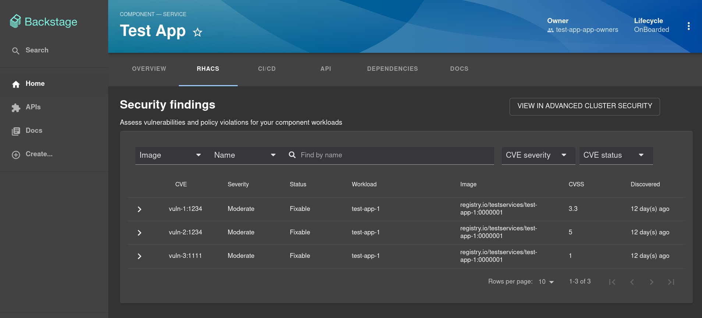
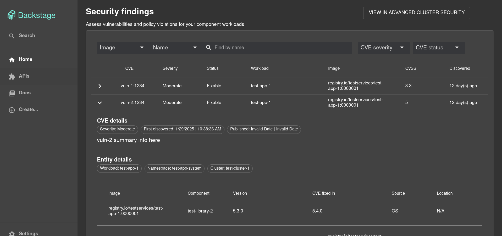

# Advanced Cluster Security Backstage Plugin

This is a development mono-repo for the Advanced Cluster Security plugin. This mono-repo was created using @backstage/create-app to provide a frontend for the plugin to integrate with.

You can find the plugin code in plugins/acs




## Local Development

### Prerequisites

Along with the NodeJS specific prerequisites we'll cover below you will need to have some bog-standard development tools installed:

* Git
* Make
* Podman / Docker

### Node CLI Tools

NodeJS comes with `npm` the Node Package Manager. Use it to install `yarn` and `npx`

```bash
> npm install yarn npx

added 2 packages in 6s
```

### Test Catalog Data

This repo comes with test data at `./catalog_default`.

First copy the `catalog_default` directory and rename it to `catalog`:
```
cp -R catalog_default catalog
```

Edit line 20 of `./catalog/components/test-app.yaml` to have a comma separated string of deployment names from the ACS API you wish to test.

### Export Environment Variables

The `ACS_API_URL` and `ACS_API_KEY` will need to be set in order for the route to work in the `app-config.yaml` file. The purpose of this route is to access data from the ACS endpoint.

To start the app, run:
```sh
yarn install
yarn dev
```

## RHDH Dynamic Plugin Config

### Configuration
In `app-config.yaml` first add the proxies:

```yaml
proxy:
  endpoints:
    '/acs':
      credentials: dangerously-allow-unauthenticated
      target: ${ACS_API_URL}
      headers:
        authorization: "Bearer ${ACS_API_KEY}"
```

Under the `app` stanza in `app-config.yaml`, add the acs url. The app stanza should look like this:
```
app:
  acs:
    acsUrl: ${ACS_URL}
```

Here's an example of how to configure all of the various plugins in your dynmaic plugins config for RHDH.

```yaml
    - package: "https://github.com/RedHatInsights/backstage-plugin-advanced-cluster-security/releases/download/v0.1.1/redhatinsights-backstage-plugin-acs-dynamic-0.1.1.tgz"
      integrity: sha256-9JeRK2jN/Jgenf9kHwuvTvwTuVpqrRYsTGL6cpYAzn4=
      disabled: false
      pluginConfig:
        dynamicPlugins:
          frontend:
            redhatinsights.backstage-plugin-acs:
              entityTabs:
                - path: /acs
                  title: RHACS
                  mountPoint: entity.page.acs
              mountPoints:
                - mountPoint: entity.page.acs/cards
                  importName: EntityACSContent
                  config:
                    layout:
                      gridColumnEnd:
                        lg: "span 12"
                        md: "span 12"
                        xs: "span 12"
```

Each entity in the catalog will need to have an annotation added that references the deployment(s) in order to display vulnerability data for them. Here is an example:
```
acs/deployment-name: "test-deployment-1,test-deployment-2,test-deployment-3"
```

