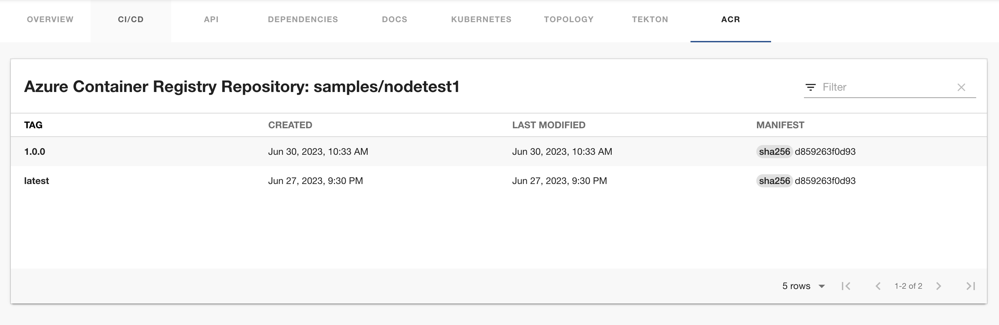

# Azure Container Registry plugin for Backstage

The Azure Container Registry (ACR) plugin displays information about your container images available in the Azure Container Registry.

## For administrators

### Installing and configuring the ACR plugin

1. Run the following command to install the ACR plugin:

   ```bash
   yarn workspace app add @backstage-community/plugin-acr
   ```

1. Set the proxy to the desired ACR server in the `app-config.yaml` file as follows:

   ```yaml
   # app-config.yaml
   proxy:
     endpoints:
       '/acr/api':
         target: 'https://mycontainerregistry.azurecr.io/acr/v1/'
         credentials: require
         changeOrigin: true
         headers:
           # If you use Bearer Token for authorization, please replace the 'Basic' with 'Bearer' in the following line.
           Authorization: 'Basic ${ACR_AUTH_TOKEN}'
         # Change to "false" in case of using self hosted artifactory instance with a self-signed certificate
         secure: true
   ```

   #### (Optional) Specify a Custom Registry Path to Support Multiple Registries

   ```yaml
   # app-config.yaml
   proxy:
     endpoints:
       '/acr/api':
         target: 'https://mycontainerregistry.azurecr.io/acr/v1/'
         credentials: require
         changeOrigin: true
         headers:
           # If you use Bearer Token for authorization, replace 'Basic' with 'Bearer'
           Authorization: 'Basic ${ACR_AUTH_TOKEN}'
         # Set to false if using a self-hosted ACR instance with a self-signed certificate
         secure: true

       '/acr/custom/api/mysecondregistry':
         target: 'https://mysecondregistry.azurecr.io/acr/v1/'
         credentials: require
         changeOrigin: true
         headers:
           Authorization: 'Basic ${SECOND_ACR_AUTH_TOKEN}'
         secure: true
   ```

   > [!NOTE]
   > The value inside each route is either a simple URL string, or an object on the format accepted by [http-proxy-middleware](https://www.npmjs.com/package/http-proxy-middleware). Additionally, it has an optional `credentials` key which can have the following values:
   >
   > - `require`: Callers must provide Backstage user or service credentials with each request. The credentials are not forwarded to the proxy target. This is the **default**.
   > - `forward`: Callers must provide Backstage user or service credentials with each request, and those credentials are forwarded to the proxy target.
   > - `dangerously-allow-unauthenticated`: No Backstage credentials are required to access this proxy target. The target can still apply its own credentials checks, but the proxy will not help block non-Backstage-blessed callers. If you also add allowedHeaders: ['Authorization'] to an endpoint configuration, then the Backstage token (if provided) WILL be forwarded.
   >
   > Note that if you have `backend.auth.dangerouslyDisableDefaultAuthPolicy` set to true, the credentials value does not apply; the proxy will behave as if all endpoints were set to dangerously-allow-unauthenticated.

1. Set the authorization using one of the following options:

   - Basic authorization:

     - Navigate to the ACR portal and go to the **Access Keys** tab.
     - Retrieve the username and password of the Admin user and use the [Basic Auth Header Generator tool](https://www.debugbear.com/basic-auth-header-generator) or run `echo printf '<username>:<password>' | base64` in a terminal to convert the credentials into a basic token.
     - Set the generated token as `ACR_AUTH_TOKEN` in environment variables.

   - OAuth2: - Generate bearer access token using the process described in Authenticate with an Azure Container Registry.

     - One method is to generate a bearer token using your basic authorization token, i.e.

       ```bash
               curl --location 'https://<yourregistry>.azurecr.io/oauth2/token?scope=repository%3A*%3A*&service=<yourregistry>.azurecr.io' \
       --header 'Authorization: Basic <basic_token>'
       ```

     - Set the generated token as `ACR_AUTH_TOKEN` in environment variables. Make sure to replace the `Basic` in the `app-config.yaml` with `Bearer`

1. Enable an additional tab on the entity view page using the `packages/app/src/components/catalog/EntityPage.tsx` file as follows:

   ```tsx title="packages/app/src/components/catalog/EntityPage.tsx"
   /* highlight-add-start */
   import {
     AcrImagesEntityContent,
     isAcrAvailable,
   } from '@backstage-community/plugin-acr';

   /* highlight-add-end */

   const serviceEntityPage = (
     <EntityLayout>
       // ...
       {/* highlight-add-start */}
       <EntityLayout.Route if={isAcrAvailable} path="/acr" title="ACR images">
         <AcrImagesEntityContent />
       </EntityLayout.Route>
       {/* highlight-add-end */}
     </EntityLayout>
   );
   ```

1. Annotate your entity using the following annotations:

   ```yaml
   metadata:
     annotations:
       'azure-container-registry/repository-name': `<REPOSITORY-NAME>',
   ```

#### (Optional) Specify a Custom Registry Path to Support Multiple Registries

```yaml
  metadata:
    annotations:
      'azure-container-registry/repository-name': `<REPOSITORY-NAME>',
      'azure-container-registry/registry-name': `<REGISTRY-NAME>',
```

### Use new frontend system

1. Install the frontend plugin:

   ```sh
   yarn workspace app add @backstage-community/plugin-acr
   ```

2. Enable the plugin in your `packages/app(-next)/src/App.tsx`:

   After all other imports:

   ```tsx
   import acrPlugin from '@backstage-community/plugin-acr/alpha';
   ```

   ```tsx
   export const app = createApp({
     features: [
       catalogPlugin,
       catalogImportPlugin,
       userSettingsPlugin,
       acrPlugin,
       // ...
     ],
   });
   ```

## For users

### Using the ACR plugin in Backstage

ACR is a front-end plugin that enables you to view information about the container images from your Azure Container Registry in Backstage.

#### Prerequisites

- Your Backstage application is installed and running.
- You have installed the ACR plugin. For installation instructions, see [Installing and configuring the ACR plugin](#installing-and-configuring-the-acr-plugin).

#### Procedure

1. Open your Backstage application and select a component from the Catalog page.

1. Go to the **ACR** tab.

   

   The **ACR** tab in the Backstage UI contains a list of container images and related information, such as **TAG**, **CREATED**, **LAST MODIFIED**, and **MANIFEST**.
