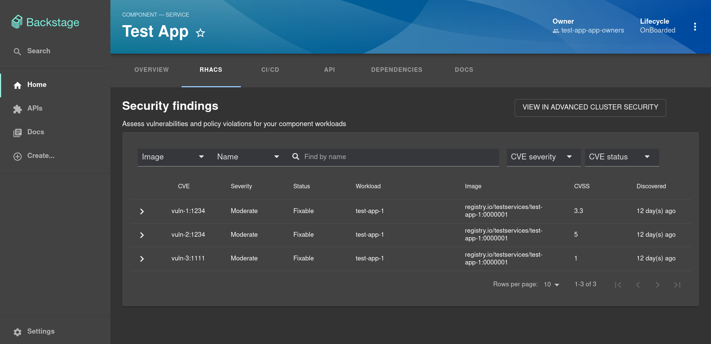
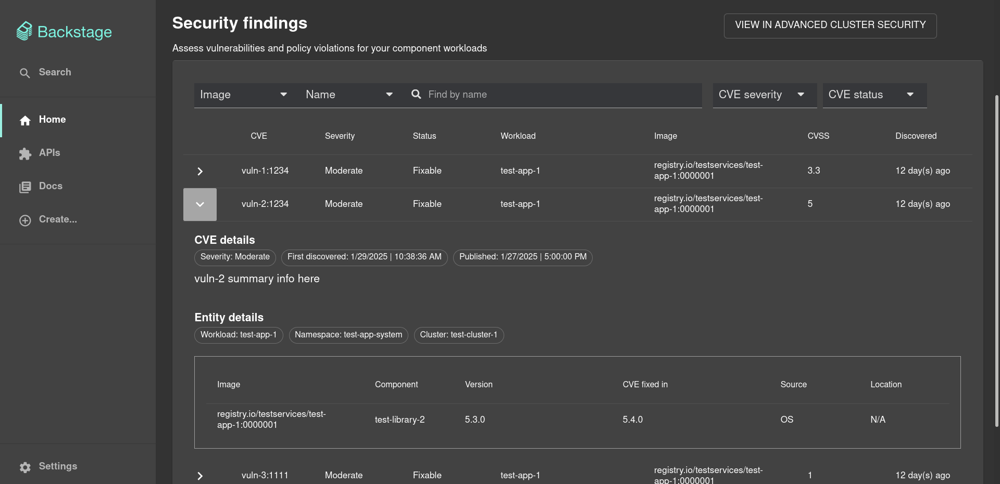

# Advanced Cluster Security Backstage Plugin




## For Administrators

### Backstage Installation

Run the following command to install the 3scale Backstage provider plugin:

```console
yarn workspace backend add @backstage-community/plugin-acs
```

### Configuration

In `app-config.yaml` first add the proxies:

```yaml
proxy:
  endpoints:
    '/acs':
      credentials: dangerously-allow-unauthenticated
      target: ${ACS_API_URL}
      headers:
        authorization: 'Bearer ${ACS_API_KEY}'
```

Add the following top-level stanza to the `app-config.yaml` file:

```
acs:
  acsUrl: ${ACS_API_URL}
```

## RHDH Dynamic Plugin Config

The ACS plugin is also available as an [Red Hat Developer Hub (RHDH)](https://github.com/redhat-developer/rhdh) dynamic plugin. The following should be able to run within the [RHDH local](https://github.com/redhat-developer/rhdh-local) repo.

Here's an example of how to configure the ACS plugin as a dynamic plugin in RHDH:

```yaml
- package: '@backstage-community/plugin-acs@0.1.0'
  disabled: false
  pluginConfig:
    dynamicPlugins:
      frontend:
        redhatinsights.backstage-plugin-acs:
          entityTabs:
            - path: /acs
              title: RHACS
              mountPoint: entity.page.acs
          mountPoints:
            - mountPoint: entity.page.acs/cards
              importName: EntityACSContent
              config:
                layout:
                  gridColumnEnd:
                    lg: 'span 12'
                    md: 'span 12'
                    xs: 'span 12'
```

Each service component entity in the catalog will need to have an annotation added that references the deployment(s) in order to display vulnerability data for them. Here is an example:

```
acs/deployment-name: "test-deployment-1,test-deployment-2,test-deployment-3"
```

## Local Development

### Prerequisites

Please refer to the [Backstage Prerequisites page](https://backstage.io/docs/getting-started/#prerequisites) regarding getting started.

### Node CLI Tools

You will want to use node verion 20. You can set the version with the following command:

```
nvm use 20
```

NodeJS comes with `npm` the Node Package Manager. Use it to install `yarn` and `npx`.

```bash
> npm install yarn npx

added 2 packages in 6s
```

### Test Catalog Data

This repo comes with test data at `./catalog_default`.

First copy the `catalog_default` directory and rename it to `catalog`:

```
cp -R catalog_default catalog
```

In order for vulernability data to display, the annotation `acs/deployment-name` needs to be set. Edit line 19 of `./catalog/components/test-app.yaml` to have a comma separated string of deployment names from the ACS API you wish to test.

### Export Environment Variables

The `ACS_API_URL` and `ACS_API_KEY` will need to be set in order for the route to work in the `app-config.yaml` file. The purpose of this route is to access data from the ACS endpoint.

### Add Annotation

To start the app, run:

```sh
yarn install
yarn dev
```

The app will be available at `http://localhost:3000`.
