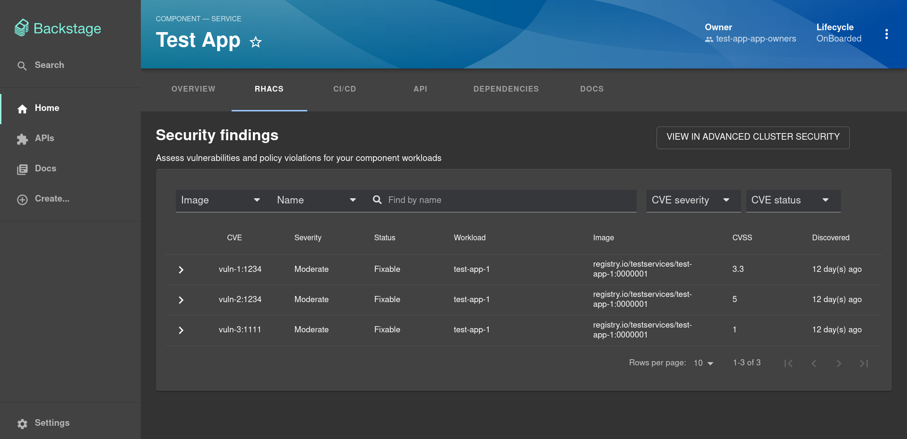
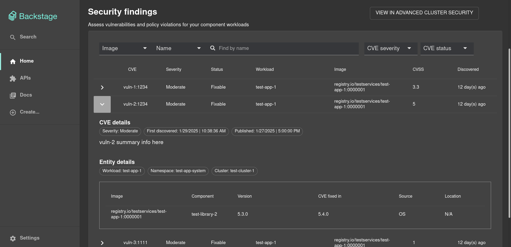

# Advanced Cluster Security Backstage Plugin




## For Administrators

### Backstage Installation

1. Run the following command to install the ACS Backstage provider plugin:

```console
yarn --cwd packages/app add @backstage-community/plugin-acs
```

2. Second we need to add the EntityACSContent extension to the entity page in your app:

```
import { EntityACSContent } from '@backstage-community/plugin-acs';

// For example in the Service section
const serviceEntityPage = (
  <EntityLayout>
    // ...
    <EntityLayout.Route path="/acs" title="Security">
      <EntityACSContent />
    </EntityLayout.Route>
    // ...
  </EntityLayout>
```

### Entity Annotation

To be able to use the Advanced Cluster Security plugin you need to add the following annotation to any entities you want to use it with:

```
acs/deployment-name: <deployment name>
```

If multiple deployments can be linked to a catalog entity item, you can add a comma separated list of deployment names:

```
acs/deployment-name: "deployment-1,deployment-2,deployment-3"
```

Here's what that will look like in action:

# Example catalog-info.yaml entity definition file

```
apiVersion: backstage.io/v1alpha1
kind: Component
metadata:
  # ...
  annotations:
    acs/deployment-name: <deployment name>
spec:
  type: service
  # ...
```

### Export Environment Variables

The `ACS_API_URL` and `ACS_API_KEY` will need to be set in order for the route to work in the `app-config.yaml` file. The purpose of this route is to access data from the ACS endpoint.

### Configuration

In `app-config.yaml` first add the proxies:

```yaml
proxy:
  endpoints:
    '/acs':
      target: ${ACS_API_URL}
      headers:
        authorization: 'Bearer ${ACS_API_KEY}'
```

Add the following top-level stanza to the `app-config.yaml` file:

```
acs:
  acsUrl: ${ACS_API_URL}
```

## Local Development

### Prerequisites

Please refer to the [Backstage Prerequisites page](https://backstage.io/docs/getting-started/#prerequisites) regarding getting started.

### Test Catalog Data

This repo comes with test data at `./catalog_default`.

First copy the `catalog_default` directory and rename it to `catalog`:

```
cp -R catalog_default catalog
```

### Entity Annotation

In order for vulernability data to display, the annotation `acs/deployment-name` needs to be set. Edit line 19 of `./catalog/components/test-app.yaml` to have a comma separated string of deployment names from the ACS API you wish to test.

### Export Environment Variables

The `ACS_API_URL` and `ACS_API_KEY` will need to be set in order for the route to work in the `app-config.yaml` file. The purpose of this route is to access data from the ACS endpoint.

### Run Backstage

To start the app, run:

```sh
yarn install
yarn start
```

The app will be available at `http://localhost:3000`.
