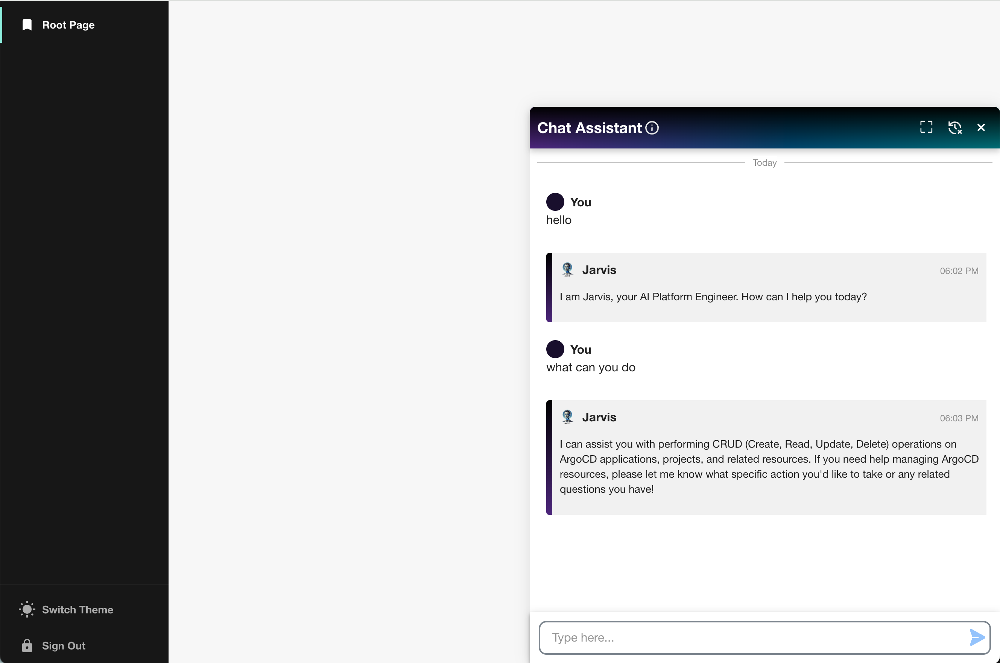
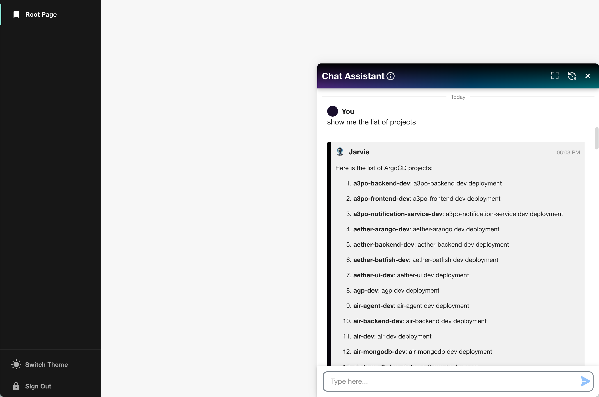

# CAIPE AgentForge Backstage AI Chat Plugin

This plugin is part of the [**CAIPE (Community AI Platform Engineering)**](https://cnoe-io.github.io/ai-platform-engineering/) initiative, providing seamless integration between Backstage and the multi-agentic AI systems developed by the CNOE (Cloud Native Operational Excellence) community.



## What is CAIPE?

**CAIPE (Community AI Platform Engineering)** (pronounced as `cape`) is an open-source, Multi-Agentic AI System (MAS) championed by the CNOE forum. CAIPE provides a secure, scalable, persona-driven reference implementation with built-in knowledge base retrieval that streamlines platform operations, accelerates workflows, and fosters innovation for modern engineering teams.

As Platform Engineering, SRE, and DevOps environments grow in complexity, traditional approaches often lead to delays, increased operational overhead, and developer frustration. By adopting Multi-Agentic Systems and Agentic AI, Platform Engineering teams can move from manual, task-driven processes to more adaptive and automated operations, better supporting development and business goals.

## CAIPE Platform Agents

CAIPE is empowered by a set of specialized sub-agents that integrate seamlessly with essential engineering tools. This Backstage plugin enables you to interact with these agents through an intuitive chat interface:

- 🚀 **ArgoCD Agent** for continuous deployment
- 🚨 **PagerDuty Agent** for incident management
- 🐙 **GitHub Agent** for version control
- 🗂️ **Jira/Confluence Agent** for project management
- ☸ **Kubernetes Agent** for K8s operations
- 💬 **Slack/Webex Agents** for team communication
- ☁️ **AWS Agent** for cloud infrastructure management

_...and many more platform agents are available for additional tools and use cases._

For detailed information on all available agents and their capabilities, visit: [https://cnoe-io.github.io/ai-platform-engineering/](https://cnoe-io.github.io/ai-platform-engineering/)

## Key Features

- **A curated prompt library**: A carefully evaluated collection of prompts designed for high accuracy and optimal workflow performance in multi-agent systems
- **Multiple End-user interfaces**: Easily invoke agentic workflows programmatically using standard A2A protocol or through intuitive UIs
- **End-to-end security**: Secure agentic communication and task execution across all agents, ensuring API RBACs to meet enterprise requirements
- **Enterprise-ready cloud deployment architecture**: Reference deployment patterns for scalable, secure, and resilient multi-agent systems

## Installation

To start using the Agent-Forge Plugin, follow these steps:

1. **Install Dependencies**:

   ```bash
   # From your Backstage root directory
   yarn --cwd packages/app add @backstage-community/plugin-agent-forge
   ```

2. **Configure App.tsx**:

   ```tsx
   import { ChatAssistantPage } from '@backstage-community/plugin-agent-forge';

   ...

   // Add <ChatAssistantPage /> to the AppRouter
   export default app.createRoot(
   <>
    ...
    <AppRouter>
      ...
      <Root>{routes}</Root>
      <ChatAssistantPage />
      ...
    </AppRouter>
   </>
   );
   ```

## Configuration

### CAIPE Agent Integration

To configure the plugin to connect to CAIPE agents, you need to configure the base URL of the running CAIPE system in your Backstage portal config file:

```yaml
agentForge:
  baseUrl: http://127.0.0.1:8000
```

The plugin can display pre-defined options based on the agent's available skills. To enable this feature, set the `showOptions` configuration to true:

```yaml
agentForge:
  showOptions: true
```

### CAIPE Setup

Before using this plugin, you need to have CAIPE running locally or have access to a deployed CAIPE instance. Follow these steps to get CAIPE up and running:

#### Prerequisites

- Docker or Podman installed on your system
- Access to LLM providers (OpenAI, Anthropic, etc.)
- Agent secrets configured

#### Quick Start with Docker

1. **Configure Agent Secrets and LLM Providers**

   - Set up your API keys and credentials for the agents you plan to use
   - Configure your preferred LLM provider

2. **Run CAIPE with Docker Compose**

   ```bash
   # Clone the CAIPE repository
   git clone https://github.com/cnoe-io/ai-platform-engineering.git
   cd ai-platform-engineering

   # Run with Docker Compose
   docker-compose up -d
   ```

3. **Verify CAIPE is Running**
   - CAIPE will be available at `http://localhost:8000` (or your configured port)
   - You can interact with agents using the Agent Chat CLI or this Backstage plugin

#### Alternative Setup Options

- **Kubernetes**: Use Kind or EKS for Kubernetes-based deployment
- **Local Development**: Follow the [Local Development guide](https://cnoe-io.github.io/ai-platform-engineering/getting-started/local-development) for development setup

For detailed setup instructions, visit the [CAIPE Quick Start Guide](https://cnoe-io.github.io/ai-platform-engineering/getting-started/quick-start).

## Usage

### Getting Started with CAIPE

Once you have CAIPE running and the plugin configured, you can interact with the multi-agent system through the chat interface. The AI Platform Engineer will intelligently route your requests to the appropriate specialized agents.

For detailed information on agent capabilities, prompt examples, and advanced usage patterns, visit the [CAIPE Documentation](https://cnoe-io.github.io/ai-platform-engineering/).

### Chat Interface

Use the chat interface to ask questions or perform required tasks. The system supports a wide range of platform engineering operations including incident management, version control, project management, team communication, continuous deployment, and cloud infrastructure management.




## Community and Resources

- **Documentation**: [https://cnoe-io.github.io/ai-platform-engineering/](https://cnoe-io.github.io/ai-platform-engineering/)
- **GitHub Repository**: [https://github.com/cnoe-io/ai-platform-engineering](https://github.com/cnoe-io/ai-platform-engineering)
- **Community**: Join the [CNOE Agentic AI SIG Community](https://cnoe-io.github.io/ai-platform-engineering/community/) for meetings, discussions, and collaboration
- **Slack Channel**: Join #cnoe-sig-agentic-ai in CNCF Slack
