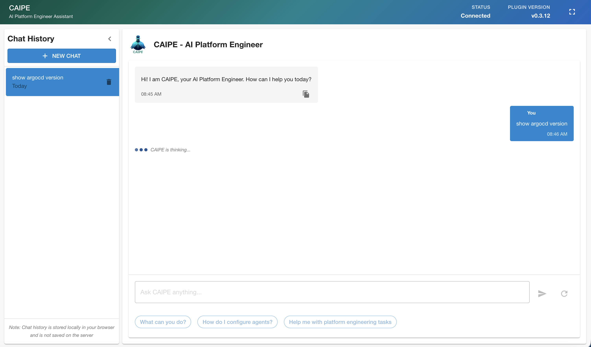

# AgentForge Backstage Frontend Plugin

This plugin is part of the AGNTCY(agntcy.org) community effort to provide the right tools & protocols for agent to agent communication.
It allows the integration of any agent supporting A2A (Agent2Agent Protocol) especially the platfrom related agents released under the CNOE (Cloud Native Operational Excellence) open source organization.


Please take a look here for a complete list and detailed documentation on the CNOE agents: https://github.com/cnoe-io/agentic-ai/wiki/Getting%E2%80%90Started

- agent-template (https://github.com/cnoe-io/agent-template) - template to be used as a starting point for creating new ACP agents

- agent-argocd (https://github.com/cnoe-io/agent-argocd) - agent for interacting with ArgoCD

- agent-atlassian (https://github.com/cnoe-io/agent-atlassian) - agent for managing JIRA

- agent-github (https://github.com/cnoe-io/agent-github) - agent for managing github

- agent-slack (https://github.com/cnoe-io/agent-slack) - agent for interacting with slack

## Installation

To start using the Agent-Forge Plugin, follow these steps:

1. **Install Dependencies**:

   ```bash
   # From your Backstage root directory
   yarn --cwd packages/app add @backstage-community/plugin-agent-forge
   ```

2. **Configure App.tsx**:

   ```tsx
   import { ChatAssistantPage } from '@backstage-community/plugin-agent-forge';

   ...

   // Add <ChatAssistantPage /> to the AppRouter
   export default app.createRoot(
   <>
    ...
    <AppRouter>
      ...
      <Root>{routes}</Root>
      <ChatAssistantPage />
      ...
    </AppRouter>
   </>
   );
   ```

## Configuration

### A2A agents

To configure the plugin to connect to any of the CNOE agents you need to configure the url of the running agent in the backstage portal config file:

```
...
agentForge:
  baseUrl: http://127.0.0.1:8000
...
```

The plugin can display as pre-defined options all the examples defined in the agent card skills. In order to do so, set the showOptions configuration to true:

```
...
agentForge:
  showOptions: true
...
```

## Usage

Use the chat to ask your questions or perform the required task




