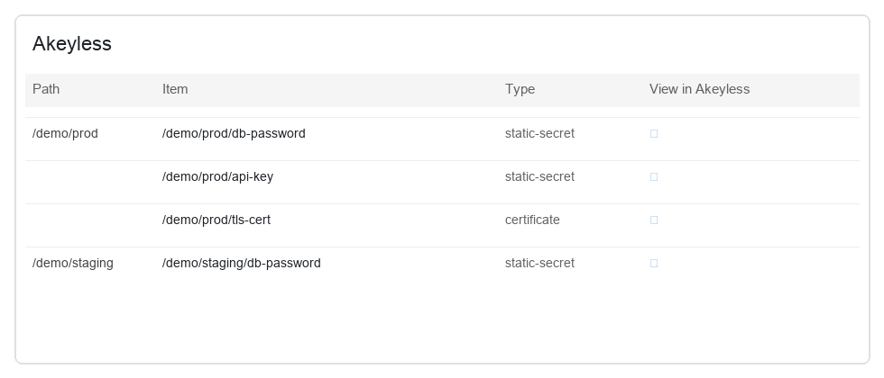
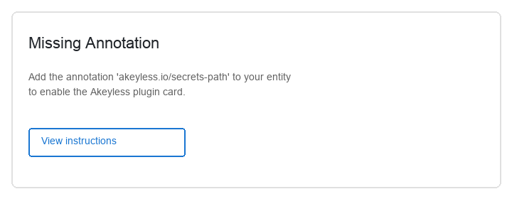

# @backstage-community/plugin-akeyless

Frontend plugin for the [Akeyless](https://www.akeyless.io) Backstage integration. Shows Akeyless items linked to a catalog entity and optionally manages static secrets in Backstage.



> **Requires the backend plugin.** Install and configure [@backstage-community/plugin-akeyless-backend](../akeyless-backend/README.md) first.

## Introduction

For each catalog Component annotated with an Akeyless path, this plugin:

1. Lists secrets and other item types under that path
2. Links each item to the Akeyless Console for view/manage actions
3. Optionally supports full CRUD for **static secrets** when enabled

Dynamic secrets, rotated secrets, and certificates are listed with Console links only — their values are not shown or edited in Backstage.

## Prerequisites

- [@backstage-community/plugin-akeyless-backend](../akeyless-backend/README.md) installed and configured
- Akeyless credentials with access to the paths you will annotate on catalog entities

## Installation

### 1. Install the package

```bash
yarn --cwd packages/app add @backstage-community/plugin-akeyless
```

### 2. Register the plugin

#### Frontend system

The alpha plugin registers the API client, an **overview card**, and a **Development → Akeyless** entity tab automatically:

```tsx
// packages/app/src/App.tsx
import akeylessPlugin from '@backstage-community/plugin-akeyless/alpha';

export default createApp({
  features: [catalogPlugin, akeylessPlugin],
});
```

No further entity-page wiring is required. The card and tab appear only for entities that have `akeyless.io/secrets-path`.

#### Legacy frontend system

```tsx
// packages/app/src/App.tsx
import { akeylessPlugin } from '@backstage-community/plugin-akeyless';

const app = createApp({
  plugins: [akeylessPlugin],
});
```

Add the card to your entity page — typically on the Overview tab and/or as a dedicated route:

```tsx
// packages/app/src/components/catalog/EntityPage.tsx
import { EntityAkeylessCard } from '@backstage-community/plugin-akeyless';
import Grid from '@material-ui/core/Grid';

const overviewContent = (
  <Grid container spacing={3} alignItems="stretch">
    {/* ...other cards... */}
    <Grid item md={6} xs={12}>
      <EntityAkeylessCard />
    </Grid>
  </Grid>
);

const serviceEntityPage = (
  <EntityLayout>
    <EntityLayout.Route path="/" title="Overview">
      {overviewContent}
    </EntityLayout.Route>
    <EntityLayout.Route path="/akeyless" title="Akeyless">
      <EntityAkeylessCard />
    </EntityLayout.Route>
    {/* ...other routes... */}
  </EntityLayout>
);
```

## Catalog integration

Add annotations to each `catalog-info.yaml` Component that should show Akeyless data.

### Basic example

```yaml
apiVersion: backstage.io/v1alpha1
kind: Component
metadata:
  name: payment-service
  annotations:
    akeyless.io/secrets-path: /payments/prod
spec:
  type: service
  lifecycle: production
  owner: payments-team
```

### Multiple paths

Comma-separated paths are listed in a single table:

```yaml
metadata:
  annotations:
    akeyless.io/secrets-path: /payments/prod,/payments/staging
```

### Filter item types

By default the plugin lists static, dynamic, rotated, and certificate secrets. Override with:

```yaml
metadata:
  annotations:
    akeyless.io/secrets-path: /payments/prod
    akeyless.io/secret-types: static-secret,dynamic-secret
```

If `akeyless.io/secret-types` is present but empty after parsing, the default types are used.

### Disable CRUD for one entity

Useful when you want listing and Console links but not in-Backstage secret management:

```yaml
metadata:
  annotations:
    akeyless.io/secrets-path: /payments/prod
    akeyless.io/allow-crud: 'false'
```

Global CRUD is **off by default**. Enable it with `akeyless.allowCrud: true` in `app-config.yaml` — see the [backend README](../akeyless-backend/README.md#enable-crud).

### Missing annotation



Behavior depends on which frontend system you use:

- **Frontend system** — the overview card and Akeyless entity tab are not shown unless the entity has `akeyless.io/secrets-path`.
- **Legacy frontend system** — if you mount `EntityAkeylessCard` unconditionally, missing or blank `akeyless.io/secrets-path` shows Backstage's standard missing-annotation empty state prompting you to add the annotation.

## Using the UI

### Overview card / Akeyless tab

The table shows:

- **Path** — which annotated path each row belongs to (when multiple paths are configured)
- **Item** — full Akeyless item path
- **Type** — item type (e.g. `static-secret`)
- **View in Akeyless** — opens the item in the Akeyless Console
- **Actions** (when CRUD enabled) — view value, edit, or delete static secrets

When CRUD is enabled, a **Create static secret** button adds a new static secret under one of the entity's annotated paths.

### CRUD behavior

| Item type                                                 | In Backstage                                                 |
| --------------------------------------------------------- | ------------------------------------------------------------ |
| `static-secret`                                           | List, view value, create, update, delete (when CRUD enabled) |
| `dynamic-secret`, `rotated-secret`, `certificate`, others | List + Console link only                                     |

The frontend sends the entity's annotated path as `contextPath`. The backend rejects operations on secrets outside that caller-provided scope (root `/` is not allowed). The backend does not verify `contextPath` against the catalog — see [Security notes](#security-notes).

## Security notes

- Secret values for static secrets are only fetched when a user explicitly opens the view or edit dialog — they are not shown in the list by default.
- The Akeyless API credential lives in the Backstage backend configuration, not in the browser.
- `contextPath` is a caller-provided guard, not a catalog-enforced security boundary. Any Backstage user who can reach the plugin API could supply a different `contextPath` within the limits enforced by the backend and the shared credential.
- Any Backstage user who can view an annotated entity can use the plugin with the permissions of that shared credential. Restrict catalog access, scope the Akeyless credential narrowly, and keep CRUD disabled unless you need it.

## Troubleshooting

| Symptom                                 | What to check                                                                                          |
| --------------------------------------- | ------------------------------------------------------------------------------------------------------ |
| Card/tab not visible                    | Entity missing `akeyless.io/secrets-path`; legacy frontend may need manual `EntityAkeylessCard` wiring |
| "Failed to load secrets" row for a path | Akeyless credential lacks list permission on that path, or path does not exist                         |
| No CRUD buttons                         | CRUD is off by default — set `akeyless.allowCrud: true`, and check `akeyless.io/allow-crud` on entity  |
| Edit dialog does not open               | Value fetch failed — check read permissions on the static secret                                       |
| API errors / 404                        | Backend plugin not installed; verify `GET /api/akeyless/health`                                        |

## Related documentation

- [Backend plugin README](../akeyless-backend/README.md) — configuration, API reference, authentication methods
- [Workspace README](../../README.md) — end-to-end quick start
