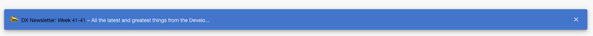
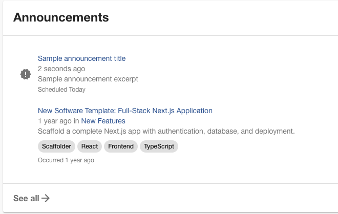
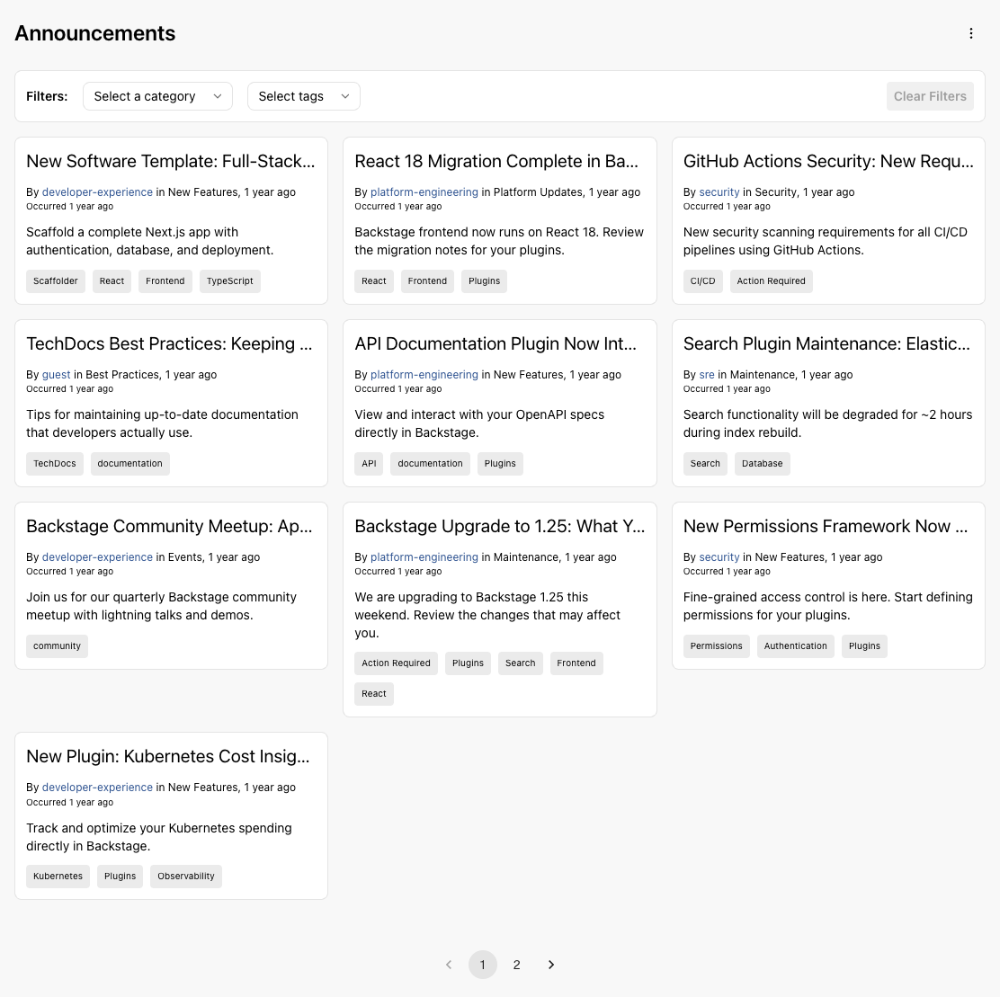
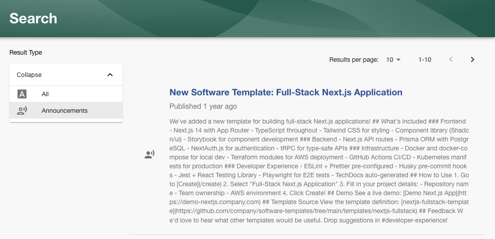
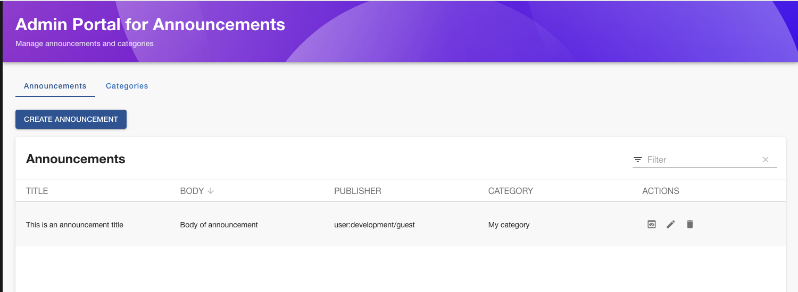

# Announcements plugin for Backstage

The Announcements plugin manages and displays announcements within Backstage.

## Features

This plugin provides:

- a component to display the latest announcement as a banner, if there is one
- a component to display the latest announcements, for example on a homepage
- pages to list, view, create, edit and delete announcements
- an admin portal to manage announcements
- integration with the [`@backstage/plugin-search`](https://github.com/backstage/backstage/tree/master/plugins/search) plugin
- integration with the [`@backstage/plugin-permission-backend`](https://github.com/backstage/backstage/tree/master/plugins/permission-backend) plugin
- integration with the [`@backstage/plugin-events-backend`](https://github.com/backstage/backstage/tree/master/plugins/events-backend) plugin
- integration with the [`@backstage/plugin-signals-backend`](https://github.com/backstage/backstage/tree/master/plugins/signals-backend) plugin

You will find installation instructions in each plugin's readme file.

## How does it look?

### Latest announcement banner

### Announcements card

### Announcements page

### Announcements search

### Admin Portal

## Previously maintained by

- [procore-oss](https://github.com/procore-oss/backstage-plugin-announcements)
- [K-Phoen](https://github.com/K-Phoen/backstage-plugin-announcements)
