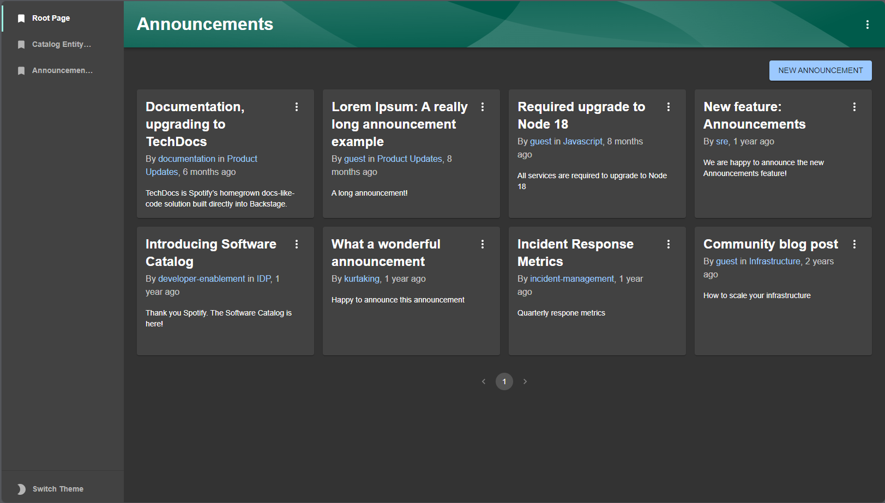

# Announcements

## Overview

The Announcements plugin manages and displays announcements within Backstage.

This plugin provides:

- a component to display the latest announcement as a banner, if there is one
- a component to display the latest announcements, for example on a homepage
- pages to list, view, create, edit and delete announcements
- integration with the [`@backstage/plugin-search`](https://github.com/backstage/backstage/tree/master/plugins/search) plugin
- integration with the [`@backstage/plugin-permission-backend`](https://github.com/backstage/backstage/tree/master/plugins/permission-backend) plugin
- integration with the [`@backstage/plugin-events-backend`](https://github.com/backstage/backstage/tree/master/plugins/events-backend) plugin
- integration with the [`@backstage/plugin-signals-backend`](https://github.com/backstage/backstage/tree/master/plugins/signals-backend) plugin

## Installation

Find [installation instructions](./docs/index.md#installation) in our documentation.

## How does it look?

### Latest announcement banner


### Announcements card


### Announcements page



### Announcements search


### Admin Portal


## Quick start

To start the app, run:

```sh
yarn install
yarn dev
```

To generate knip reports for this app, run:

```sh
yarn backstage-repo-tools knip-reports
```
