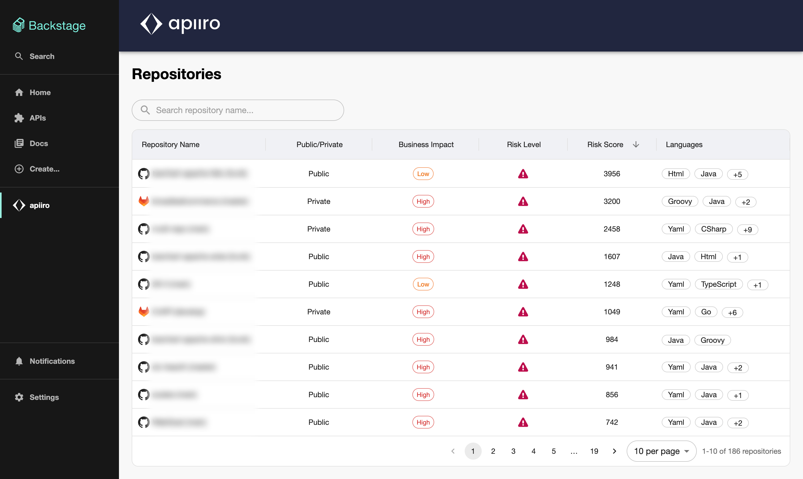
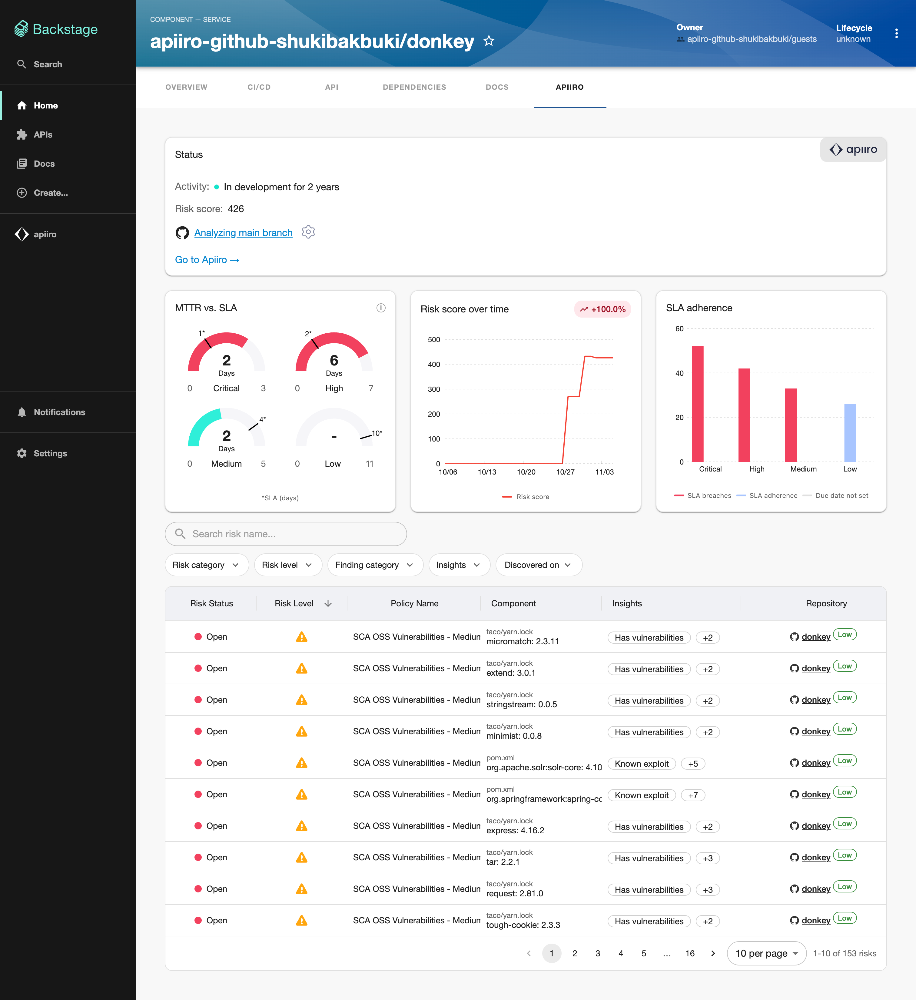
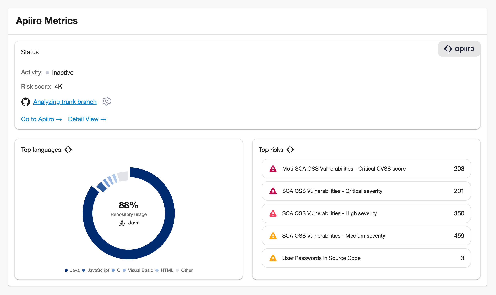
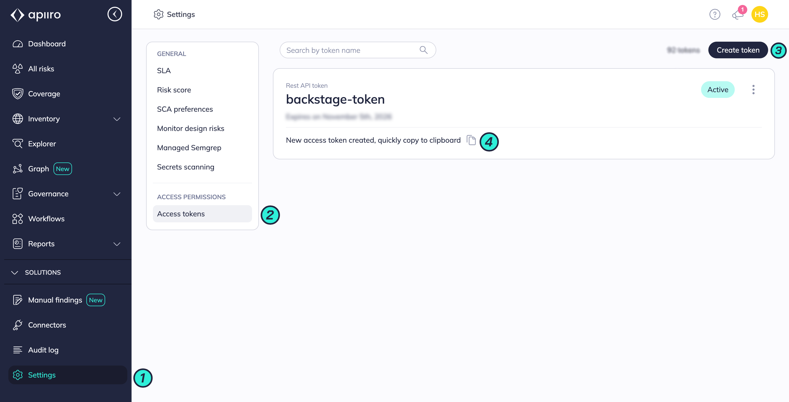

# Apiiro Plugin for Backstage

The Apiiro plugin for Backstage integrates Apiiro's application risk management capabilities directly into your Backstage developer portal. This plugin empowers developers to code securely by automatically checking for security vulnerabilities and enables them to review and address newly introduced vulnerabilities directly in Backstage.

## Plugin Compatibility

The plugin has been successfully tested with Backstage v1.44.0 If you are using a newer version of Backstage, please file an issue, and we will provide guidance on the best integration practices for your specific version.

## Features

- **Dashboard View**: Repository list with statistics sourced from Apiiro
- **Apiiro Tab**: In-depth view of repository open risks and detailed metrics
- **Apiiro Widget**: High-level overview widget that can be embedded in custom entity tabs
- **Permission Control**: Conditional permissions for fine-grained access control to Apiiro metrics

## Views

### Dashboard – Repository List

Displays the list of integrated repositories along with statistics sourced from Apiiro. Clicking on a repository redirects you to the Apiiro tab for detailed insights.



### Apiiro Tab

Provides an in-depth look at each repository's open risks and detailed metrics retrieved from Apiiro.



### Apiiro Widget

Offers a high-level overview of the repository, including programming languages and top risk details. Can be added to any custom entity tab.



## Prerequisites

- The entity for a repository must be present within Backstage to see Apiiro results
- Appropriate access permissions to an entity in Backstage are required to view its Apiiro results
- An Apiiro Access Token with at least read permissions

### Dependencies

> [!IMPORTANT]
> Please note that the frontend plugin will not function without the backend plugin.

## Getting Started

### 1. Configure Apiiro Plugin for Backstage

Add the following annotation into your catalog.

- `apiiro.com/repo-id`: `<repo-key>`
- `apiiro.com/allow-metrics-view`: `"true"` or `"false"` (controls whether the Metrics view appears in the Apiiro Tab and Apiiro Widget)

```yaml
apiVersion: backstage.io/v1alpha1
kind: Component
metadata:
  name: backstage
  annotations:
    - apiiro.com/repo-id: <APIIRO_REPO_KEY>
    - apiiro.com/allow-metrics-view: 'true'
```

Please find the steps to add the annotation automatically [here](../apiiro-backend/README.md#automatically-adding-apiiro-annotations-optional).

### 2. Install required plugins packages

From your Backstage root directory, run:

```bash
yarn --cwd packages/app add @backstage-community/plugin-apiiro
yarn --cwd packages/backend add @backstage-community/plugin-apiiro-backend
```

Add the Apiiro backend plugin:
In your `packages/backend/src/index.ts` file:

```ts
backend.add(import('@backstage-community/plugin-apiiro-backend');
```

**Note:** The Backstage frontend plugin will not function without the backend plugin.

### 3. Configuration

Add your Apiiro Access Token to your `app-config.yaml` or `app-config.production.yaml`:

```yaml
apiiro:
  accessToken: ${APIIRO_TOKEN}
  defaultAllowMetricsView: true
  # Optional: Configure default risk filters for the Apiiro Risk Table (Example configuration)
  defaultRiskFilters:
    RiskLevel:
      - Critical
      - High
    RiskInsight:
      - Internet exposed
      - Deployed
    RiskCategory:
      - SAST findings
      - Secrets
    Provider:
      - ApiiroSca
      - AkamaiApiSecurity
```

Where:

- `accessToken` is your Apiiro Access Token
- `defaultAllowMetricsView` is a boolean value that controls whether the Metrics view appears in the Apiiro Tab and Apiiro Widget by default. If annotation is not set, this value will be used. Default value is `true`.
- `defaultRiskFilters` (optional) configures default filters for the Apiiro Risk Table. Please refer to the [backend documentation](../apiiro-backend/README.md#configure-default-risk-filters-optional) for more details.

**How to Retrieve an Access Token from Apiiro:**

1. Log in to your Apiiro instance
2. Go to Settings → Access Token
3. Create a new Access Token with a long expiration period (1 year) and grant at least read permissions
4. Generate and securely save the token



### 4. Add Apiiro Tab to Entity Page

In `packages/app/src/components/Catalog/EntityPage.tsx`:

```tsx
// Import the Apiiro tab
import {
  ApiiroTab,
  isApiiroRepoAvailable,
} from '@backstage-community/plugin-apiiro';

// Add the route to your service entity page
const serviceEntityPage = (
  <EntityLayout>
    <EntityLayout.Route path="/" title="Overview">
      {/* ... other elements */}
    </EntityLayout.Route>

    <EntityLayout.Route
      if={isApiiroRepoAvailable}
      path="/apiiro"
      title="Apiiro"
    >
      <ApiiroTab />
    </EntityLayout.Route>

    {/* ... other elements */}
  </EntityLayout>
);
```

### 5. Add the Apiiro Sidebar with Repositories List (Optional)

In `packages/app/src/App.tsx`:

```tsx
// Import the Apiiro page
import { ApiiroPage } from '@backstage-community/plugin-apiiro';

// Add the route
const routes = (
  <FlatRoutes>
    <Route path="/" element={<Navigate to="catalog" />} />
    <Route path="/catalog" element={<CatalogIndexPage />} />
    {/* ... other elements */}
    <Route path="/apiiro" element={<ApiiroPage />} />
    {/* ... other elements */}
  </FlatRoutes>
);
```

Add Apiiro Sidebar Button

In `packages/app/src/components/Root/Root.tsx`:

```tsx
// Import the Apiiro sidebar
import { ApiiroSidebar } from '@backstage-community/plugin-apiiro';

// Add to your sidebar
export const Root = ({ children }: PropsWithChildren<{}>) => (
  <SidebarPage>
    <Sidebar>
      {/* ... other elements */}

      <ApiiroSidebar />

      {/* ... other elements */}
    </Sidebar>
    {children}
  </SidebarPage>
);
```

### 6. Add Apiiro Widget to Custom Entity Tab (Optional)

The Apiiro plugin for Backstage includes a widget that can be embedded in a custom tab of the Backstage entity. This widget provides an overview of the risk associated with that entity, alongside your other valuable insights.
To add the widget, include the following component in your custom entity tab:

```tsx
// ... other imports here
import {
  ApiiroWidget,
  isApiiroRepoAvailable,
} from '@backstage-community/plugin-apiiro';
// ... other components

// add the following line to import the component at required position
<EntitySwitch>
  <EntitySwitch.Case if={isApiiroRepoAvailable}>
    <Grid item md={12} xs={12}>
      <ApiiroWidget />
    </Grid>
  </EntitySwitch.Case>
</EntitySwitch>;
```

## Development

To run the entire project including the backend, run `yarn start` from the workspace root directory.

## Links

- [Backend Plugin Documentation](../apiiro-backend/README.md)
- [Add Annotation Automatically](../apiiro-backend/README.md#automatically-adding-apiiro-annotations-optional)
