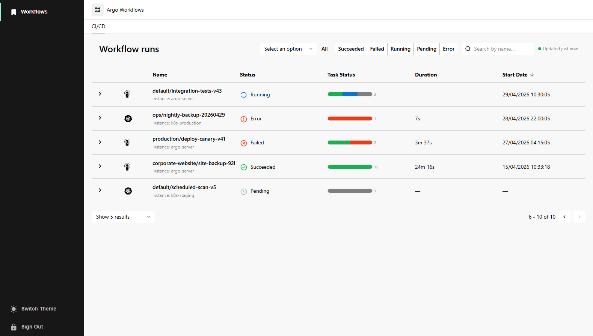
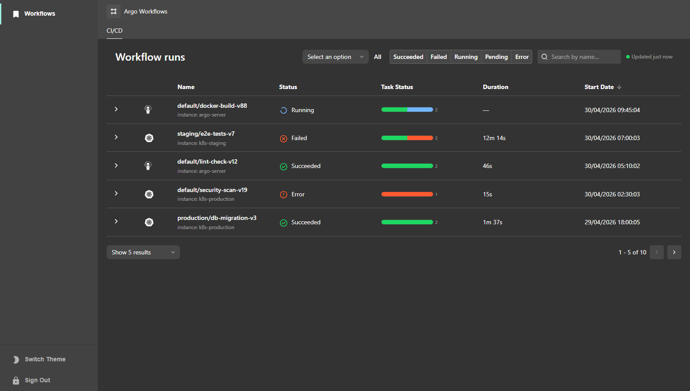
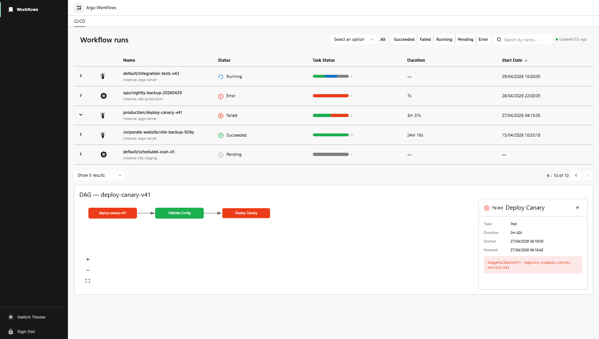
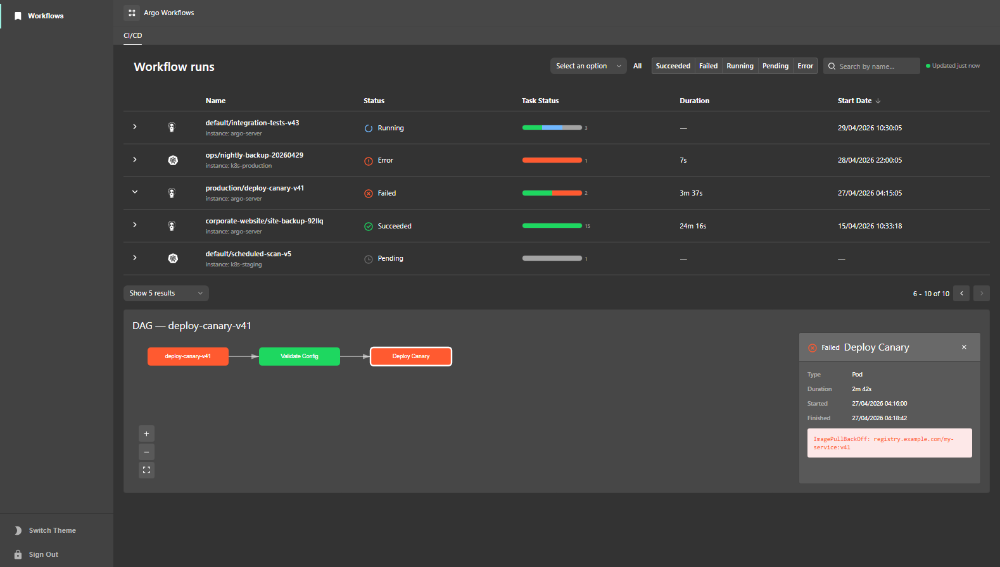

# Argo Workflows plugin for Backstage

The Argo Workflows plugin enables you to visualize Argo Workflow executions directly in the Backstage catalog, providing a CI/CD view with workflow run history, task status bars, and interactive DAG visualizations.

| Light                                         | Dark                                               |
| --------------------------------------------- | -------------------------------------------------- |
|           |           |
|  |  |

## For administrators

### Setting up the Argo Workflows plugin

#### Prerequisites

- An Argo Workflows server is deployed and accessible from the Backstage backend.
- A service account token with read access to the Argo Workflows API is available.
- The `@backstage-community/plugin-argo-workflows-backend` backend plugin is installed and configured (see the [backend plugin README](../argo-workflows-backend/README.md)).

#### Backend configuration

Add the Argo Workflows backend configuration to your `app-config.yaml`:

```yaml
argoWorkflows:
  defaultInstance: main
  instances:
    - name: main
      baseUrl: https://argo.example.com
      token: ${ARGO_WORKFLOWS_TOKEN}
```

| Field                 | Required | Description                                                           |
| --------------------- | -------- | --------------------------------------------------------------------- |
| `defaultInstance`     | No       | Name of the default instance when the entity annotation omits one.    |
| `instances[].name`    | Yes      | Unique identifier for this Argo Workflows server.                     |
| `instances[].baseUrl` | Yes      | Base URL of the Argo Workflows API (e.g. `https://argo.example.com`). |
| `instances[].token`   | Yes      | Bearer token for authenticating with the Argo Workflows API.          |

#### Entity annotations

Add the following annotations to your entity's `catalog-info.yaml` to enable the Argo Workflows CI/CD view:

```yaml
apiVersion: backstage.io/v1alpha1
kind: Component
metadata:
  name: my-service
  annotations:
    argoworkflows.argoproj.io/workflow-selector: 'app=my-service'
    argoworkflows.argoproj.io/instance-name: main # optional
spec:
  type: service
  owner: team-a
  lifecycle: production
```

| Annotation                                    | Required | Description                                                                    |
| --------------------------------------------- | -------- | ------------------------------------------------------------------------------ |
| `argoworkflows.argoproj.io/workflow-selector` | Yes      | Kubernetes label selector to filter workflows for this entity.                 |
| `argoworkflows.argoproj.io/instance-name`     | No       | Name of the Argo Workflows instance to query. Falls back to `defaultInstance`. |

#### Kubernetes annotation compatibility

The plugin also recognizes the standard Backstage Kubernetes annotations used by the Kubernetes and Tekton plugins. If you already have these annotations on your entities, the Argo Workflows plugin can use them as well:

```yaml
annotations:
  backstage.io/kubernetes-id: my-service
  backstage.io/kubernetes-namespace: production # optional
  backstage.io/kubernetes-label-selector: 'app=my-service,component=api' # optional
```

| Annotation                               | Description                                                                                                                                                |
| ---------------------------------------- | ---------------------------------------------------------------------------------------------------------------------------------------------------------- |
| `backstage.io/kubernetes-id`             | Matches workflows by the `backstage.io/kubernetes-id` label on the workflow resource. Same annotation used by the Backstage Kubernetes and Tekton plugins. |
| `backstage.io/kubernetes-namespace`      | Scopes workflow discovery to a specific Kubernetes namespace.                                                                                              |
| `backstage.io/kubernetes-label-selector` | Custom label selector. Takes precedence over `backstage.io/kubernetes-id` when both are present.                                                           |

> **Note:** The Argo Workflows-specific annotations (`argoworkflows.argoproj.io/*`) take precedence over the Kubernetes annotations when both are present. This allows you to use the same entity for both the Kubernetes plugin and the Argo Workflows plugin with different selectors if needed.

#### Procedure

1. Install the frontend plugin:

   ```console
   yarn workspace app add @backstage-community/plugin-argo-workflows
   ```

2. Add the CI/CD tab to your entity page in `packages/app/src/components/catalog/EntityPage.tsx`:

   ```tsx
   import {
     isArgoWorkflowsAvailable,
     ArgoWorkflowsCI,
   } from '@backstage-community/plugin-argo-workflows';

   const cicdContent = (
     <EntitySwitch>
       {/* ... */}
       <EntitySwitch.Case if={isArgoWorkflowsAvailable}>
         <ArgoWorkflowsCI />
       </EntitySwitch.Case>
     </EntitySwitch>
   );
   ```

## For users

### Using the Argo Workflows plugin in Backstage

#### Prerequisites

- Your Backstage application is installed and running.
- The Argo Workflows plugin is installed and configured by your administrator.
- Your catalog entity has the required annotations.

#### Procedure

1. Open your Backstage application and select a component from the **Catalog** page.

2. Go to the **CI/CD** tab.

   The CI/CD tab displays a table of workflow runs associated with the entity. Each row shows:

   - **Name** — The workflow namespace and name, with the instance name below.
   - **Status** — A colored icon indicating the workflow phase (Succeeded, Running, Pending, Failed, Error).
   - **Task Status** — A horizontal stacked bar showing the proportion of task statuses within the workflow (similar to the Tekton plugin).
   - **Duration** — How long the workflow ran.
   - **Start Date** — When the workflow started.

3. Click on a row to expand the **DAG visualization** below the table. The DAG shows the workflow's task graph with:

   - Status-colored nodes for each task.
   - Directed edges showing task dependencies.
   - Pan and zoom controls (mouse wheel, drag, or the toolbar buttons).

4. Click on a **node** in the DAG to open the **detail panel** alongside the graph. The panel shows:

   - Node name and status icon.
   - Task type (Pod, Steps, DAG, etc.).
   - Duration, start time, and finish time.
   - Error message (if the task failed).

5. Use the **search field** above the table to filter workflows by name.

6. Use the **status filter toggles** to show or hide workflows by status.

## Packages

| Package                                                                                     | Description                                                           |
| ------------------------------------------------------------------------------------------- | --------------------------------------------------------------------- |
| [`@backstage-community/plugin-argo-workflows`](./README.md)                                 | Frontend plugin — CI/CD tab with workflow table and DAG views.        |
| [`@backstage-community/plugin-argo-workflows-backend`](../argo-workflows-backend/README.md) | Backend plugin — proxies requests to the Argo Workflows API.          |
| [`@backstage-community/plugin-argo-workflows-common`](../argo-workflows-common/README.md)   | Shared types, annotations, and serialization utilities.               |
| [`@backstage-community/plugin-argo-workflows-react`](../argo-workflows-react/README.md)     | React library — reusable hooks and components (status icons, badges). |
