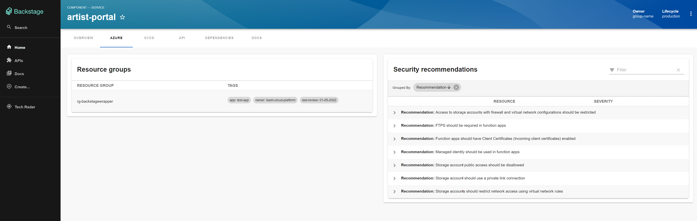

# Azure resources front-end

This plugin shows information about Azure resources related to your Backstage entity.



## Getting started

[First install the backend plugin](https://github.com/backstage/community-plugins/tree/main/workspaces/azure-resources/plugins/backstage-azure-resources-backend). After that follow the below instructions.

```
# From your Backstage root directory
yarn add --cwd packages/app @backstage-community/plugin-azure-resources
```

Add the following to `packages\app\src\components\catalog\EntityPage.tsx` The below enables all entity cards. Security, Cost advisor, and resource group.

```TypeScript
import { AzureResourceEntityOverviewCard, AZURE_ANNOTATION_TAG_SELECTOR, EntityAzureSecurityOverviewCard,EntityAzureCostAdviceOverviewCard, isAzureResourceEnabled } from '@backstage-community/plugin-azure-resources';
```

```TypeScript
const azureResourceContent = (
  <EntitySwitch>
    <EntitySwitch.Case if={isAzureResourceEnabled}>
    <Grid container spacing={3} alignItems="stretch">
      <Grid item md={6}>
        <AzureResourceEntityOverviewCard />
      </Grid>
      <Grid item md={6}>
        <EntityAzureSecurityOverviewCard />
      </Grid>
      <Grid item md={6}>
        <EntityAzureCostAdviceOverviewCard />
      </Grid>
    </Grid>
    </EntitySwitch.Case>
    <EntitySwitch.Case>
      <>
        <MissingAnnotationEmptyState annotation={AZURE_ANNOTATION_TAG_SELECTOR} />
      </>
    </EntitySwitch.Case>
  </EntitySwitch>
);

```

```TypeScript
    <EntityLayout.Route path="/azure" title="Azure">
      {azureResourceContent}
    </EntityLayout.Route>
```

### Annotation

This plugin use a custom annotation from your entity. To use the plugin add the following annotation:

```YAML
annotations:
    azure.com/tag-selector: key/value
```

When doing Azure Resource Graph queries the plugin will use the tag key and its value to pull information.
