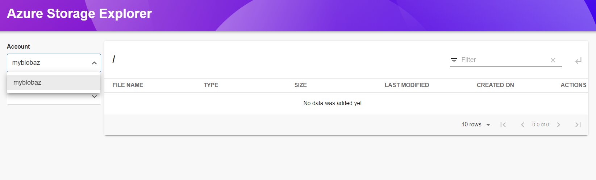
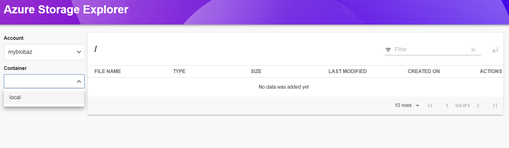
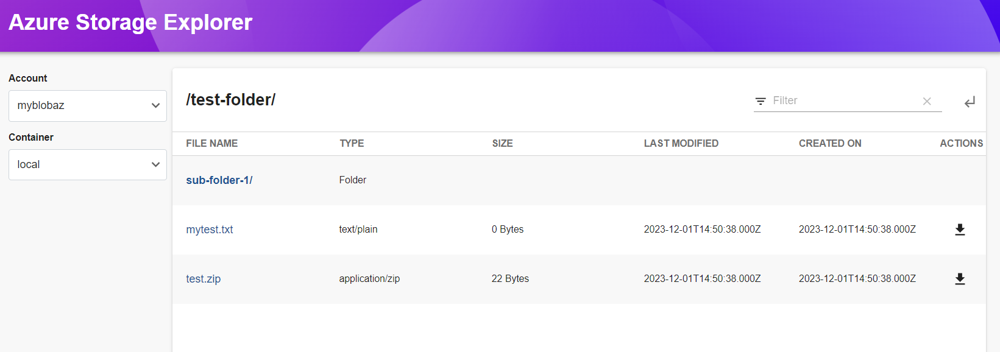
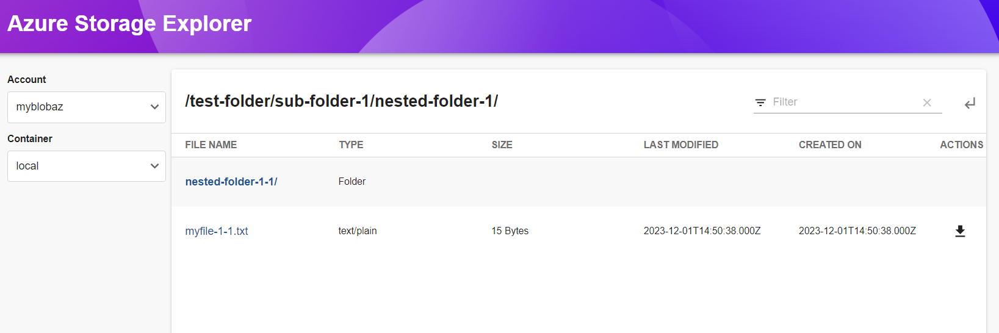
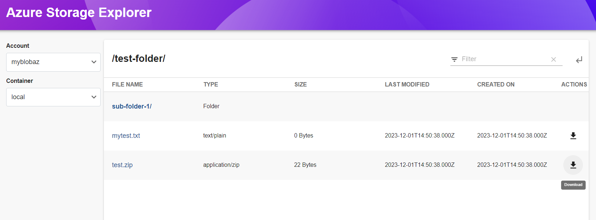

# Azure Storage

Welcome to the `AzureStorage` plugin!

## Intruduction

This plugin helps to explore (navigate and download) the blobs in Azure storage account.











## Getting started

### AzureStorage Installation

This plugin needs to be added to an existing backstage instance.

```bash
# From your Backstage root directory
yarn --cwd packages/backend add @backstage-community/plugin-azure-storage-explorer
```

### Configure Route

Add the following lines in `packages/app/src/App.tsx` to create new route

```typescript
import { AzureStoragePage } from 'backstage-plugin-azure-storage';

const routes = (
  <FlatRoutes>
    {/* ...other routes */}
    <Route path="/azure-storage" element={<AzureStoragePage />} />
    {/* ...other routes */}
  </FlatRoutes>
);
```

### Configure SideBar

Add the following line in `packages/app/src/components/Root/Root.tsx` to create a new element in the Sidebar

```typescript
import FolderIcon from '@material-ui/icons/Folder';

<SidebarPage>
  {/* ...other contents */}
  <SidebarItem
    icon={FolderIcon}
    to="azure-storage"
    text="Azure Storage Explorer"
  />
  {/* ...other contents */}
</SidebarPage>;
```

### AzureStorage Backend Installation

This plugin needs to be added to an existing backstage instance. Uou can find the instructions in [Readme.md](https://github.com/backstage/community-plugins/blob/main/workspaces/azure-storage-explorer/plugins/azure-storage-backend/README.md).
