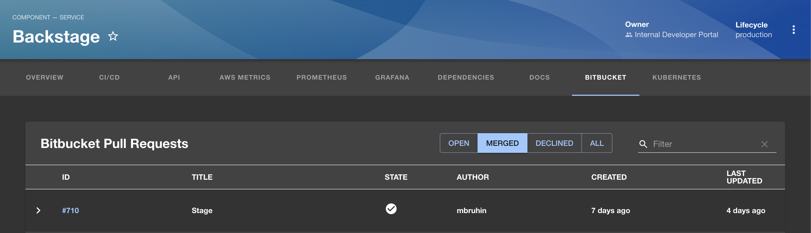

# Bitbucket PullRequest Plugin for Backstage



## Features

- List of PR's from particular bitbucket repo
- Filtering like OPEN/CLOSED/MERGED/ALL PR and Search
- Able to view Creator name, Created date and last update etc.
- We can go to Particular PR by clicking ID.

## Limitations

This plugin currently only works with Bitbucket Data center. Bitbucket cloud uses a different API to get pull requests [documented here](https://developer.atlassian.com/cloud/bitbucket/rest/api-group-pullrequests/#api-repositories-workspace-repo-slug-pullrequests-get). Contributions are welcome to add support for Bitbucket cloud.

## How to add Bitbucket PR plugin to Backstage app

1. Install the plugin into Backstage.

```bash
cd packages/app
yarn add @backstage-community/plugin-bitbucket-pull-requests
```

2. Add plugin API to your Backstage instance.

```ts
// packages/app/src/components/catalog/EntityPage.tsx
import { EntityBitbucketPullRequestsContent } from '@backstage-community/plugin-bitbucket-pull-requests';

...

const serviceEntityPage = (
  <EntityLayout>
    ...
        <EntityLayout.Route path="/bitbucket-pullrequests" title="Bitbucket">
            <EntityBitbucketPullRequestsContent />
        </EntityLayout.Route>
    ...
  </EntityLayout>
```

3. Add proxy config

```yaml
// app-config.yaml
proxy:
  '/bitbucket/api':
    target: https://bitbucket.org
    changeOrigin: true
    headers:
      Authorization: Bearer ${BITBUCKET_TOKEN}
      Accept: 'application/json'
      Content-Type: 'application/json'

bitbucket:
  # Defaults to /bitbucket/api and can be omitted if proxy is configured for that url
  proxyPath: /bitbucket/api
```

4. Run backstage app with `yarn start` and navigate to services tabs.

## How to use Bitbucket PR plugin in Backstage

- Add annotation to the yaml config file of a component

```yaml
metadata:
  annotations:
    bitbucket.com/project-slug: <example-bitbucket-project-name>/<example-bitbucket-repo-name>
```

## Adding Bitbucket Pull Requests to your Homepage

This plugin also provides a homepage component that displays your Bitbucket pull requests directly on your Backstage homepage.


### Features

- View pull requests assigned to you or authored by you in a tabbed interface
- Shows PR ID, title, repository, branch, author/reviewers information, and build status (can be disabled)

### How to add to your Homepage

1. Make sure you've installed this plugin and configured the proxy as described above.

2. Make sure you've installed the homepage plugin and configured it as described in the [official documentation](https://github.com/backstage/backstage/tree/master/plugins/home#readme).

3. Add the component to your homepage:

```tsx
// packages/app/src/components/home/HomePage.tsx
import { HomePagePullRequestsCard } from '@backstage-community/plugin-bitbucket-pull-requests';

export const HomePage = () => (
  <Page themeId="home">
    <Content>
      <Grid container spacing={3}>
        {/* Other homepage components */}
        <Grid item xs={12} md={6}>
          {/* Default: includes build status column */}
          <HomePagePullRequestsCard />

          {/* Or disable the build status column */}
          {/* <HomePagePullRequestsCard buildStatus={false} /> */}
        </Grid>
      </Grid>
    </Content>
  </Page>
);
```

### Props

| Prop          | Type    | Default | Description                                                            |
| ------------- | ------- | ------- | ---------------------------------------------------------------------- |
| `buildStatus` | boolean | `true`  | Whether to show build status column and fetch build status information |
