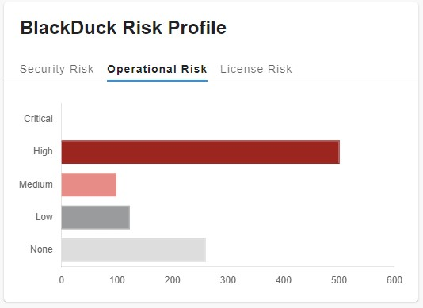
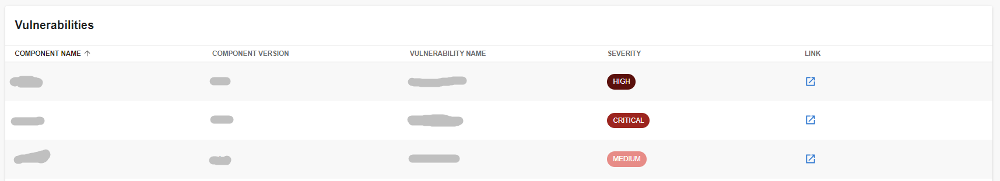

# blackduck

Welcome to the blackduck plugin!

## Getting started

### Overview

#### Overview Page - BlackDuck Risk Profile Chart



#### Service Entiry Page - BlackDuck Vulnerability Table List



The following sections will help you get the BlackDuck plugin setup.

## BlackDuck Backend

You need to setup the [BlackDuck backend plugin](https://github.com/backstage/community-plugins/blob/main/workspaces/blackduck/plugins/blackduck-backend) before you move forward with any of these steps if you haven't already

## Installation

This plugin needs to be added to an existing backstage instance.

```bash
# From your Backstage root directory
yarn add --cwd packages/app @backstage-community/plugin-blackduck
```

## BlackDuck Risk Profile Card in to Overview page

Add the following into `packages/app/src/components/catalog/EntityPage.tsx`.

### EntityPage.tsx

```typescript
// ...
import { RiskCard } from '@backstage-community/plugin-blackduck';
// ...
const overviewContent = (
  <Grid container spacing={3} alignItems="stretch">
    {entityWarningContent}
    <Grid item md={6}>
      <EntityAboutCard variant="gridItem" />
    </Grid>
    //...
    <Grid item md={6} xs={12}>
      <RiskCard />
    </Grid>
    <Grid item md={8} xs={12}>
      <EntityHasSubcomponentsCard variant="gridItem" />
    </Grid>
  </Grid>
);
```

### BlackDuck Vulnerability Table List in to Service Entity

Add the following into `packages/app/src/components/catalog/EntityPage.tsx` and add the following.

```typescript
// ...
import { BlackDuckPage } from '@backstage-community/plugin-blackduck';
// ...
const serviceEntityPage = (
  <EntityLayout>
    <EntityLayout.Route path="/" title="Overview">
      {overviewContent}
    </EntityLayout.Route>
    <EntityLayout.Route path="/ci-cd" title="CI/CD">
      {cicdContent}
    </EntityLayout.Route>
    //...
    <EntityLayout.Route path="/blackduck" title="Security">
      <BlackDuckPage />
    </EntityLayout.Route>
    // ...
  </EntityLayout>
);
```

`Note: If you dont want to display the Service page if no annotation specified in catalog.`

```typescript
//...
import {
  BlackDuckPage,
  isBlackDuckAvailable,
} from '@backstage-community/plugin-blackduck';
//...
<EntityLayout.Route
  if={isBlackDuckAvailable}
  path="/blackduck"
  title="BlackDuck"
>
  <BlackDuckPage />
</EntityLayout.Route>;
// ...
```
