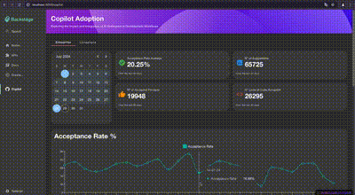

Aqui está o README ajustado, agora incluindo a nova funcionalidade para selecionar um time e comparar suas métricas com os dados gerais:

---

# GitHub Copilot Plugin

Welcome to the GitHub Copilot Plugin!

## Layout



## Overview

The GitHub Copilot Plugin enhances your Backstage experience by providing features tailored to both enterprise and organization management.

## Features

- **Enterprise and Organization Integration**: Seamlessly integrate functionalities for GitHub Enterprise and GitHub Organizations.
- **Team Metrics Comparison**: Select a team and compare its metrics with the overall data, offering more insights into individual team performance.

## Setup

The following sections will help you get the GitHub Copilot Plugin setup and running.

### Backend

You need to set up the Copilot backend plugin ([copilot-backend](../copilot-backend/README.md)) before you move forward with any of the following steps if you haven't already.

## Installation

To start using the GitHub Copilot Plugin, follow these steps:

1. **Install Dependencies**:

   ```bash
   yarn add @backstage-community/plugin-copilot
   ```

2. **Configure Routes**:

   **App.tsx**:

   ```tsx
   import { CopilotIndexPage } from '@backstage-community/plugin-copilot';

   // Add the routes
   <Route path="/copilot" element={<CopilotIndexPage />} />;
   ```

   **Root.tsx**:

   ```tsx
   import { CopilotSidebar } from '@backstage-community/plugin-copilot';
   // Add the copilot sidebar
   <SidebarScrollWrapper>
     <CopilotSidebar />
   </SidebarScrollWrapper>;
   ```
