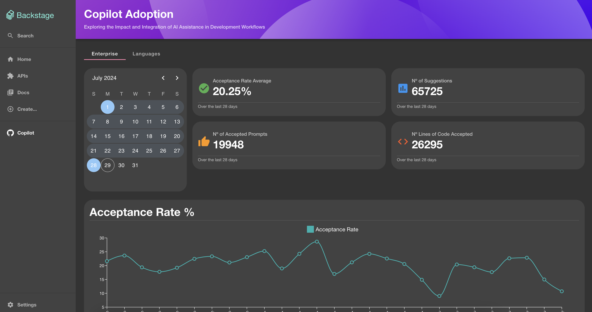
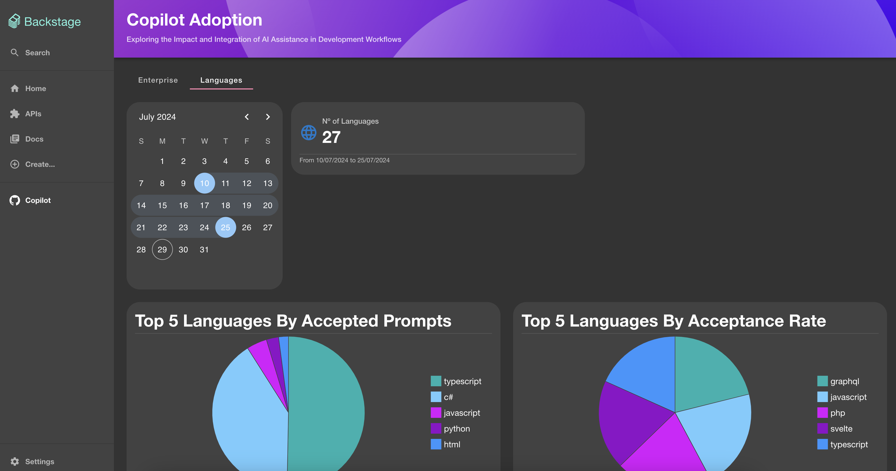

# GitHub Copilot Plugin

Welcome to the GitHub Copilot Plugin!

## Layout






## Overview

The GitHub Copilot Plugin enhances your Backstage experience by providing features tailored to enterprise management.

## Features

- **Enterprise Integration**: Seamlessly integrate enterprise-level functionalities.

## Setup

The following sections will help you get the GitHub Copilot Plugin setup and running.

### Backend

You need to setup the Copilot backend plugin ([copilot-backend](../copilot-backend/README.md)) before you move forward with any of the following steps if you haven't already.

## Installation

To start using the GitHub Copilot Plugin, follow these steps:

1. **Install Dependencies**:

   ```bash
   yarn add @backstage-community/plugin-copilot
   ```

2. **Configure Routes**:

   **App.tsx**:

   ```tsx
   import { CopilotPage } from '@backstage-community/plugin-copilot';
   // Add route
   <Route path="/copilot" element={<CopilotPage />} />;
   ```

   **Root.tsx**:

   ```tsx
   import GithubIcon from '@mui/icons-material/GitHub';
   // Add sidebar item
   <SidebarScrollWrapper>
     <SidebarItem icon={GithubIcon} to="copilot" text="Copilot" />
   </SidebarScrollWrapper>;
   ```
