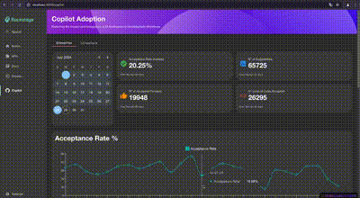

# GitHub Copilot Plugin

Welcome to the GitHub Copilot Plugin!

## Layout



## Overview

The GitHub Copilot Plugin enhances your Backstage experience by providing GitHub Copilot usage insights for both enterprise and organization scopes.

The plugin now defaults to the V2 dashboard, backed by GitHub's report-based Copilot metrics API. The older dashboard remains available as a transitional legacy view.

## Features

- **Enterprise and Organization Integration**: Use the dashboard with a GitHub enterprise, a GitHub organization, or both.
- **V2 Insights Dashboard**: View daily totals, feature usage, IDE breakdowns, language views, model usage, and PR metrics from the new GitHub reports API.
- **Legacy Dashboard Access**: Keep the pre-V2 dashboard available during migration when you need to compare behavior.
- **Team Filtering**: Filter V2 data by team when backend ingestion is configured to collect team membership data.

_GitHub APIs will only show metrics for teams of 5 or more active users per day_

## Setup

The following sections will help you get the GitHub Copilot Plugin setup and running.

### Backend

You need to set up the Copilot backend plugin ([copilot-backend](../copilot-backend/README.md)) before you move forward with any of the following steps if you haven't already.

## Installation

To start using the GitHub Copilot Plugin, follow these steps:

1. **Install Dependencies**:

   ```bash
   # From your Backstage root directory
   yarn --cwd packages/app add @backstage-community/plugin-copilot
   ```

2. **Configure Routes**:

   **App.tsx**:

   ```tsx
   import { CopilotIndexPage } from '@backstage-community/plugin-copilot';

   // Add the route
   const routes = (
     <FlatRoutes>
       // ...
       <Route path="/copilot" element={<CopilotIndexPage />} />
     </FlatRoutes>
   );
   ```

`CopilotIndexPage` now renders the V2 dashboard by default.

**Root.tsx**:

```tsx
import { CopilotSidebar } from '@backstage-community/plugin-copilot';

// Add the CopilotSidebar component somewhere inside your SidebarPage
export const Root = ({ children }: PropsWithChildren<{}>) => (
  <SidebarPage>
    <Sidebar>
      {/* ... */}
      <SidebarGroup label="Menu" icon={<MenuIcon />}>
         {/* ... */}
        <SidebarScrollWrapper>
         <CopilotSidebar />
        </SidebarScrollWrapper>
         {/* ... */}
     </SidebarGroup>
     {/* ... */}
  </SidebarPage>
);
```

## New Frontend System

### Setup

If you're using [feature discovery](https://backstage.io/docs/frontend-system/architecture/app/#feature-discovery), the plugin should be automatically discovered and enabled. Otherwise, you can manually enable the plugin by adding it to your app:

```tsx
// packages/app/src/App.tsx
import copilotPlugin from '@backstage-community/plugin-copilot/alpha';

const app = createApp({
  features: [
    // ...
    copilotPlugin,
  ],
});
```

### Extensions

The following extensions are available in the plugin:

- `api:copilot`
- `page:copilot`
- `nav-item:copilot`

## Frontend Configuration

The frontend reads the following `app-config.yaml` settings:

- `copilot.enterprise`: Enterprise slug to use for the dashboard.
- `copilot.organization`: Organization slug to use for the dashboard.
- `copilot.defaultView`: Optional default scope when both enterprise and organization are configured. Supported values are `enterprise` and `organization`.
- `copilot.showLegacyView`: When `true`, the sidebar shows a link to the legacy dashboard.

Example:

```yaml
copilot:
  enterprise: my-enterprise
  organization: my-organization
  defaultView: enterprise
  showLegacyView: true
```

## Routes And Legacy Dashboard

- `/copilot`: Default Copilot route. This now renders the V2 dashboard.
- `/copilot/v2`: Explicit V2 dashboard route.
- `/copilot/legacy`: Legacy dashboard route.
- `/copilot/enterprise` and `/copilot/organization`: Older legacy routes kept for backward compatibility.

The legacy dashboard is useful during migration while you verify V2 backfill coverage. The sidebar only shows a dedicated legacy entry when `copilot.showLegacyView: true`, but direct navigation to `/copilot/legacy` still works.

## Migration Notes

This plugin moved to V2 because GitHub replaced the older direct metrics endpoints with a report-based API. Instead of returning metrics inline, GitHub now returns signed download URLs for daily reports.

That change affects the frontend in three visible ways:

1. V2 is the default UI.
2. Historical data in V2 depends on backend backfill from the GitHub report window, which starts at `2025-10-10`.
3. Team filtering in V2 depends on backend ingestion of user and user-team reports.

For operator upgrade steps and configuration guidance, see [../../docs/copilot-v2-migration-guide.md](../../docs/copilot-v2-migration-guide.md).
