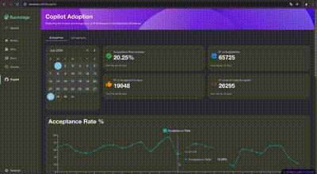

# GitHub Copilot Plugin

Welcome to the GitHub Copilot Plugin!

## Layout



## Overview

The GitHub Copilot Plugin enhances your Backstage experience by providing GitHub Copilot usage insights for both enterprise and organization scopes.

The plugin now defaults to the V2 dashboard, backed by GitHub's report-based Copilot metrics API. The older dashboard remains available as a transitional legacy view.

## Features

- **Enterprise and Organization Integration**: Use the dashboard with a GitHub enterprise, a GitHub organization, or both.
- **V2 Insights Dashboard**: View daily totals, feature usage, IDE breakdowns, language views, model usage, and PR metrics from the new GitHub reports API.
- **Legacy Dashboard Access**: Keep the pre-V2 dashboard available during migration when you need to compare behavior.
- **Team Filtering**: Filter V2 data by team when backend ingestion is configured to collect team membership data.
- **Individual ("Me") Metrics**: A privacy-scoped view, mounted by default at `/copilot/me`, that shows only the signed-in user's own Copilot usage and consumption — see [Individual ("Me") Metrics](#individual-me-metrics) below.

_GitHub APIs will only show metrics for teams of 5 or more active users per day_

## Setup

The following sections will help you get the GitHub Copilot Plugin setup and running.

### Backend

You need to set up the Copilot backend plugin ([copilot-backend](../copilot-backend/README.md)) before you move forward with any of the following steps if you haven't already.

## Installation

To start using the GitHub Copilot Plugin, follow these steps:

1. **Install Dependencies**:

   ```bash
   # From your Backstage root directory
   yarn --cwd packages/app add @backstage-community/plugin-copilot
   ```

2. **Configure Routes**:

   **App.tsx**:

   ```tsx
   import { CopilotIndexPage } from '@backstage-community/plugin-copilot';

   // Add the route
   const routes = (
     <FlatRoutes>
       // ...
       <Route path="/copilot" element={<CopilotIndexPage />} />
     </FlatRoutes>
   );
   ```

`CopilotIndexPage` now renders the V2 dashboard by default.

**Root.tsx**:

```tsx
import { CopilotSidebar } from '@backstage-community/plugin-copilot';

// Add the CopilotSidebar component somewhere inside your SidebarPage
export const Root = ({ children }: PropsWithChildren<{}>) => (
  <SidebarPage>
    <Sidebar>
      {/* ... */}
      <SidebarGroup label="Menu" icon={<MenuIcon />}>
         {/* ... */}
        <SidebarScrollWrapper>
         <CopilotSidebar />
        </SidebarScrollWrapper>
         {/* ... */}
     </SidebarGroup>
     {/* ... */}
  </SidebarPage>
);
```

## New Frontend System

### Setup

If you're using [feature discovery](https://backstage.io/docs/frontend-system/architecture/app/#feature-discovery), the plugin should be automatically discovered and enabled. Otherwise, you can manually enable the plugin by adding it to your app:

```tsx
// packages/app/src/App.tsx
import copilotPlugin from '@backstage-community/plugin-copilot/alpha';

const app = createApp({
  features: [
    // ...
    copilotPlugin,
  ],
});
```

### Extensions

The following extensions are available in the plugin:

- `api:copilot`
- `page:copilot`
- `sub-page:copilot/me`
- `nav-item:copilot`

## Individual ("Me") Metrics

`api:copilot` and `page:copilot` power the org/team-scoped V2 dashboard. The
plugin also mounts a **privacy-scoped, individual metrics view** — showing
only the signed-in user's own Copilot usage and consumption, reusing the
same charts and controls as the main dashboard, scoped to the caller's own
data.

By default it's mounted as a `me` sub-page (tab) of the main Copilot
Insights page, at `/copilot/me`. It only supports **v2 metrics** — there is
no v1 support for this view.

### Privacy design

This view is built around a single hard rule: **a user can only ever see
their own metrics**, never anyone else's, through any API this plugin
exposes.

- The frontend API client ([`MyMetricsApi`](./src/me/api/MyMetricsApi.ts))
  has a single method, `getMyDashboard`, whose parameters have **no field**
  for a user or team identifier — it is structurally impossible to use this
  client to ask for someone else's data.
- The backend route it calls, `GET /v2/me/dashboard` (see
  [copilot-backend](../copilot-backend/README.md#individual-me-metrics)),
  resolves the caller's own GitHub login exclusively from their own request
  credentials, never from a query parameter.
- If the caller's login cannot be resolved to any ingested Copilot data, the
  route returns `{ matched: false }` (HTTP 200) rather than an error, to
  avoid leaking any signal about other users or teams.

### User matching

Because Backstage identities and GitHub Copilot usernames are two different
namespaces, the backend needs a way to resolve "the signed-in Backstage
user" to "a GitHub login". This is handled via the pluggable
`CopilotUserResolver` extension point (`copilotUserResolverExtensionPoint`),
exported from `@backstage-community/plugin-copilot-backend` — see that
plugin's README for the default behavior and how to customize it.

### Overriding the mount point

The `me` sub-page is a regular `SubPageBlueprint` extension
(`sub-page:copilot/me`), attached to the `page:copilot` extension's `pages`
input. Consumers who want to mount it somewhere else (e.g. as a tab in
`/settings`, or as a standalone page) can override this attachment with a
frontend module:

```tsx
// packages/app/src/modules/copilot-me-override/index.tsx
import {
  createFrontendModule,
  SubPageBlueprint,
} from '@backstage/frontend-plugin-api';

export const copilotMeOverrideModule = createFrontendModule({
  pluginId: 'copilot',
  extensions: [
    SubPageBlueprint.make({
      name: 'me',
      attachTo: { id: 'page:user-settings', input: 'pages' },
      params: {
        path: 'copilot-me',
        title: 'Copilot Metrics',
        loader: () =>
          import('@backstage-community/plugin-copilot').then(m => (
            <m.MyMetricsContent />
          )),
      },
    }),
  ],
});
```

then install `copilotMeOverrideModule` alongside `copilotPlugin` in your
app's feature list. See `packages/app/src/modules/copilot-me-override` in
this workspace for a complete, working example.

## Frontend Configuration

The frontend reads the following `app-config.yaml` settings:

- `copilot.enterprise`: Enterprise slug to use for the dashboard.
- `copilot.organization`: Organization slug to use for the dashboard.
- `copilot.defaultView`: Optional default scope when both enterprise and organization are configured. Supported values are `enterprise` and `organization`.
- `copilot.showLegacyView`: When `true`, the sidebar shows a link to the legacy dashboard.
- `copilot.showUserMetrics`: Set to `false` to disable the individual ("me") metrics view — it will render a message explaining the feature has been turned off, rather than being removed from navigation. Defaults to `true`.

Example:

```yaml
copilot:
  enterprise: my-enterprise
  organization: my-organization
  defaultView: enterprise
  showLegacyView: true
  showUserMetrics: true
```

## Routes And Legacy Dashboard

- `/copilot`: Default Copilot route. This now renders the V2 dashboard.
- `/copilot/v2`: Explicit V2 dashboard route.
- `/copilot/me`: The signed-in user's own, privacy-scoped Copilot metrics — see [Individual ("Me") Metrics](#individual-me-metrics) above.
- `/copilot/legacy`: Legacy dashboard route.
- `/copilot/legacy/enterprise` and `/copilot/legacy/organization`: Older legacy routes kept for backward compatibility.

The legacy dashboard is useful during migration while you verify V2 backfill coverage. The sidebar only shows a dedicated legacy entry when `copilot.showLegacyView: true`, but direct navigation to `/copilot/legacy` still works.

### Testing the individual ("me") view with the guest auth provider

Because `/copilot/me` always resolves the caller's GitHub login from their
own signed-in entity ref (see [User matching](#user-matching) above), the
default `guest` sign-in identity (`user:default/guest`) won't match any
ingested Copilot data — there's no GitHub user called `guest`.

To test this view locally against real ingested data, override the guest
user's entity ref in `app-config.yaml` to use a GitHub username that
actually has ingested Copilot metrics:

```yaml
auth:
  providers:
    guest:
      # Overrides the guest user's entity ref so that signing in as guest
      # resolves to a real GitHub login with ingested Copilot metrics, for
      # local testing of the /copilot/me individual metrics view.
      userEntityRef: user:default/your-github-username
```

With the default `DefaultCopilotUserResolver`, the `name` part of this
entity ref (`your-github-username`) is used directly as the GitHub login, so
signing in as guest will resolve to that user's own metrics — no catalog
entity for that user needs to exist.

## Migration Notes

This plugin moved to V2 because GitHub replaced the older direct metrics endpoints with a report-based API. Instead of returning metrics inline, GitHub now returns signed download URLs for daily reports.

That change affects the frontend in three visible ways:

1. V2 is the default UI.
2. Historical data in V2 depends on backend backfill from the GitHub report window, which starts at `2025-10-10`.
3. Team filtering in V2 depends on backend ingestion of user and user-team reports.

For operator upgrade steps and configuration guidance, see [../../docs/copilot-v2-migration-guide.md](../../docs/copilot-v2-migration-guide.md).
