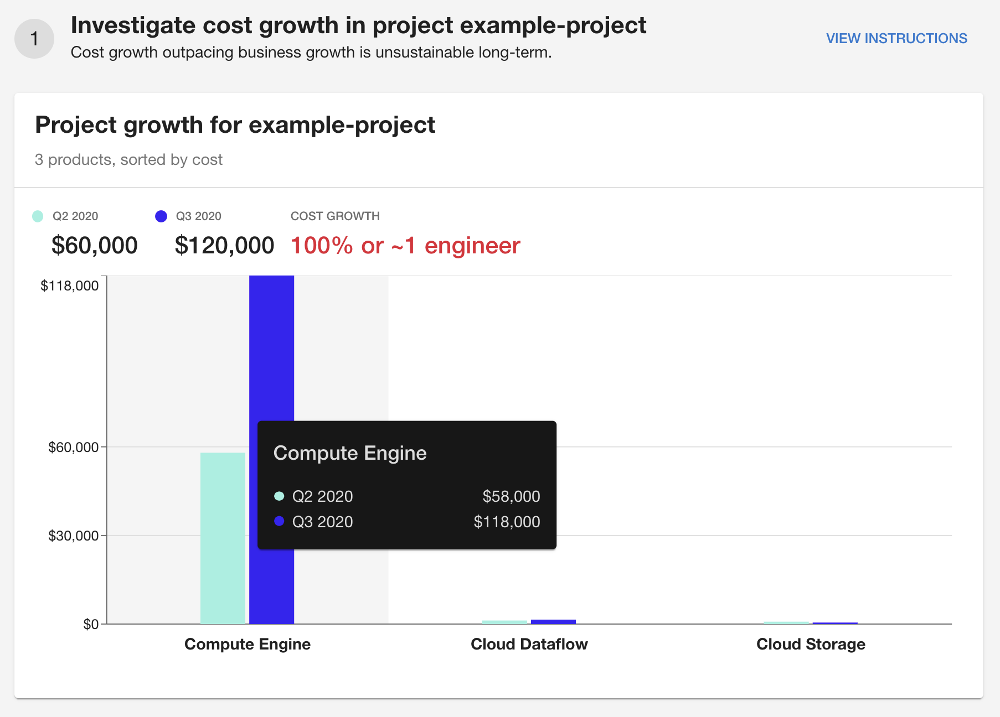
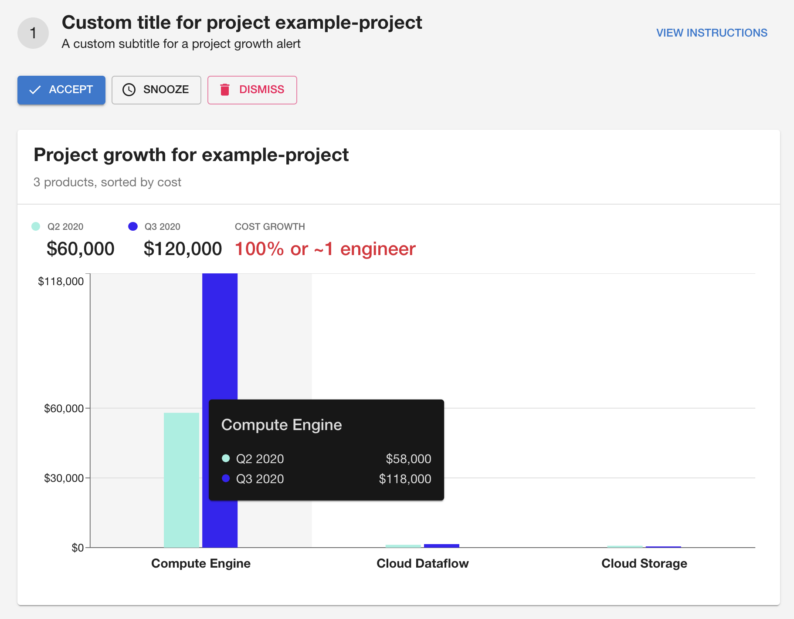
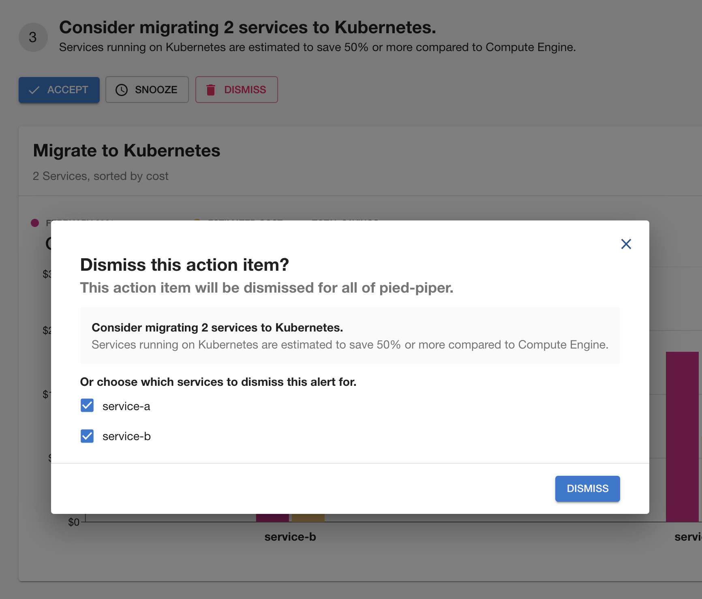

# Cost Insights Alerts

Cost Insights supports custom and ready-to-use alerts such as [project growth](https://github.com/backstage/backstage/blob/master/plugins/cost-insights/src/alerts/ProjectGrowthAlert.tsx) and [unlabeled dataflow](https://github.com/backstage/backstage/blob/master/plugins/cost-insights/src/alerts/UnlabeledDataflowAlert.tsx) alerts. These exported alerts do not require any UI or additional configuration but are extendable for custom implementations.

### Basic Setup

Project growth alerts, for example, can be used to alert users to increased cost growth in a Google Cloud project within the past 30 days.



```ts
// client.ts
import { ProjectGrowthAlert, ProjectGrowthData } from '@backstage-community/plugin-cost-insights';

export class CostInsightsClient extends CostInsightsApi {

  ...

  async getAlerts(group: string): Promise<Alert[]> {
    const data: ProjectGrowthData = await getAlertDataSomehow(group);
    return [
      new ProjectGrowthAlert({
        project: data.project,
        products: data.products,
        periodEnd: data.periodEnd,
        periodStart: data.periodStart,
        aggregation: data.aggregation,
        change: data.change
      })
    ]
  }
}

```

### Custom Setup

Default properties such as the title, subtitle and instructions page URL can be overridden - even default UI such as chart itself. Additionally, alerts can be extended to support actions such as snoozing or dismissing.



```ts
// ./ProjectGrowthAlert.ts

import {
  Alert,
  AlertOptions,
  AlertDismissFormData,
  AlertSnoozeFormData,
  ProjectGrowthAlert as DefaultProjectGrowthAlert,
  ProjectGrowthData
} from '@backstage-community/plugin-cost-insights';

export class ProjectGrowthAlert extends DefaultProjectGrowthAlert {

  constructor(data: ProjectGrowthData){
    super(data);
  }

  get url(){
    return '/path/to/your/docs';
  }

  get title(){
    return `Custom title for ${this.data.project}`;
  }

  get subtitle(){
    return 'A custom subtitle for a project growth alert';
  }

  // render a custom component in the Action Items section
  get element(){
    return <MyCustomChart data={this.data} />
  }

  async onAccepted(options: AlertOptions<null>): Promise<Alert>{
    ...
  }

  async onDismissed(options: AlertOptions<AlertDismissFormData>): Promise<Alert>{
    ...
  }

  async onSnoozed(options: AlertOptions<AlertSnoozeFormData>): Promise<Alert>{
    ...
  }
}
```

```ts
// client.ts
import { ProjectGrowthAlert } from './ProjectGrowthAlert';

export class CostInsightsClient extends CostInsightsApi {

  ...

  async getAlerts(group: string): Promise<Alert[]> {
    const data: ProjectGrowthData = await getAlertDataSomehow(group);
    return [
      new ProjectGrowthAlert({
        project: data.project,
        products: data.products,
        periodEnd: data.periodEnd,
        periodStart: data.periodStart,
        aggregation: data.aggregation,
        change: data.change
      })
    ]
  }
}
```

### Advanced Setup

Alerts can render their own custom forms for actions such as snoozing or dismissing if the default UI is insufficient.

Cost Insights exports several core UI components such as the `BarChart` and `LegendItem` to support custom implementations.

**Note**: We recommend using Backstage's [InfoCard](https://backstage.io/storybook/?path=/story/layout-information-card--default) and [Recharts](http://recharts.org/en-US/) to show actionable visualizations.

For more advanced usage, see example [KubernetesMigrationAlert](https://github.com/backstage/backstage/blob/master/plugins/cost-insights/src/example/alerts/KubernetesMigrationAlert.tsx).


