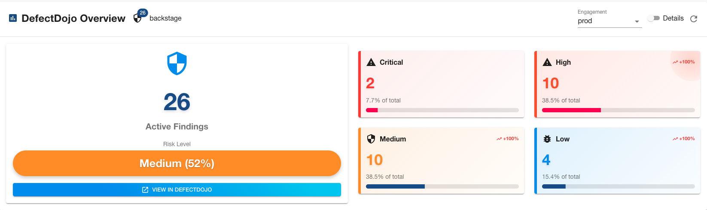
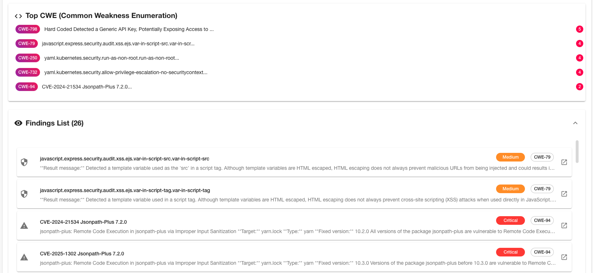

# DefectDojo Backstage Integration

This workspace provides a complete DefectDojo integration for Backstage, including both frontend components and backend services to visualize and manage security findings.

## 📦 Plugins

### Backend Plugin (`@backstage-community/plugin-defectdojo-backend`)

- Complete DefectDojo v2 API integration
- Robust error handling and timeouts
- Automatic pagination for large datasets
- Comprehensive logging and TypeScript support

### Frontend Plugin (`@backstage-community/plugin-defectdojo-frontend`)

- Security vulnerability dashboard with severity metrics
- Expandable findings list with detailed information
- CWE analysis and trend indicators
- Responsive design with direct DefectDojo links

## 🚀 Quick Start

1. **Install both plugins:**

   ```bash
   yarn add --cwd packages/backend @backstage-community/plugin-defectdojo-backend
   yarn add --cwd packages/app @backstage-community/plugin-defectdojo-frontend
   ```

2. **Configure backend** in `packages/backend/src/index.ts`:

   ```typescript
   backend.add(import('@backstage-community/plugin-defectdojo-backend'));
   ```

3. **Add configuration** in `app-config.yaml`:

   ```yaml
   defectdojo:
     baseUrl: https://your-defectdojo-instance.com
     token: ${DEFECTDOJO_TOKEN}
   ```

4. **Add component** to entity pages:

   ```typescript
   import { DefectDojoOverview } from '@backstage-community/plugin-defectdojo-frontend';
   ```

5. **Configure entities** with annotations:
   ```yaml
   metadata:
     annotations:
       defectdojo.org/product-id: '123'
   ```

## 📸 Screenshots

### Security Dashboard


_Security overview showing vulnerability metrics by severity_

### Findings List


_Detailed findings list with expandable information_

## 🔌 API Endpoints

- `GET /api/defectdojo/health` - Health check
- `GET /api/defectdojo/v1/findings?productId={id}` - Get security findings

## 🛠️ Development

```bash
yarn start    # Start development server
yarn test     # Run tests
yarn lint     # Run linting
yarn tsc      # Type check
```

## 📚 Documentation

- [Frontend Plugin README](./plugins/defectdojo/README.md)
- [Backend Plugin README](./plugins/defectdojo-backend/README.md)
- [DefectDojo API Documentation](https://defectdojo.github.io/django-DefectDojo/api-v2-docs/)

## 🤝 Contributing

This project is part of [Backstage Community Plugins](https://github.com/backstage/community-plugins). See individual plugin READMEs for detailed installation and configuration instructions.

## 📄 License

Licensed under the Apache 2.0 License. See [LICENSE](../../LICENSE) for details.
