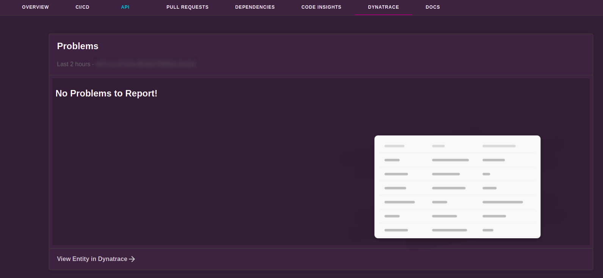

# Dynatrace

Welcome to the Dynatrace plugin!



## Getting started

This plugin uses the Backstage proxy to communicate with Dynatrace's REST APIs.

### Setup

#### Requirements

##### Dynatrace API Key

The Dynatrace plugin will require the following information, to be used in the configuration options detailed below:

- Dynatrace API URL, e.g. `https://my-dynatrace-instance.dynatrace.com/api/v2`
- Dynatrace API access token (see [documentation](https://www.dynatrace.com/support/help/dynatrace-api/basics/dynatrace-api-authentication)), with the following permissions:
  - `entities.read`
  - `problems.read`
  - `DataExport` and/or `ExternalSyntheticIntegration` and/or `ReadSyntheticData`

#### Install

1. Install the plugin on your frontend:

```
# From your Backstage root directory
yarn --cwd packages/app add @backstage-community/plugin-dynatrace
```

2. We created in our catalog the interface for using the integration with Dynatrace.

```diff
# packages/app/src/components/catalog/EntityPage.tsx

[...]
+ import { DynatraceTab, isDynatraceAvailable } from '@backstage-community/plugin-dynatrace'

[...]

const serviceEntityPage = (
  <EntityLayout>
    [...]
+    <EntityLayout.Route
+      path="/dynatrace"
+      title="Dynatrace"
+      if={isDynatraceAvailable}
+    >
+      <DynatraceTab />
+    </EntityLayout.Route>
  </EntityLayout>
)

```

#### Plugin Configuration

This plugin requires a proxy endpoint for Dynatrace configured in `app-config.yaml` like so:

```yaml
proxy:
  endpoints:
    '/dynatrace':
      target: 'https://example.dynatrace.com/api/v2'
      headers:
        Authorization: 'Api-Token ${DYNATRACE_ACCESS_TOKEN}'
```

It also requires a `baseUrl` for rendering links to problems in the table like so:

```yaml
dynatrace:
  baseUrl: 'https://example.dynatrace.com'
```

#### Catalog Configuration

##### View Recent Application Problems

To show information from Dynatrace for a catalog entity, add the following annotation to `catalog-info.yaml`:

```yaml
# catalog-info.yaml
# [...]
metadata:
  annotations:
    dynatrace.com/dynatrace-entity-id: DYNATRACE_ENTITY_ID
# [...]
```

The `DYNATRACE_ENTITY_ID` can be found in Dynatrace by browsing to the entity (a service, synthetic, frontend, workload, etc.). It will be located in the browser address bar in the `id` parameter and has the format `ENTITY_TYPE-ENTITY_ID`, where `ENTITY_TYPE` will be one of `SERVICE`, `SYNTHETIC_TEST`, or other, and `ENTITY_ID` will be a string of characters containing uppercase letters and numbers.

##### Viewing Recent Synthetics Results

To show recent results from a Synthetic Monitor, add the following annotation to `catalog-info.yaml`:

```yaml
# catalog-info.yaml
# [...]
metadata:
  annotations:
    dynatrace.com/synthetics-ids: SYNTHETIC_ID, SYNTHETIC_ID_2, ...
# [...]
```

The annotation can also contain a comma or space separated list of Synthetic Ids to surface details for multiple monitors!

The `SYNTHETIC_ID` can be found in Dynatrace by browsing to the Synthetic monitor. It will be located in the browser address bar in the resource path - `https://example.dynatrace.com/ui/http-monitor/HTTP_CHECK-1234` for an Http check, or `https://example.dynatrace.com/ui/browser-monitor/SYNTHETIC_TEST-1234` for a browser clickpath.

## Contribution

This plugin was originally built by [TELUS](https://github.com/telus).

## Disclaimer

This plugin is not officially supported by Dynatrace.
