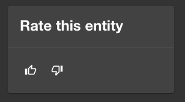
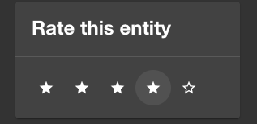
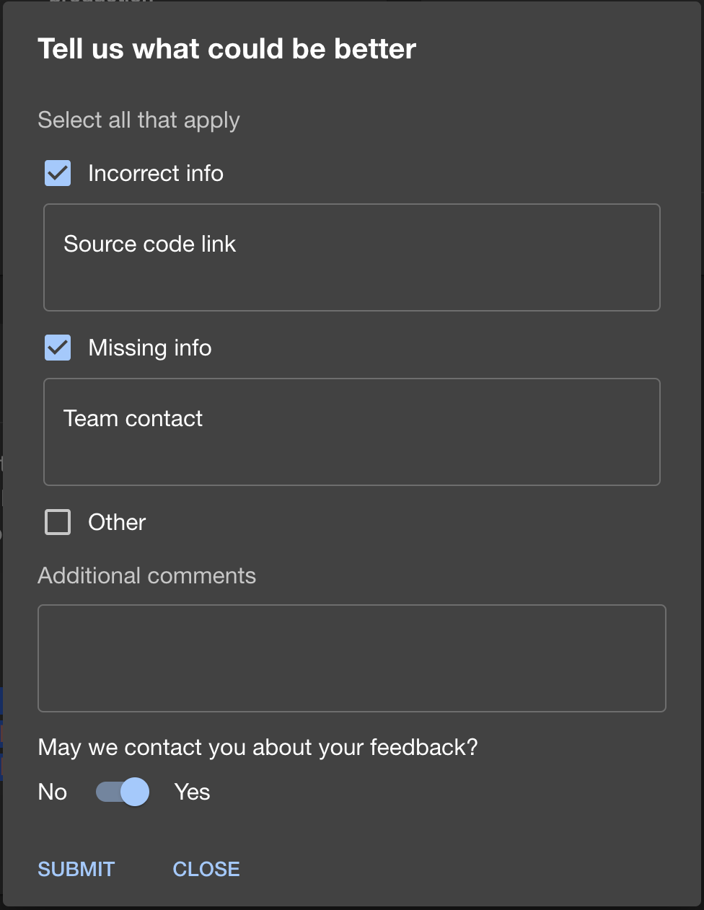
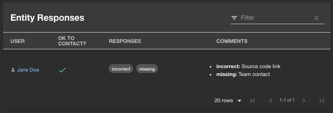
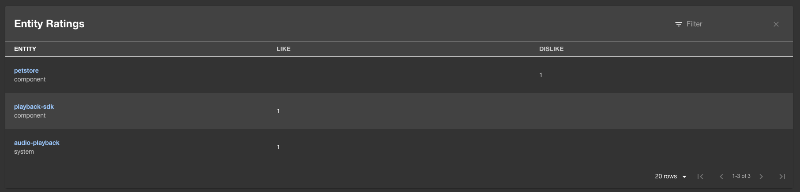
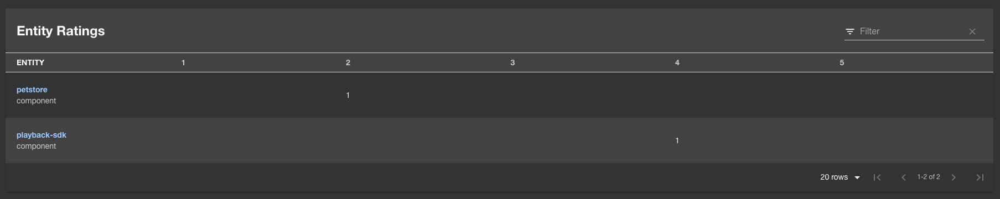

# Entity Feedback Plugin

Welcome to the entity-feedback plugin!

This plugin allows you give and view feedback on entities available in the Backstage catalog.

## Features

### Rate entities

#### Like/Dislike rating



#### Starred rating



### Request additional feedback when poorly rated



### View entity feedback responses



### View aggregated ratings on owned entities

#### Total likes/dislikes



#### Star breakdowns



## Setup

The following sections will help you get the Entity Feedback plugin setup and running.

Note: this plugin requires authentication and identity configured so Backstage can identify
which user has rated the entity. If you are using the guest identity provider which comes
out of the box, this plugin will not work when you test it.

### Backend

You need to setup the [Entity Feedback backend plugin](https://github.com/backstage/community-plugins/tree/main/workspaces/entity-feedback/plugins/entity-feedback-backend) before you move forward with any of these steps if you haven't already

### Installation

Install this plugin:

```bash
# From your Backstage root directory
yarn --cwd packages/app add @backstage-community/plugin-entity-feedback
```

### Entity Pages

Add rating and feedback components to your `EntityPage.tsx` to hook up UI so that users
can rate your entities and for owners to view feedback/responses.

To allow users to apply "Like" and "Dislike" ratings add the following to each kind/type of
entity in your `EntityPage.tsx` you want to be rated (if you prefer to use star ratings, replace
`EntityLikeDislikeRatingsCard` with `EntityStarredRatingsCard` and `LikeDislikeButtons` with
`StarredRatingButtons`):

```diff
import {
  ...
+ InfoCard,
  ...
} from '@backstage/core-components';
+import {
+ EntityFeedbackResponseContent,
+ EntityLikeDislikeRatingsCard,
+ LikeDislikeButtons,
+} from '@backstage-community/plugin-entity-feedback';

// Add to each applicable kind/type of entity as desired
const overviewContent = (
  <Grid container spacing={3} alignItems="stretch">
    ...
+   <Grid item md={2}>
+     <InfoCard title="Rate this entity">
+       <LikeDislikeButtons />
+     </InfoCard>
+   </Grid>
    ...
  </Grid>
);

...

// Add to each applicable kind/type of entity as desired
const serviceEntityPage = (
  <EntityLayoutWrapper>
    ...
+   <EntityLayout.Route path="/feedback" title="Feedback">
+     <EntityFeedbackResponseContent />
+   </EntityLayout.Route>
    ...
  </EntityLayoutWrapper>
);

...

// Add ratings card component to user/group entities to view ratings of owned entities
const userPage = (
  <EntityLayoutWrapper>
    <EntityLayout.Route path="/" title="Overview">
      <Grid container spacing={3}>
        ...
+       <Grid item xs={12}>
+         <EntityLikeDislikeRatingsCard />
+       </Grid>
        ...
        </Grid>
      </Grid>
    </EntityLayout.Route>
  </EntityLayoutWrapper>
);

const groupPage = (
  <EntityLayoutWrapper>
    <EntityLayout.Route path="/" title="Overview">
      <Grid container spacing={3}>
        ...
+       <Grid item xs={12}>
+         <EntityLikeDislikeRatingsCard />
+       </Grid>
        ...
        </Grid>
      </Grid>
    </EntityLayout.Route>
  </EntityLayoutWrapper>
);
```

Note: For a full example of this you can look at [this EntityPage](../../packages/app/src/components/catalog/EntityPage.tsx).

## New Frontend System

Follow these steps to detect and configure the Entity Feedback plugin if you'd like to use it in an application that supports the new Backstage frontend system.

### Package detection

Once you install the `@backstage-community/plugin-entity-feedback` package using your preferred package manager, you have to choose how the package should be detected by the app. The package can be automatically discovered when the feature discovery config is set, or it can be manually enabled via code (for more granular package customization cases, such as extension overrides).

<table>
  <tr>
    <td>Via config</td>
    <td>Via code</td>
  </tr>
  <tr>
    <td>
      <pre lang="yaml">
        <code>
# app-config.yaml
  app:
    # Enable package discovery for all plugins
    packages: 'all'
  ---
  app:
    # Enable package discovery only for Entity Feedback
    packages:
      include:
        - '@backstage-community/plugin-entity-feedback'
        </code>
      </pre>
    </td>
    <td>
      <pre lang="javascript">
       <code>
// packages/app/src/App.tsx
import { createApp } from '@backstage/frontend-defaults';
import entityFeedbackPlugin from '@backstage-community/plugin-entity-feedback/alpha';
//...
const app = createApp({
  // ...
  features: [
    //...
    entityFeedbackPlugin,
  ],
});

//...
</code>

</pre>
</td>

  </tr>
</table>

## Extensions config

Currently, the plugin installs 4 extensions: 1 api, 2 entity cards (buttons and table ratings) and 1 entity page content (also known as entity page tab), see below examples of how to configure the available extensions.

```yml
# app-config.yaml
app:
  extensions:
    # Example disabling the "buttons" rating entity card
    - 'entity-card:entity-feedback/ratings-buttons': false
    # Example customizing the "buttons" rating entity card
    - 'entity-card:entity-feedback/ratings-buttons':
        config:
          variant: 'starred' # (Optional) defaults to "like-dislike"
          title: 'Rating Buttons' # (Optional) defaults to "Rate this entity"
          requireResponse: false # (Optional) defaults to "true"
          dialogTitle: 'What could be better?' # (Optional) defaults to "Tell us what could be better"
          dialogResponses: # (Optional) defaults to "Incorrect info, Missing info and Other"
            - id: 'inaccurate'
              label: 'Inaccurate'
            - id: 'other'
              label: 'Other'
    # Example disabling the "table" rating entity card
    - 'entity-card:entity-feedback/ratings-table': false
    # Example customizing the "table" rating entity card
    - 'entity-card:entity-feedback/ratings-table':
        config:
          variant: 'starred' # (Optional) defaults to "like-dislike"
          title: 'Rating Table' # (Optional) defaults to "Entity Ratings"
          allEntities: true # (Optional) defaults to "false"
    # Example disabling the entity feedback content
    - 'entity-content:entity-feedback': false
    # Example customizing the entity feedback content
    - 'entity-content:entity-feedback':
        config:
          path: '/feedbacks'
          title: 'Feedbacks'
```

## Local Development

To start the mocked example you need to run the front and backend.
Start the backend from `workspaces/entity-feedback/plugins/entity-feedback-backend`

```sh
yarn install
yarn start
```

Then start the frontend example from `workspaces/entity-feedback/plugins/entity-feedback`

```sh
yarn install
yarn start
```

Once that is running you can navigate to `http://localhost:3000/feedback`
