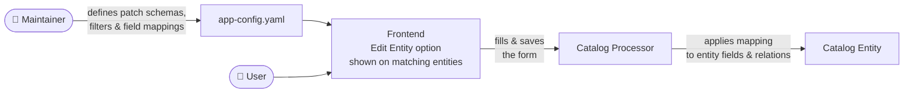

# entity-patch

This workspace contains the plugins that enable UI-driven editing of [Backstage catalog](https://backstage.io/docs/features/software-catalog/) entity fields — without writing custom UI code or editing YAML files manually.

Patches are declared in `app-config.yaml`. An **Edit Entity** context menu item appears on matching entities, opens a form pre-populated from the current entity, and persists changes back to the catalog on save.

## Packages

| Package                                                                                                                      | Description                                                                                                                       |
| ---------------------------------------------------------------------------------------------------------------------------- | --------------------------------------------------------------------------------------------------------------------------------- |
| [`@backstage-community/plugin-entity-patch`](./plugins/entity-patch/README.md)                                               | Frontend plugin. Adds an **Edit Entity** context menu item and a standalone page to catalog entities.                             |
| [`@backstage-community/plugin-entity-patch-backend`](./plugins/entity-patch-backend/README.md)                               | Backend plugin. REST API for storing and retrieving patch data per entity; triggers a catalog refresh on save.                    |
| [`@backstage-community/plugin-catalog-backend-module-entity-patch`](./plugins/catalog-backend-module-entity-patch/README.md) | Catalog processor module. Reads stored patches, applies scalar values to entity fields, and emits custom bidirectional relations. |

## How it works



## Getting Started

```sh
yarn install
yarn start
```

The dev app starts at `http://localhost:3010` with sample catalog entities.
Open the context menu (**⋮**) on any entity and click **Edit Entity**.

## Generating knip reports

```sh
yarn backstage-repo-tools knip-reports
```
