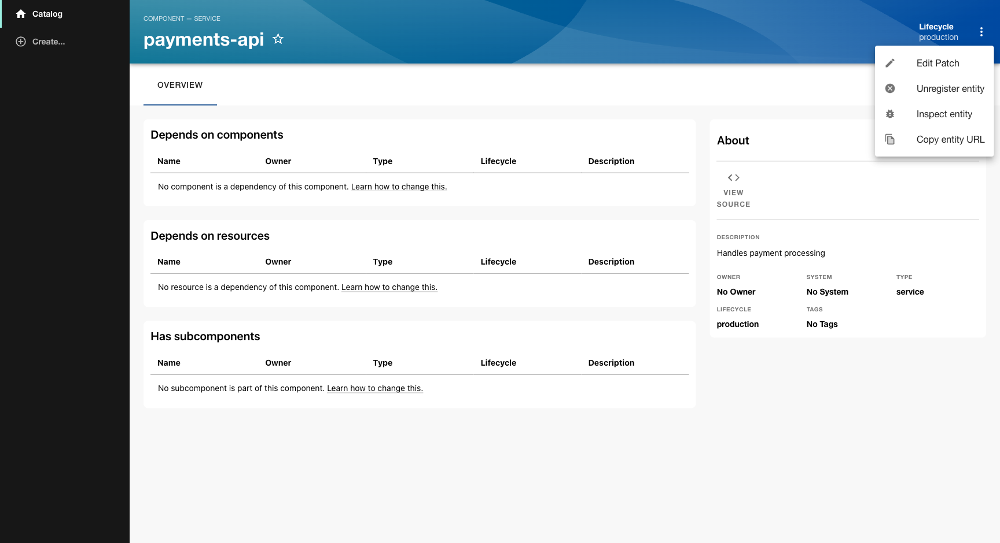
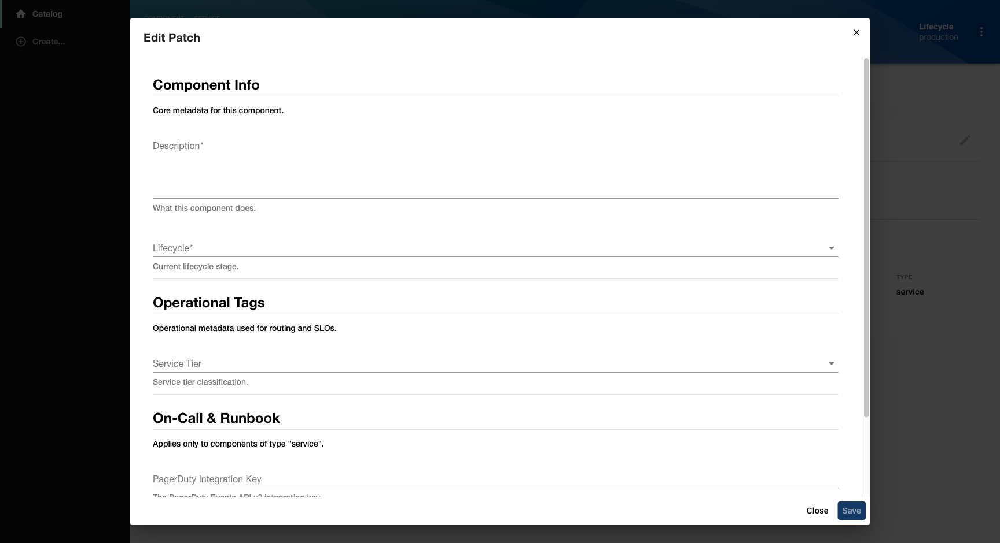
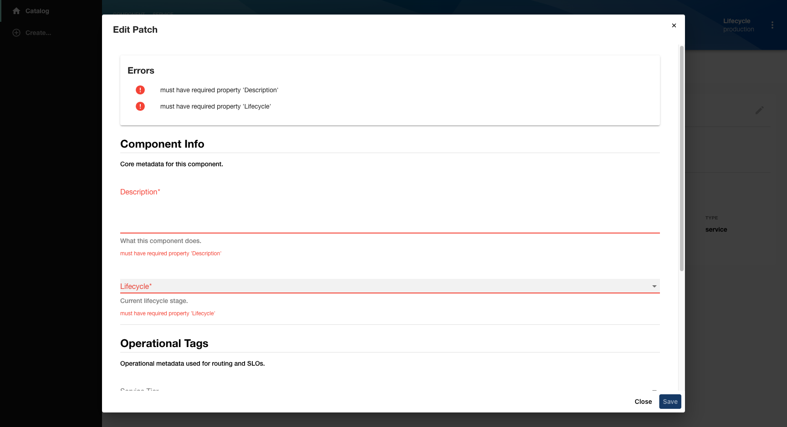
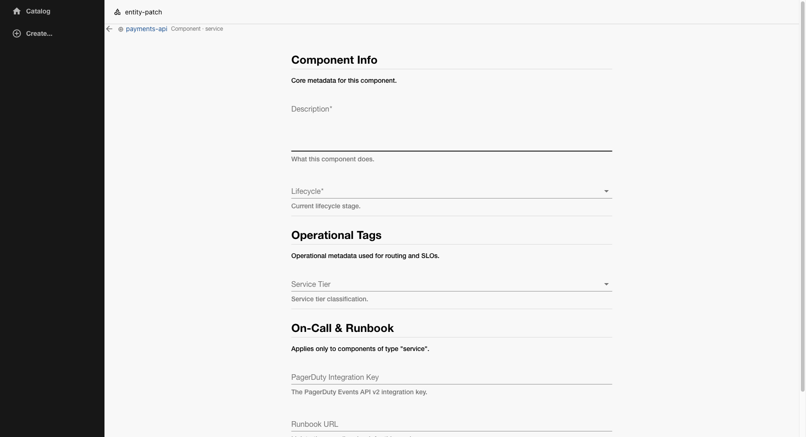

# @backstage-community/plugin-entity-patch

A Backstage frontend plugin that lets operators edit catalog entities through structured, schema-driven patch forms — without writing custom UI.

Patches are defined in `app-config.yaml`. Each patch specifies:
- A **filter** (which entities it applies to)
- One or more **sections** (groups of fields, modelled as JSON Schema)
- An optional **mapping** (field → entity path, used by the backend to persist changes)

## How it works

Once installed, an **Edit Patch** item appears in the entity context menu for any entity that matches a configured patch filter.



Clicking **Edit Patch** opens a dialog with the configured form sections. Fields are rendered from JSON Schema — no custom UI code required.



Required fields are validated on blur. Errors are shown inline and in a summary at the top of the form. The **Save** button stays disabled until all required fields are filled and valid.



A **standalone page** is also available at `/entity-patch/:namespace/:kind/:name`, useful for linking directly from notifications, scripts, or other plugins. It shows the entity context at the top and constrains the form to a readable width.



## Features

- **Context menu integration** — an "Edit Patch" item appears on matching entities via the catalog context menu.
- **Standalone page** — a dedicated route at `/entity-patch/:namespace/:kind/:name` that can be linked to directly.
- **Field extensions** — supports Backstage Scaffolder field extensions (e.g. `EntityPicker`, `OwnerPicker`) via the `ui:field` hint.
- **Async validation** — runs scaffolder-style async validators and surfaces errors inline.
- **Per-entity filtering** — patches that don't match the current entity are automatically hidden.

## Installation

```sh
yarn add @backstage-community/plugin-entity-patch
```

Add the plugin to your app:

```ts
// packages/app/src/App.tsx
import entityPatchPlugin from '@backstage-community/plugin-entity-patch';

export const app = createApp({
  features: [
    // ...
    entityPatchPlugin,
  ],
});
```

## Configuration

```yaml
# app-config.yaml
entityPatch:
  patches:
    - name: team-details          # stable key — used as the form data key
      filter:
        kind: group
        'spec.type': team
      mapping:
        description: metadata.description
        email: spec.profile.email
      sections:
        - title: Team Details
          required:
            - description
          properties:
            description:
              title: Description
              type: string
              'ui:widget': textarea
            email:
              title: Contact Email
              type: string
              format: email
```

### Config reference

| Key | Type | Description |
|---|---|---|
| `name` | `string` | Unique slug, used as the key in persisted form data. Must be stable. |
| `filter` | `FilterPredicate` | Which entities see this patch. Supports `$any`, `$all`, `$not`, `$in`, `$exists`. |
| `sections[].title` | `string` | Section heading. |
| `sections[].required` | `string[]` | Field names that must be non-empty. |
| `sections[].properties` | `Record<string, JSONSchema>` | Field definitions. Inline `ui:*` keys are extracted automatically. |
| `mapping` | `Record<string, string>` | Maps field name → dot-separated entity path. Backend-only — not read by the frontend. |

## Using scaffolder field extensions

The `ui:field` key in any section property works **exactly the same as in Backstage scaffolder templates**. Any scaffolder field extension registered in your app can be referenced by its `name`.

If you have used `ui:field` in a `template.yaml`, you already know how to use it here — the API is identical.

```yaml
sections:
  - title: Ownership
    properties:
      owner:
        title: Owner
        type: string
        description: The owning team for this component.
        'ui:field': OwnerPicker          # scaffolder OwnerPicker field extension
        'ui:options':
          allowedKinds:
            - Group
      relatedEntity:
        title: Related Entity
        type: string
        'ui:field': EntityPicker         # scaffolder EntityPicker field extension
```

### Available built-in fields

These come from `@backstage/plugin-scaffolder` and can be used with `ui:field`:

| `ui:field` value | Description |
|---|---|
| `EntityNamePicker` | Autocomplete for entity names in the catalog |
| `EntityPicker` | Full entity ref picker with kind/namespace filtering |
| `OwnerPicker` | Entity picker constrained to ownable kinds (Group, User) |
| `EntityTagsPicker` | Tag selector with autocomplete from existing entity tags |
| `RepoUrlPicker` | Repository URL picker (SCM-aware) |

For custom field extensions (written with `createScaffolderFieldExtension`), register them in your app the same way you would for scaffolder templates. They will automatically be available for use in patch configs.

See the [Backstage scaffolder field extension docs](https://backstage.io/docs/features/software-templates/writing-custom-field-extensions) for writing your own.

## Local development

```sh
yarn start
```

Opens a dev app at `http://localhost:3010` with mock entities of all supported kinds.
Navigate to any entity page and use the **⋮** context menu → **Edit Patch**, or go directly to `/entity-patch/default/component/payments-api`.
