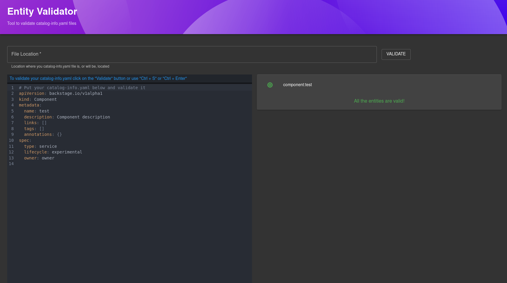

# entity-validation

This plugin creates a new page in Backstage where the user can validate the entities.



## Getting started

First of all, install the package in the `app` package by running the following command:

```bash
# From your Backstage root directory
yarn --cwd packages/app add @backstage-community/plugin-entity-validation
```

Add the new route to the app by adding the following line:

```typescript
// In packages/app/src/App.tsx
import { EntityValidationPage } from '@backstage-community/plugin-entity-validation';

const routes = (
  <FlatRoutes>
    {/* ...other routes */}
    <Route path="/entity-validation" element={<EntityValidationPage />} />
  </FlatRoutes>
);
```

To add the new page to your sidebar, you must include these lines in your `Root.tsx` file:

```typescript
    // In packages/app/src/components/Root/Root.tsx
    import BuildIcon from '@material-ui/icons/Build';

    ...

    export const Root = ({ children }: PropsWithChildren<{}>) => (
      <SidebarPage>
        <Sidebar>
          {/* ...other elements */}
          <SidebarGroup label="Menu" icon={<MenuIcon />}>
            {/* Global nav, not org-specific */}
            {/* ...other sidebars */}
            <SidebarItem icon={BuildIcon} to="entity-validation" text="Validator" />
            {/* End global nav */}
            <SidebarDivider />
          </SidebarGroup>
          {/* ...other elements */}
        </Sidebar>
        {children}
      </SidebarPage>
    );
```

## Embedding inside other pages

The plugin can also be embedded inside other pages.

### Devtools

Here's how to add Entity Validation to the [DevTools](https://github.com/backstage/backstage/tree/master/plugins/devtools) plugin:

1. Install the Entity Validation plugin and add the route to your app as per the [Getting Started](#getting-started) section.

2. Add the following import to your `CustomDevToolsPage.tsx`:

   `import { EntityValidationContent } from '@backstage-community/plugin-entity-validation';`

3. Then add a new `DevToolsLayout.Route` to the end of your `DevToolsLayout` like this:

   ```diff
     <DevToolsLayout>
       ...
   +   <DevToolsLayout.Route path="entity-validation" title="Entity Validation">
   +     <EntityValidationContent
   +      contentHead={<Typography variant="h6">Entity Validation</Typography>} />
   +   </DevToolsLayout.Route>
     </DevToolsLayout>
   ```
