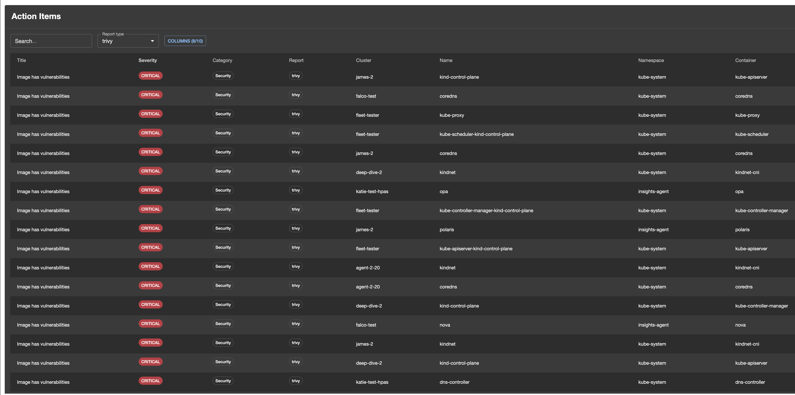
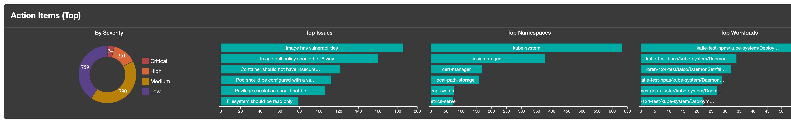
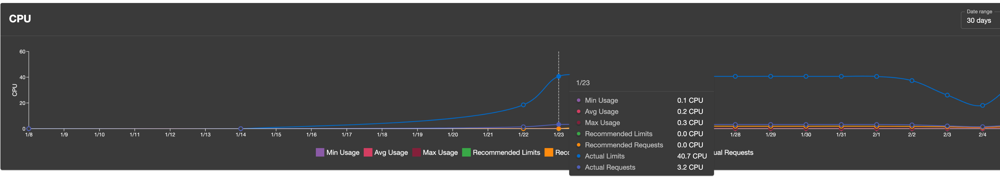
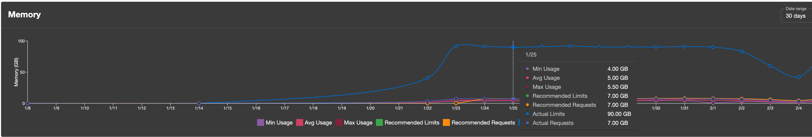
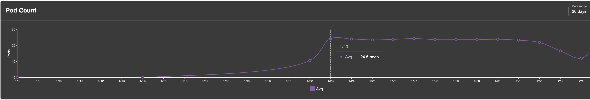
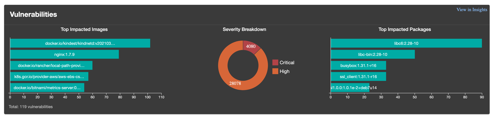

# Fairwinds Insights (Backstage)

This workspace contains plugins for integrating [Fairwinds Insights](https://www.fairwinds.com/fairwinds-insights) with Backstage, with metrics and insights for your organization.

## Start dev environment

Create `app-config.local.yaml` with Fairwinds Insights configuration:

```yaml
fairwindsInsights:
  apiUrl: ${FAIRWINDS_INSIGHTS_URL}
  organization: ${FAIRWINDS_INSIGHTS_ORGANIZATION}
  apiKey: ${FAIRWINDS_INSIGHTS_API_KEY}
  cacheTTL: 300 # optional; seconds (default 300)
```

To start the app, run:

Make sure you have yarn 4.X installed

```sh
yarn --version
```

```sh
yarn install && yarn start
```

## Plugins

- [fairwinds-insights](./plugins/fairwinds-insights/README.md): Frontend plugin that provides the UI components and functionality.
- [fairwinds-insights-common](./plugins/fairwinds-insights-common/README.md): Shared types, permissions, and constants.
- [fairwinds-insights-backend](./plugins/fairwinds-insights-backend/README.md): Backend plugin that provides the API integration and proxies to the Fairwinds Insights API.

## Screenshots

| Action items (table)                                 | Action items (top graph)                                      | MTD costs                          |
| ---------------------------------------------------- | ------------------------------------------------------------- | ---------------------------------- |
|  |  |  |

| Resource history — CPU                                   | Resource history — Memory                                      | Resource history — Pod count                                         |
| -------------------------------------------------------- | -------------------------------------------------------------- | -------------------------------------------------------------------- |
|  |  |  |

| Vulnerabilities Summary                        |
| ---------------------------------------------- |
|  |
