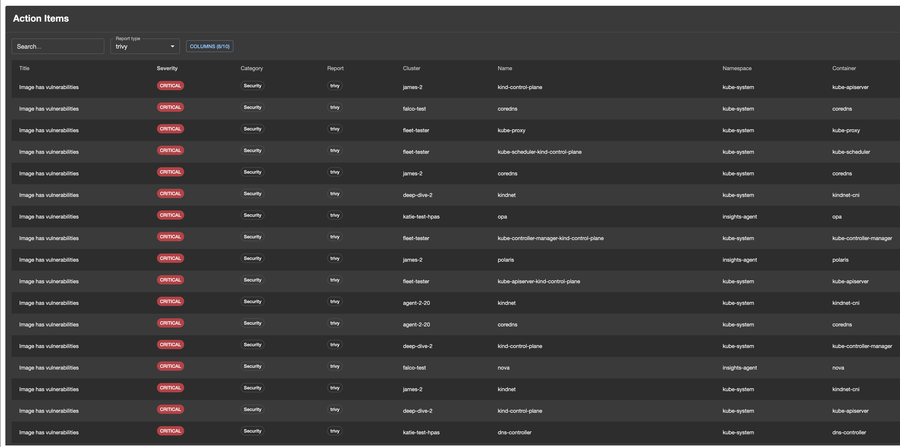
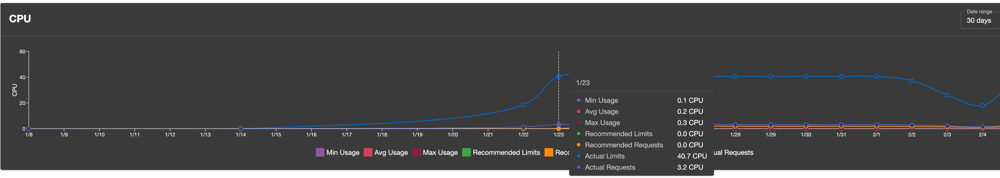
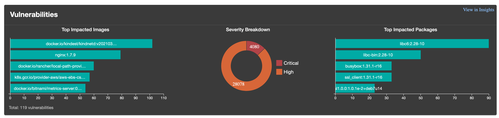

# Fairwinds Insights (Backstage)

This workspace contains plugins for integrating [Fairwinds Insights](https://www.fairwinds.com/fairwinds-insights) with Backstage: vulnerabilities, month-to-date cost, action items, and resource history for catalog entities linked to Insights app groups.

## Start dev environment

Create `app-config.local.yaml` with Fairwinds Insights configuration (used when you run the backend alongside the app):

```yaml
fairwindsInsights:
  apiUrl: ${FAIRWINDS_INSIGHTS_URL}
  organization: ${FAIRWINDS_INSIGHTS_ORGANIZATION}
  apiKey: ${FAIRWINDS_INSIGHTS_API_KEY}
  cacheTTL: 300 # optional; seconds (default 300)
```

Install dependencies and start the workspace (Yarn 4.x):

```sh
yarn --version
yarn install && yarn start
```

The frontend plugin’s dev shell (`plugins/fairwinds-insights/dev/index.tsx`) uses `createApp` from `@backstage/frontend-defaults` with the default export from `./alpha`, plus standalone pages so cards can be exercised with and without the app-groups annotation.

## Plugins

- [fairwinds-insights](./plugins/fairwinds-insights/README.md): UI, API client, and catalog entity card extensions.
- [fairwinds-insights-common](./plugins/fairwinds-insights-common/README.md): Shared types and helpers.
- [fairwinds-insights-backend](./plugins/fairwinds-insights-backend/README.md): Backend API and Insights proxy.

## Screenshots

| Action items (table)                                 | Action items (top graph)                                      | MTD costs                          |
| ---------------------------------------------------- | ------------------------------------------------------------- | ---------------------------------- |
|  |  |  |

| Resource history — CPU                                   | Resource history — Memory                                      | Resource history — Pod count                                         |
| -------------------------------------------------------- | -------------------------------------------------------------- | -------------------------------------------------------------------- |
|  |  |  |

| Vulnerabilities Summary                        |
| ---------------------------------------------- |
|  |
