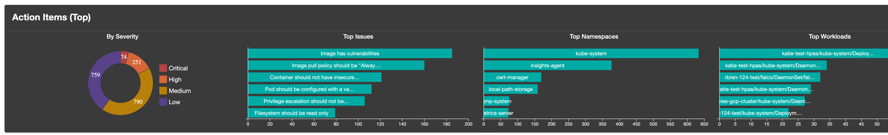
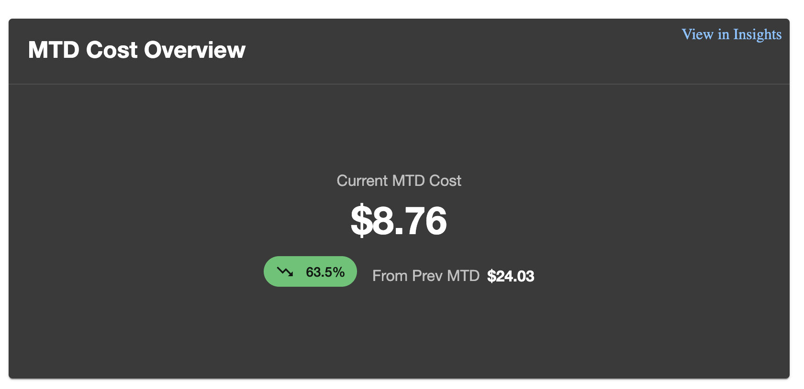
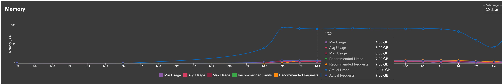
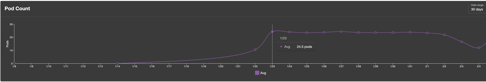

# Fairwinds Insights Plugin

This plugin surfaces [Fairwinds Insights](https://www.fairwinds.com/fairwinds-insights) data in Backstage: vulnerabilities, cost (MTD), action items, and resource history for entities linked to Insights via the `insights.fairwinds.com/app-groups` annotation (or `spec.app-groups` / `spec.app-group`).

## Screenshots

| Action items (table)                                        | Action items (top graph)                                             | MTD costs                                 |
| ----------------------------------------------------------- | -------------------------------------------------------------------- | ----------------------------------------- |
|  |  |  |

| Resource history — CPU                                          | Resource history — Memory                                             | Resource history — Pod count                                                |
| --------------------------------------------------------------- | --------------------------------------------------------------------- | --------------------------------------------------------------------------- |
|  |  |  |

| Vulnerabilities Summary                               |
| ----------------------------------------------------- |
|  |

## Setup

**Install and configure the [Fairwinds Insights backend plugin](../fairwinds-insights-backend/README.md) first** so the frontend can reach the `fairwinds-insights` HTTP routes.

### 1. Install the package

```bash
# From your Backstage root directory
yarn --cwd packages/app add @backstage-community/plugin-fairwinds-insights
```

### 2. Register the frontend plugin (new frontend system)

The integration point is the **default export** from the `/alpha` entry: it registers the Insights API extension and catalog **entity card** extensions. Add it to your app `features` (exact `createApp` import depends on your app template, often `@backstage/frontend-defaults`):

```tsx
// e.g. packages/app/src/App.tsx
import { createApp } from '@backstage/frontend-defaults';
import fairwindsInsightsPlugin from '@backstage-community/plugin-fairwinds-insights/alpha';

export const app = createApp({
  features: [
    // ...other features (catalog, etc.)
    fairwindsInsightsPlugin,
  ],
});
```

If you use [feature discovery](https://backstage.io/docs/frontend-system/architecture/app/#feature-discovery), the plugin may be picked up automatically without a manual import; otherwise keep the explicit `features` entry above.

**Alpha exports:** the same module also exports `fairwindsInsightsApiExtension` and the individual entity card blueprints (for example `entityVulnerabilitiesCard`) if you need to compose or test extensions manually.

### 3. Configuration

Backend configuration (used by the proxy, not the frontend package directly):

```yaml
# app-config.yaml
fairwindsInsights:
  apiUrl: ${INSIGHTS_URL} # optional; base Fairwinds Insights URL (default: https://insights.fairwinds.com)
  apiKey: ${INSIGHTS_TOKEN} # Bearer token for Insights API
  organization: ${INSIGHTS_ORGANIZATION}
  cacheTTL: 300 # optional; cache TTL in seconds (default: 300)
```

### 4. Entity pages — catalog entity cards

Each card is published as a catalog **entity card** extension. They only render for entities that have at least one app group (same rules as the backend). Extension IDs follow `entity-card:fairwinds-insights/<name>`:

| Extension ID                                                 | Card                     |
| ------------------------------------------------------------ | ------------------------ |
| `entity-card:fairwinds-insights/vulnerabilities`             | Vulnerability summary    |
| `entity-card:fairwinds-insights/mtd-cost-overview`           | Month-to-date cost       |
| `entity-card:fairwinds-insights/action-items-top`            | Top action items (chart) |
| `entity-card:fairwinds-insights/action-items`                | Full action items table  |
| `entity-card:fairwinds-insights/resources-history-pod-count` | Pod count over time      |
| `entity-card:fairwinds-insights/resources-history-cpu`       | CPU over time            |
| `entity-card:fairwinds-insights/resources-history-memory`    | Memory over time         |

Enable the cards your app needs via `app.extensions` in `app-config.yaml` (see [app configuration](https://backstage.io/docs/frontend-system/architecture/app-configuration/) and the catalog [entity card](https://backstage.io/docs/frontend-system/building-plugins/common-extension-blueprints/#entity-card) docs). Example:

```yaml
app:
  extensions:
    - entity-card:fairwinds-insights/vulnerabilities
    - entity-card:fairwinds-insights/mtd-cost-overview
    - entity-card:fairwinds-insights/action-items-top
    - entity-card:fairwinds-insights/action-items
    - entity-card:fairwinds-insights/resources-history-pod-count
    - entity-card:fairwinds-insights/resources-history-cpu
    - entity-card:fairwinds-insights/resources-history-memory
```

### 5. Annotation

Entities must declare which Fairwinds Insights app group(s) they belong to:

```yaml
# catalog-info.yaml
metadata:
  annotations:
    insights.fairwinds.com/app-groups: <APP_GROUP_NAME>
```

For multiple app groups, use comma-separated values.

### Optional: embed card components manually

The main package entry (`@backstage-community/plugin-fairwinds-insights`) exports the same React components for custom layouts, tests, or older catalog composition. Example:

```tsx
import {
  ActionItemsCard,
  ActionItemsTopCard,
  MTDCostOverviewCard,
  VulnerabilitiesCard,
  ResourcesHistoryPodCountCard,
  ResourcesHistoryCPUCard,
  ResourcesHistoryMemoryCard,
} from '@backstage-community/plugin-fairwinds-insights';
```

Wrap with `EntityProvider` where the entity is not already provided by the catalog page. All cards use `useFairwindsInsightsApi()` and the backend plugin ID `fairwinds-insights`.

### Package exports

| Entry                                                  | Contents                                                                                                             |
| ------------------------------------------------------ | -------------------------------------------------------------------------------------------------------------------- |
| `@backstage-community/plugin-fairwinds-insights`       | Card components, `fairwindsInsightsApiRef`, `useFairwindsInsightsApi`, `FairwindsInsightsClient`, and related types. |
| `@backstage-community/plugin-fairwinds-insights/alpha` | Default frontend plugin (features array), API extension, entity card extensions.                                     |

## Links

- [Fairwinds Insights](https://www.fairwinds.com/fairwinds-insights)
- [Backstage frontend system](https://backstage.io/docs/frontend-system/)
- [Backstage plugin docs](https://backstage.io/docs)
