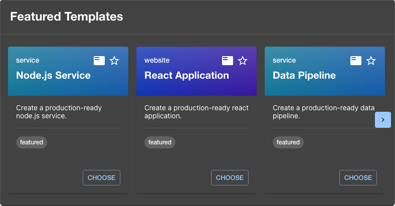

# Featured Templates plugin for Backstage

The Featured Templates plugin showcases Software Templates containing a configurable tag (default: `featured`) on the Backstage home page.



## Plugins

- [featured-templates](./plugins/featured-templates/README.md) - The frontend plugin that provides the home page widget.

## Quick start

You will find detailed installation instructions in the plugin's readme file.

```sh
# From your Backstage root directory
yarn --cwd packages/app add @backstage-community/plugin-featured-templates
```
