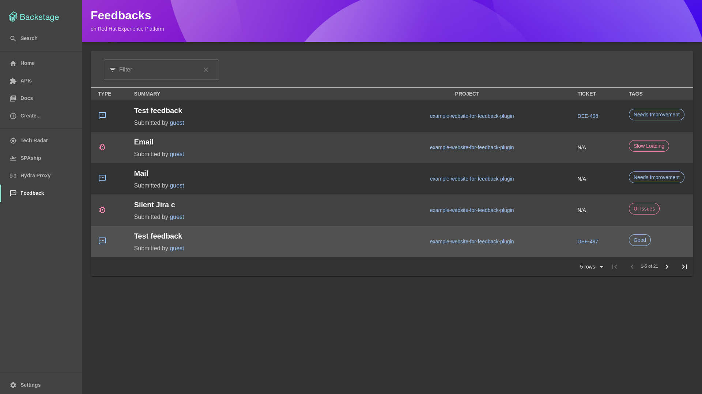
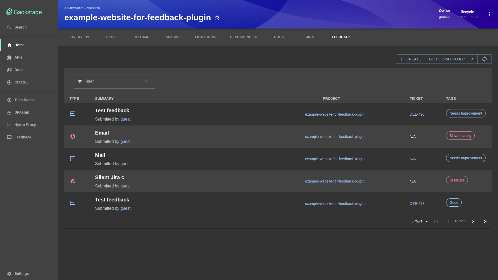
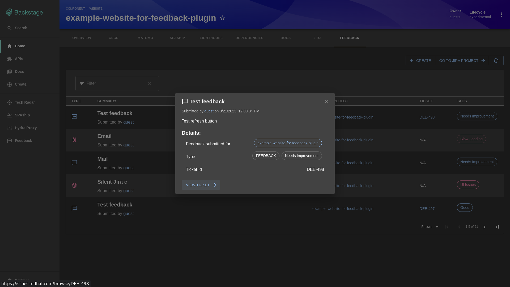
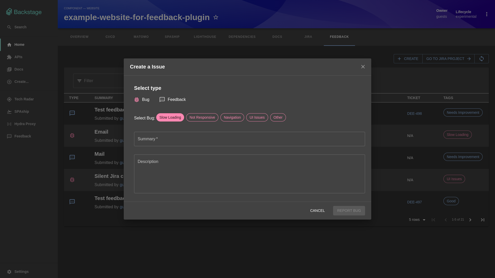
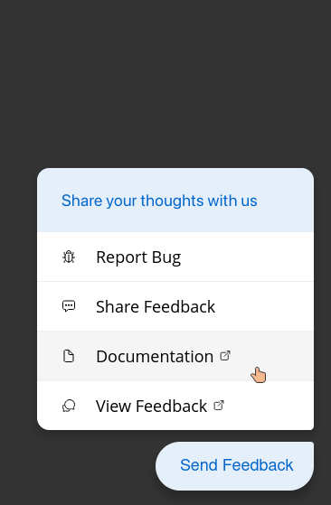
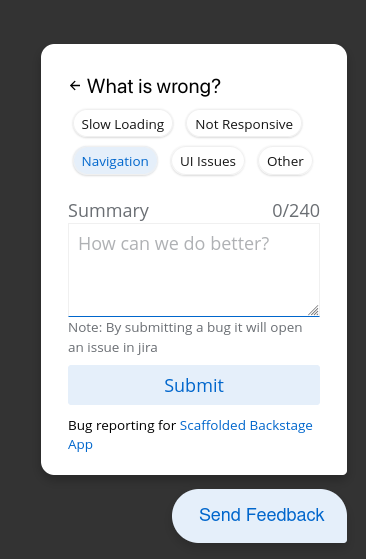
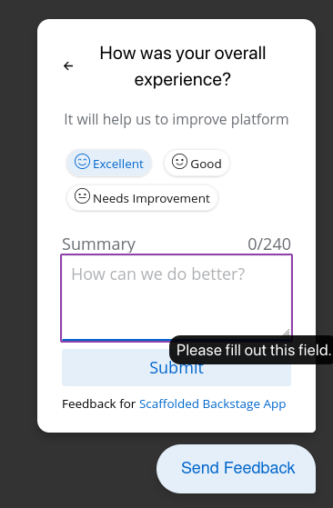
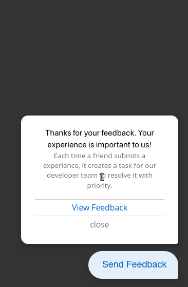
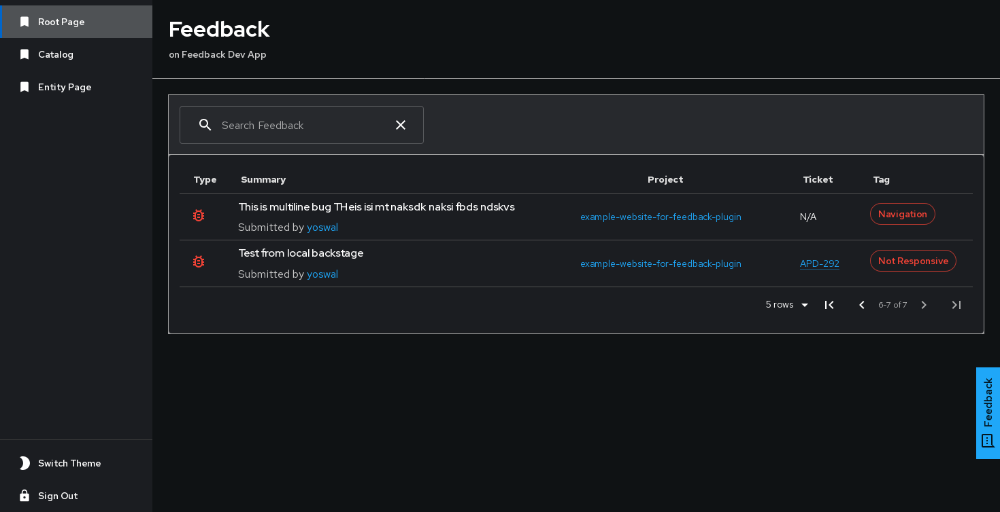

# Feedback Plugin

## Introduction

Feedback plugin is a valuable addition to backstage which allows project managers to get feedbacks for entites in Backstage Catalog.

It is dedicated to simplifying the process of gathering and managing user feedback for service catalog entities. This plugin seamlessly integrates with the [feedback-backend-plugin](../feedback-backend) and extends its capabilities by allowing users to create Jira tickets associated with their feedback.

### Screenshots

| Global Page                                  | Entity Page                                  |
| -------------------------------------------- | -------------------------------------------- |
|  |  |

| Feedback Details Modal                             | Create Feedback Modal                         |
| -------------------------------------------------- | --------------------------------------------- |
|  |  |

| Opc Feedback Component                             |                                                |                                                      |                                                |
| -------------------------------------------------- | ---------------------------------------------- | ---------------------------------------------------- | ---------------------------------------------- |
|  |  |  |  |

| Global Feedback Component                                               |
| ----------------------------------------------------------------------- |
|  |

### Key Features

- List all the feedbacks and bugs for the componnets on global page.
- List all the feedbacks and bugs for each component on entity page.
- Create Bugs, Feedbacks directly on JIRA and also sends a mail to reporter.
- Unique feedback links for each feedback.
- Works with all knex supported databases.

### Requirements

- Make sure that [feedback-backend-plugin](../feedback-backend) is configured prior to this.

### Plugin Setup

1. Install the plugin in your environment

   ```bash
   yarn workspace app add @backstage-community/plugin-feedback
   ```

2. Add configuration to app-config.yml

   ```yaml
   feedback:
     # A ref to base entity under which global feedbacks gets stored
     # in format: kind:namespace/name
     baseEntityRef: 'component:default/example-website'

     # Limit the number of characters for summary field
     # should be between 1-255
     summaryLimit: 240

     # Frontend plugin customizations (optional)
     customizations:
       # Hide docs link from OpcFeedbackComponent
       hideDocsLink: true

       ## refer https://github.com/1-Platform/op-components/tree/master/packages/opc-feedback#custom-template-example
       opcFeedbackTemplate:
         feedbackFAB: 'Send Feedback'
         dialogTitle: 'Share your thoughts with us'
         bugReportTitle: 'Report Bug'
         feedbackReportTitle: 'Send Feedback'
         documentationTitle: 'Documentation'
         spaRedirectTitle: 'View Feedback'
         errorTitle: 'What is wrong?'
         bugSubmissionNote: 'Note: By submitting a bug it will open an issue in jira'
         feedbackTitle: 'How was your overall experience?'
         feedbackSubtitle: 'It will help us to improve platform'
         summary: 'Summary'
         summaryPlaceholder: 'How can we do better?'
         confirmationTitle: 'Thanks for your feedback. Your experience is important to us!'
         confirmationSubTitle: 'Each time a friend submits a experience, it creates a task for our developer team to resolve it with priority.'
         confirmationEventMessage: 'Submitted the feedback'

       # Provide an empty list to disable a type (experience or error). At least one must be enabled.
       # List of experiences to show in feedback form, (note: jira is not created for "excellent" and "good" feedbacks)
       experienceList:
         - Excellent
         - Good
         - Needs Improvement
         - Other
       # List of errors to show in feedback form
       errorList:
         - Slow Loading
         - Not Responsive
         - Navigation
         - UI Issues
         - Other
   ```

3. Add `GlobalFeedbackPage`, `GlobalFeedbackComponent` component to the `src/App.tsx`.

   ```jsx
   import {
     feedbackPlugin,
     GlobalFeedbackPage,
     OpcFeedbackComponent,
     GlobalFeedbackComponent,
   } from '@backstage-community/plugin-feedback';

   // ...
   const app = createApp({
     apis,
     bindRoutes({ bind }) {
       // ...
       // Bind techdocs root route to feedback plugin externalRoute.viewDocs to add "View Docs" link in opc-feedback component
       bind(feedbackPlugin.externalRoutes, {
         viewDocs: techdocsPlugin.routes.root,
       });
     },
     featureFlags: [
       // ...
     ],
   });
   const routes = (
     <FlatRoutes>
       // Insert this line to add feedback route
       <Route path="/feedback" element={<GlobalFeedbackPage />} />
     </FlatRoutes>
   );

   export default app.createRoot(
     <>
       // ...
       <AppRouter>
         // ...
         <OpcFeedbackComponent />
         <GlobalFeedbackComponent />
       </AppRouter>
     </>,
   );
   ```

4. Then add the feedback route to sidebar to easily access `/feedback`, in `src/components/Root/Root.tsx`.

   ```ts
   import TextsmsOutlined  from '@material-ui/icons/TextsmsOutlined';
   //...
   export const Root = ({ children }: PropsWithChildren<{}>) => (
     <SidebarPage>
       <Sidebar>
         // ...
         <SidebarGroup label="Menu" icon={<MenuIcon />}>
           // ...
           // Insert these lines in SidebarGroup
           <SidebarScrollWrapper>
             <SidebarItem icon={TextsmsOutlined} to="feedback" text="Feedback" />
           </SidebarScrollWrapper>
           // ...
         // ...
     </SidebarPage>
   )
   ```

5. Import the `EntityFeedbackPage` component and add it to the **Component page, Api page** in `src/components/catalog/EntityPage.tsx`.

   ```ts
   import { EntityFeedbackPage } from '@backstage-community/plugin-feedback';
   // ...

   <EntityLayout.Route path="/feedback" title="Feedback">
     <EntityFeedbackPage />
   </EntityLayout.Route>;
   ```

### Annotations

To configure only mail:

- Add these annotations to your `catalog-info.yaml` file.

```yaml
metadata:
  annotations:
    # Set to MAIL, if you want to recevie mail
    # on every feedback.
    feedback/type: 'MAIL'

    # Type in your mail here, it will be kept in cc,
    # while sending mail on feedback generation.
    feedback/email-to: 'example@example.com'
```

To configure Jira + mail:

- Add these annotations to your `catalog-info.yaml` file.

```yaml
metadata:
  annotations:
    # Set to JIRA to create ticket when
    # creating feedbacks.
    feedback/type: 'JIRA'

    # Enter your jira project key,
    jira/project-key: '<your-jira-project-key>'

    # (optional) Enter the url of you jira server.
    # If not set then it will use first host from app-config
    feedback/host: '<your-jira-host-url>'

    # (optional) Type in your mail here,
    #  it will be kept in cc,
    #  while sending mail on feedback generation.
    feedback/email-to: 'example@example.com';
```

### Credits

- @1-Platform for [opc-feedback](https://github.com/1-platform/op-components) component.
