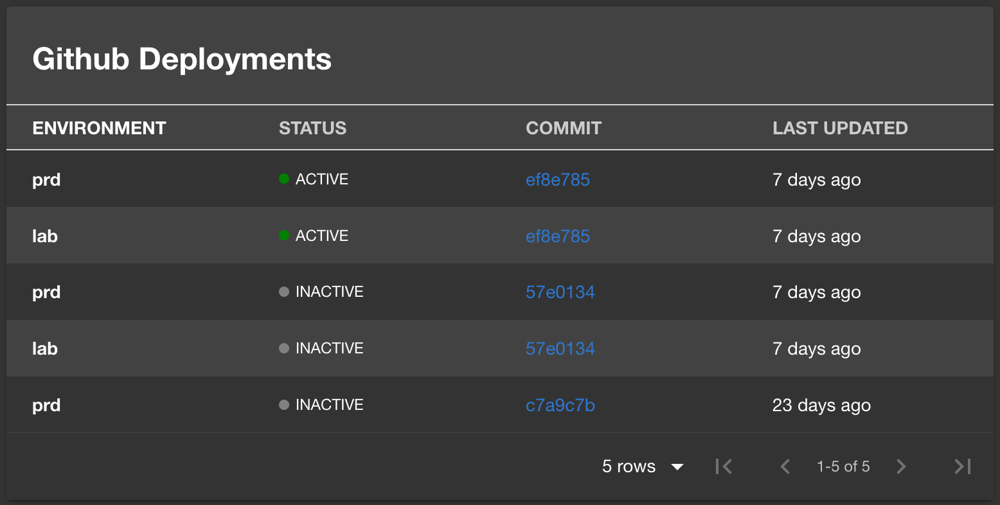

# GitHub Deployments Plugin

The GitHub Deployments Plugin displays recent deployments from GitHub.



## Prerequisites

- [GitHub Authentication Provider](https://backstage.io/docs/auth/github/provider)

## Getting Started

1. Install the GitHub Deployments Plugin.

```bash
# From your Backstage root directory
yarn --cwd packages/app add @backstage-community/plugin-github-deployments
```

2. Add the `EntityGithubDeploymentsCard` to the EntityPage:

```typescript
// packages/app/src/components/catalog/EntityPage.tsx

import { EntityGithubDeploymentsCard } from '@backstage-community/plugin-github-deployments';

const OverviewContent = () => (
  <Grid container spacing={3} alignItems="stretch">
    // ...
    <Grid item xs={12} sm={6} md={4}>
      <EntityGithubDeploymentsCard />
    </Grid>
    // ...
  </Grid>
);
```

You can filter for environemt names via a environment parameter.

```typescript
// packages/app/src/components/catalog/EntityPage.tsx
// ...
<Grid item xs={12} sm={6} md={4}>
  <EntityGithubDeploymentsCard environments={['env-a', 'env-b']} />
</Grid>
// ...
```

3. Add the `github.com/project-slug` annotation to your `catalog-info.yaml` file:

```yaml
apiVersion: backstage.io/v1alpha1
kind: Component
metadata:
  name: backstage
  description: |
    Backstage is an open-source developer portal that puts the developer experience first.
  annotations:
    github.com/project-slug: YOUR_PROJECT_SLUG
spec:
  type: library
  owner: CNCF
  lifecycle: experimental
```

### Self-hosted / Enterprise GitHub

The plugin will try to use `backstage.io/source-location` or `backstage.io/managed-by-location`
annotations to figure out the location of the source code.

1. Add the `host` and `apiBaseUrl` to your `app-config.yaml`

```yaml
# app-config.yaml

integrations:
  github:
    - host: 'your-github-host.com'
      apiBaseUrl: 'https://api.your-github-host.com'
```

## Integrating with the new Frontend System

Follow this section if you are using Backstage's [new frontend system](https://backstage.io/docs/frontend-system/).

1. Import `githubDeploymentsPlugin` in your `App.tsx` and add it to your app's `features` array:

```typescript
import githubDeploymentsPlugin from '@backstage-community/plugin-github-deployments/alpha';
// ...
export const app = createApp({
  features: [
    // ...
    githubDeploymentsPlugin,
    // ...
  ],
});
```

2. Next, enable your desired extensions in `app-config.yaml`

```yaml
app:
  extensions:
    - entity-card:github-deployments/overview
```

3. Whichever extensions you've enabled should now appear in your entity page.
