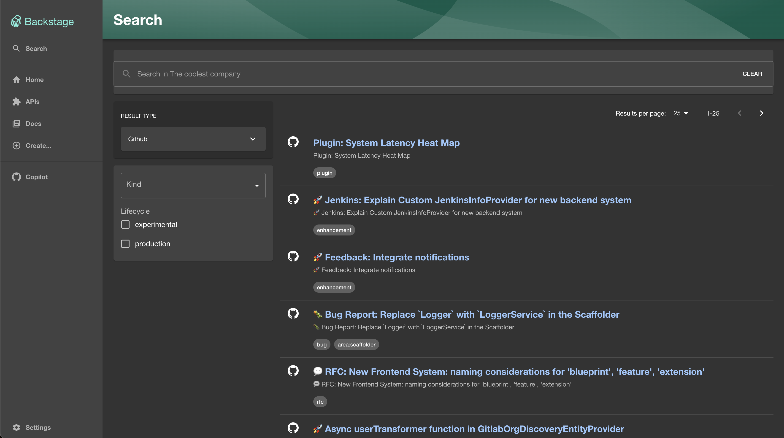

# GitHub Search Plugin

This is the frontend plugin containing the `GithubSearchResultListItem` which renders the issues indexed from [GitHub Search Backend Module](plugins/search-backend-module-github).

## Prerequisites

- Install the [GitHub Search Backend Module](plugins/search-backend-module-github)

## Install

Add the `GithubSearchResultListItem` to your `SearchPage.tsx` inside the `SearchResult` component

### Imports:

```tsx
import { GithubSearchResultListItem } from '@backstage-community/plugin-search-github';
import { GitHubIcon } from '@backstage/core-components';
```

### Add the component

```tsx
<SearchResult>
  <GithubSearchResultListItem icon={<GitHubIcon />} />
</SearchResult>
```

## Example


