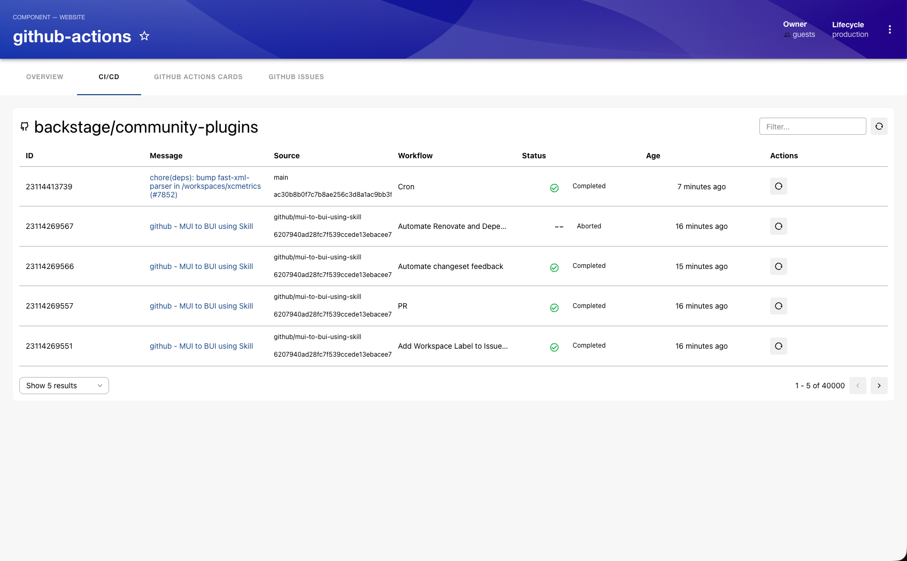
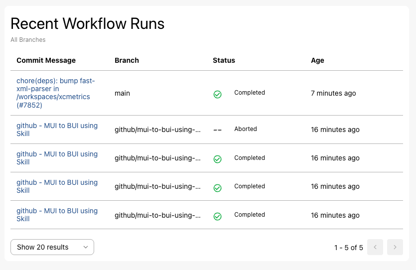
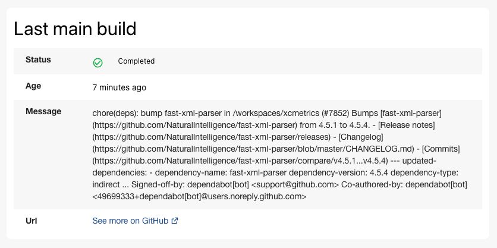
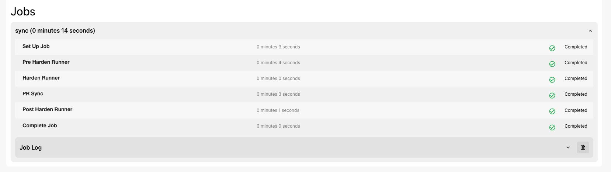

# GitHub Actions Plugin

Website: [https://github.com/actions](https://github.com/actions)

> [!Note]
> Backstage UI (BUI) is now required for the GitHub Actions plugin to function, BUI has been included as part of Backstage since `1.41.0` which means you're very likely to already have it installed. The [BUI documentation](https://ui.backstage.io/) has details on installation if needed and the Backstage [User Interface documentation](https://backstage.io/docs/conf/user-interface/) has details on creating a custom BUI theme.

## Table of Contents

- [GitHub Actions Plugin](#github-actions-plugin)
  - [Table of Contents](#table-of-contents)
  - [Screenshots](#screenshots)
    - [CI/CD - Table View](#cicd---table-view)
    - [CI/CD - Card View](#cicd---card-view)
    - [Recent Workflow Runs](#recent-workflow-runs)
    - [Recent Main Branch Builds](#recent-main-branch-builds)
    - [Last Main Build Status](#last-main-build-status)
    - [Workflow Runs Overview](#workflow-runs-overview)
    - [Workflow Run Jobs](#workflow-run-jobs)
    - [Job Step Logs](#job-step-logs)
    - [Full Job Logs](#full-job-logs)
  - [Setup](#setup)
    - [Generic Requirements](#generic-requirements)
      - [Provide OAuth Credentials](#provide-oauth-credentials)
    - [Installation](#installation)
    - [Integrating with `EntityPage`](#integrating-with-entitypage)
    - [Integrating with `EntityPage` (New Frontend System)](#integrating-with-entitypage-new-frontend-system)
    - [Self-hosted / Enterprise GitHub](#self-hosted--enterprise-github)
  - [Features](#features)
  - [Limitations](#limitations)
  - [Optional Workflow Runs Card View](#optional-workflow-runs-card-view)

## Screenshots

### CI/CD - Table View



View all workflow runs in a comprehensive table format showing status, branch, commit information, and timing details for easy monitoring of your CI/CD pipelines.

### CI/CD - Card View


Alternative card-based layout for workflow runs with branch selection dropdown, providing a more visual and compact way to monitor your builds across different branches.

### Recent Workflow Runs



Quick summary view of the most recent workflow runs with status indicators, perfect for at-a-glance monitoring of your latest builds.

### Recent Main Branch Builds


Focused view displaying the latest builds specifically from your main branch, helping you track the health of your primary development branch.

### Last Main Build Status



Summary card showing the status and details of the most recent build on the main branch for quick health checks.

### Workflow Runs Overview


Detailed overview of workflow runs with filtering and search capabilities, showing comprehensive information about each run including workflow name, status, branch, commit message, and execution time.

### Workflow Run Jobs



Drill down into individual workflow runs to see all jobs, their status, and execution duration, making it easy to identify which jobs succeeded or failed.

### Job Step Logs


View detailed logs for each step within a job, including timestamps and output, helping you debug failures and understand execution flow.

### Full Job Logs


Expanded view of complete job logs with all steps and their detailed output for thorough investigation and troubleshooting.

## Setup

### Generic Requirements

#### Provide OAuth Credentials

Create an OAuth App in your GitHub organization, setting the callback URL to:

`http://localhost:7007/api/auth/github/handler/frame`

Replacing `localhost:7007` with the base URL of your backstage backend instance.

> **Note**: This setup can also be completed with a personal GitHub account.  
> Keep in mind that using a personal account versus an organization account will affect which repositories the app can access.

1. Take the Client ID and Client Secret from the newly created app's settings page and you can do either:

   - Put them into `AUTH_GITHUB_CLIENT_ID` and `AUTH_GITHUB_CLIENT_SECRET` environment variables.
   - Add them to the app-config like below:

   ```yaml
   auth:
     providers:
       github:
         development:
           clientId: ${AUTH_GITHUB_CLIENT_ID}
           clientSecret: ${AUTH_GITHUB_CLIENT_SECRET}
   ```

2. Annotate your component with a correct GitHub Actions repository and owner:

   The annotation key is `github.com/project-slug`.

   Example:

   ```yaml
   apiVersion: backstage.io/v1alpha1
   kind: Component
   metadata:
     name: backstage
     description: backstage.io
     annotations:
       github.com/project-slug: 'backstage/backstage'
   spec:
     type: website
     lifecycle: production
     owner: user:guest
   ```

### Installation

1. Install the plugin dependency in your Backstage app package:

```bash
# From your Backstage root directory
yarn --cwd packages/app add @backstage-community/plugin-github-actions
```

> **Note**: If you are using GitHub auth to sign in, you may already have the GitHub provider, **if it is not the case**, install it by running:
>
> ```tsx
> yarn --cwd packages/backend add @backstage/plugin-auth-backend-module-github-provider
> ```
>
> And add the following dependency to your backend index file:
>
> ```tsx
> backend.add(import('@backstage/plugin-auth-backend-module-github-provider'));
> ```

### Integrating with `EntityPage`

1. Add to the app `EntityPage` component:

```tsx
// In packages/app/src/components/catalog/EntityPage.tsx
import {
  EntityGithubActionsContent,
  isGithubActionsAvailable,
} from '@backstage-community/plugin-github-actions';

// You can add the tab to any number of pages, the service page is shown as an
// example here
const serviceEntityPage = (
  <EntityLayout>
    {/* other tabs... */}
    <EntityLayout.Route path="/github-actions" title="GitHub Actions" if={isGithubActionsAvailable}>
      <EntityGithubActionsContent />
    </EntityLayout.Route>
```

3. Run the app with `yarn start` and the backend with `yarn start-backend`.
   Then navigate to `/github-actions/` under any entity.

### Integrating with `EntityPage` (New Frontend System)

Follow this section if you are using Backstage's [new frontend system](https://backstage.io/docs/frontend-system/).

Import `githubActionsPlugin` in your `App.tsx` and add it to your app's `features` array:

```typescript
import githubActionsPlugin from '@backstage-community/plugin-github-actions/alpha';

// ...

export const app = createApp({
  features: [
    // ...
    githubActionsPlugin,
    // ...
  ],
});
```

### Self-hosted / Enterprise GitHub

The plugin will try to use `backstage.io/source-location` or `backstage.io/managed-by-location`
annotations to figure out the location of the source code.

1. Add the `host` and `apiBaseUrl` to your `app-config.yaml`

```yaml
# app-config.yaml

integrations:
  github:
    - host: 'your-github-host.com'
      apiBaseUrl: 'https://api.your-github-host.com'
```

## Features

- List workflow runs for a project
- Dive into one run to see a job steps
- Retry runs
- Pagination for runs

## Limitations

- There is a limit of 100 apps for one OAuth client/token pair

## Optional Workflow Runs Card View

Github Workflow Runs optional UI to show in Card view instead of table, with branch selection option

```tsx

// You can add the tab to any number of pages, the service page is shown as an
// example given here
const serviceEntityPage = (
  <EntityLayout>
    {/* other tabs... */}
    <EntityLayout.Route path="/github-actions" title="GitHub Actions">
      <EntityGithubActionsContent view='cards' />
    </EntityLayout.Route>
```
