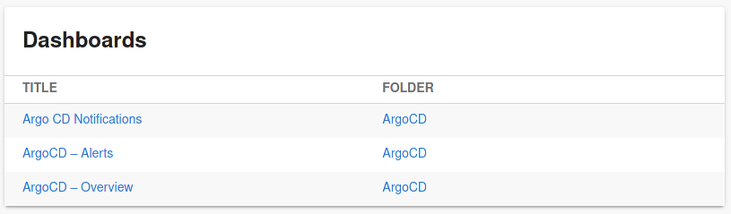

# Grafana plugin for Backstage

The Grafana plugin is a frontend plugin that lists Grafana alerts and dashboards. It includes two components that can be integrated into Backstage:

- The `EntityGrafanaDashboardsCard` component which can display dashboards for a specific entity
- The `EntityGrafanaAlertsCard` component which can display recent alerts for a specific entity
- The `EntityOverviewDashboardViewer` component which can embed an "overview" dashboard for a specific entity
- The `DashboardViewer` component which can embed any dashboard

## Setup

Find [installation instructions](./docs/index.md#installation) in our documentation.

## How does it look?

Entity alerts card:

Entity dashboards card:

## Special thanks & Disclaimer

Thanks to K-Phoen for creating the grafana plugin found [here](https://github.com/K-Phoen/backstage-plugin-grafana). As an outcome
of [this discussion](https://github.com/K-Phoen/backstage-plugin-grafana/issues/78), he gave us permission to keep working on this plugin.
