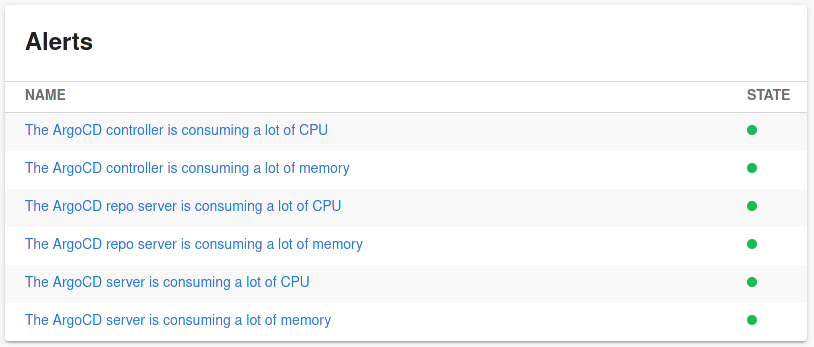

# Grafana plugin for Backstage

The Grafana plugin is a frontend plugin that lists Grafana alerts and dashboards. It includes two components that can be integrated into Backstage:

- The `EntityGrafanaDashboardsCard` component which can display dashboards for a specific entity
- The `EntityGrafanaAlertsCard` component which can display recent alerts for a specific entity
- The `EntityOverviewDashboardViewer` component which can embed an "overview" dashboard for a specific entity
- The `DashboardViewer` component which can embed any dashboard

## Setup

Find [installation instructions](./docs/index.md#installation) in our documentation.

## How does it look?

Entity alerts card:



Entity dashboards card:


## New Frontend System

### Setup

If you're using [feature discovery](https://backstage.io/docs/frontend-system/architecture/app/#feature-discovery), the plugin should be automatically discovered and enabled. Otherwise, you can manually enable the plugin by adding it to your app:

```tsx
// packages/app/src/App.tsx
import grafanaPlugin from '@backstage-community/plugin-grafana/alpha';

const app = createApp({
  features: [
    // ...
    grafanaPlugin,
  ],
});
```

### Extensions

The following extensions are available in the plugin:

- `api:grafana`
- `entity-card:grafana/dashboards`
- `entity-card:grafana/alerts`
- `entity-card:grafana/overview-dashboard`

## Special thanks & Disclaimer

Thanks to K-Phoen for creating the grafana plugin found [here](https://github.com/K-Phoen/backstage-plugin-grafana). As an outcome
of [this discussion](https://github.com/K-Phoen/backstage-plugin-grafana/issues/78), he gave us permission to keep working on this plugin.
