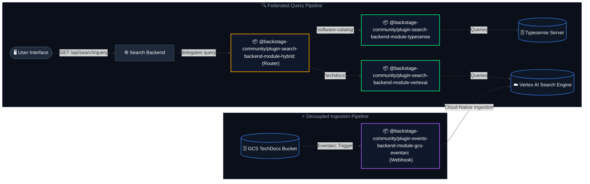

# Hybrid Search Workspace (`workspaces/hybrid-search`)

Welcome to the **Modular Hybrid Search Workspace** for Backstage.

This workspace hosts a modular hybrid search architecture for Backstage. It allows routing queries to different search engines (such as Vertex AI, Typesense, or others) in parallel based on the requested categories, and dynamically merging and interleaving the search results into a single unified search experience.

---

## 🏛️ High-Level Architecture

The workspace implements a **Federated Hybrid Search** pipeline. Queries from the user interface are handled by the hybrid engine router, which splits the query across different search systems (engines) in parallel based on the requested document categories (types), then merges and interleaves the results.



---

## 📦 Workspace Plugins & Modules

This workspace contains four highly specialized plugins:

| Plugin / Module                    | Directory                                                                                              | Purpose                                                                                                                                                                                                                                                                                                                        |
| :--------------------------------- | :----------------------------------------------------------------------------------------------------- | :----------------------------------------------------------------------------------------------------------------------------------------------------------------------------------------------------------------------------------------------------------------------------------------------------------------------------- |
| **Hybrid Search Engine Router**    | [`plugins/search-backend-module-hybrid`](./plugins/search-backend-module-hybrid/README.md)             | The core router that delegates queries to registered sub-engines in parallel based on document categories, then aggregates and interleaves the results.                                                                                                                                                                        |
| **Typesense Search Engine Module** | [`plugins/search-backend-module-typesense`](./plugins/search-backend-module-typesense/README.md)       | Integrates Typesense by registering a sub-engine to the Hybrid Router. Handles active document ingestion and query mapping for any standard/custom document types (e.g. catalog, templates, APIs).                                                                                                                             |
| **Vertex AI Search Engine Module** | [`plugins/search-backend-module-vertexai`](./plugins/search-backend-module-vertexai/README.md)         | Integrates Google Cloud Vertex AI Search by registering a query-only sub-engine (local indexing is bypassed). Translates Backstage queries to unstructured Discovery Engine API requests and schedules a task to purge orphaned documents and static GCS files when their corresponding entities are deleted from the catalog. |
| **GCS Eventarc Ingestion Webhook** | [`plugins/events-backend-module-gcs-eventarc`](./plugins/events-backend-module-gcs-eventarc/README.md) | Webhook ingress that listens to GCS file creation events via Google Eventarc to trigger incremental document ingestion into Vertex AI Search. This allows instantly indexing and picking up TechDocs changes published via CI/CD pipelines using `techdocs-cli`.                                                               |

---

## ⚙️ Quick Start Configuration

To configure the workspace routing and sub-engines in your `app-config.yaml`:

```yaml
search:
  engines:
    hybrid:
      routing:
        software-catalog: typesense
        techdocs: vertexai
        default: typesense # Fallback for unmapped categories
    typesense:
      apiKey: ${typesenseApiKey}
      nodes:
        - host: localhost
          port: 8108
          protocol: http
      collections:
        software-catalog:
          fields:
            - name: '.*'
              type: 'auto'
          searchOptions:
            query_by: 'title,text,location'
    vertexai:
      projectId: ${projectId}
      location: ${location}
      dataStoreId: ${dataStoreId}
      # Optional: Search App Engine ID. If specified, queries will target the Engine serving config
      # rather than the standalone data store serving config, enabling advanced search features.
      engineId: ${engineId}
      # Optional: Raw search client query options (e.g. summary answers / spell corrections)
      searchOptions:
        summarySpec:
          summaryResultCount: 5
          includeCitations: true
        spellCorrectionSpec:
          mode: 'AUTO'
      cleanup:
        enabled: true
        frequency: { hours: 2 }
```

---

## 🔌 Installation & Backend Integration

To register the Hybrid Search Engine and its modules in your Backstage backend instance, add them to your `packages/backend/src/index.ts` file:

```typescript
// packages/backend/src/index.ts
import { createBackend } from '@backstage/backend-defaults';

const backend = createBackend();

// ... other plugins/modules ...

// 1. Add the Hybrid search engine orchestrator
backend.add(import('@backstage-community/plugin-search-backend-module-hybrid'));

// 2. Add the sub-engine modules you wish to register
backend.add(
  import('@backstage-community/plugin-search-backend-module-typesense'),
);
backend.add(
  import('@backstage-community/plugin-search-backend-module-vertexai'),
);

// 3. (Optional) Add the companion ingestion webhook module if using Vertex AI Search
backend.add(
  import('@backstage-community/plugin-events-backend-module-gcs-eventarc'),
);

backend.start();
```

---

## 🛠️ Development & Commands

Run all command scripts from the root directory of this workspace:

### Install Workspace Dependencies

```bash
yarn install
```

### Run All Unit and Integration Tests

```bash
yarn test --watch=false
```

### Compile & Build All Packages

```bash
yarn build:all
```

### Generate and Verify API Reports

```bash
yarn build:api-reports
```
