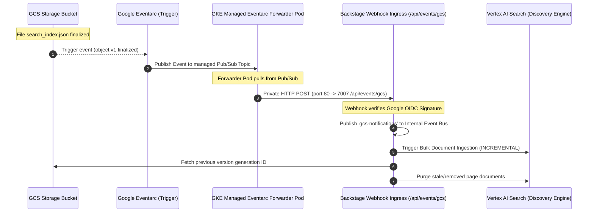

# GCS Eventarc Events Ingress Backend Module for Backstage (`@backstage-community/plugin-events-backend-module-gcs-eventarc`)

This custom backend module implements a secure webhook ingress point that listens to Google Cloud Storage (GCS) object finalize events via Google Eventarc, automatically triggering incremental ingestion into Google Vertex AI Search.

## ⚡ Ingestion Workflow



### 🔒 Direct Private Internal Routing

Eventarc delivers events privately and internally directly to your GKE cluster, entirely bypassing public ingress and Identity-Aware Proxy (IAP) protection:

1. Google's Eventarc agent automatically provisions a dedicated namespace `eventarc-<trigger-name>-<hash>` and deploys a managed **`gke-forwarder`** pod inside it.
2. The forwarder pod privately subscribes to Eventarc's Google-managed Pub/Sub topic, pulls events, and posts them **internally** inside the VPC network directly to your GKE service: `http://backstage.backstage.svc.cluster.local/api/events/gcs`.

> [!IMPORTANT] > **The Port 80 Constraint**: The GKE destination block for GCP Eventarc strictly routes events to port `80` and does not accept custom target port configurations. To support this, the backstage Kubernetes service exposes port `80` and maps it internally to your container port `7007` (see the Kubernetes configuration below).

### Webhook Endpoint: `/api/events/gcs`

Exposes a secure ingress point mounted on the events router.

- **Content Mode**: Binary content mode (Eventarc maps CloudEvent context to headers prefixed with `ce-`, while the raw GCS object metadata represents the HTTP payload body).
- **Required Header**: `ce-type: google.cloud.storage.object.v1.finalized`

### 🔐 Cryptographically Secure Google OIDC Authentication

To prevent spoofing or unauthorized ingestion, the `/api/events/gcs` webhook is secured using **Google OIDC ID Token verification**:

1.  The webhook intercepts requests and extracts the `Authorization: Bearer <ID_TOKEN>` header.
2.  Using Google's library (`google-auth-library`), it verifies:
    - **Signature & Validity**: The token is valid and cryptographically signed by Google.
    - **Issuer**: Must match `https://accounts.google.com`.
    - **Audience**: Matches the Backstage base path: `${baseUrl}/api/events/gcs`.
    - **Service Account Verification**: If configured, it ensures the token belongs exclusively to the expected GKE/Eventarc service account email (`events.modules.gcsEventarcWebhook.oidc.serviceAccountEmail`).

> [!WARNING] > **Bypassing OIDC in GKE (GKE Forwarder Constraint)**:
> In our GKE environment, OIDC token verification is disabled (`events.modules.gcsEventarcWebhook.oidc.enabled: false`).
>
> Google Eventarc only generates and attaches Google OIDC ID tokens when delivering to **public HTTPS destinations, Cloud Run, or Cloud Functions**. For **GKE service destinations**, Google Eventarc uses a GKE-managed **forwarder pod** inside the GKE cluster to pull events from the underlying Pub/Sub topic and make a direct internal HTTP POST request to the cluster-local service (`http://backstage.backstage.svc.cluster.local/api/events/gcs`).
>
> Because this forwarder pod runs locally within the private VPC/GKE network and does not support generating or forwarding Google OIDC ID tokens for cluster-local requests, OIDC verification must be disabled for GKE-based routing. Security is instead enforced at the network level (e.g., using Kubernetes NetworkPolicies or GKE private service configurations to block external ingress to `/api/events/gcs`).

> [!NOTE] > **Why the OIDC Verification Code is Retained**:
> Despite being disabled in GKE, the token verification logic is kept in the codebase to support:
>
> - **Local Development Tunnels**: For developers debugging webhook ingestion using public tunnels (such as `ngrok`), enabling OIDC ensures the endpoint remains cryptographically secured.
> - **Future-Proofing**: If the GKE Eventarc forwarder introduces support for token forwarding in the future, verification can be turned back on instantly via a config change (`enabled: true`) without requiring code modifications.

### Delta Ingest & Reconciliation

1.  When `search_index.json` is updated, the webhook parses all active page locations.
2.  Documents are mapped to stable, deterministic **MD5-hashed IDs** generated from namespace, kind, name, and page path.
3.  The webhook reads the **immediately previous generation** of `search_index.json` from GCS versioning history.
4.  It compares the previous list of document IDs against the new generation to calculate which pages were deleted.
5.  Stale documents are cleanly purged from Vertex AI Search, keeping the semantic database pristine.

## 📦 Kubernetes Service Mapping

To route private Eventarc traffic (port 80) and standard developer traffic (port 7007) to the Backstage container:

```yaml
apiVersion: v1
kind: Service
metadata:
  name: backstage
  namespace: backstage
spec:
  type: ClusterIP
  ports:
    - port: 7007
      targetPort: http
      protocol: TCP
      name: http
    - port: 80
      targetPort: http
      protocol: TCP
      name: eventarc # Map port 80 for internal GKE Eventarc Forwarder routing
  selector:
    app: backstage
```

## ⚙️ Configuration

Configure the webhook in your `app-config.yaml` as follows:

```yaml
events:
  modules:
    gcsEventarcWebhook:
      oidc:
        enabled: true # Set to false in GKE environments
        audience: ${baseUrl}/api/events/gcs
        serviceAccountEmail: ${gcpServiceAccount}
```

## 🛠️ Infrastructure Provisioning (Terraform)

To set up the Eventarc trigger in Google Cloud using Cloud Foundation Fabric (CFF) modules:

```hcl
resource "google_eventarc_trigger" "gcs_to_backstage_webhook" {
  name     = "gcs-to-backstage-webhook"
  location = "europe-west1" # Replace with your cluster region
  project  = var.project_id

  matching_criteria {
    attribute = "type"
    value     = "google.cloud.storage.object.v1.finalized"
  }

  # Only trigger on techdocs bucket finalized uploads
  matching_criteria {
    attribute = "bucket"
    value     = var.techdocs_bucket_name
  }

  destination {
    gke {
      cluster   = var.gke_cluster_name
      location  = var.gke_cluster_location
      namespace = "backstage"
      service   = "backstage"
      path      = "/api/events/gcs"
    }
  }

  service_account = google_service_account.eventarc_trigger_sa.email
}
```

> [!NOTE]
> Make sure that the Eventarc trigger service account (`google_service_account.eventarc_trigger_sa.email`) has the `roles/eventarc.eventReceiver` role and is granted permission to make requests to your GKE cluster.
