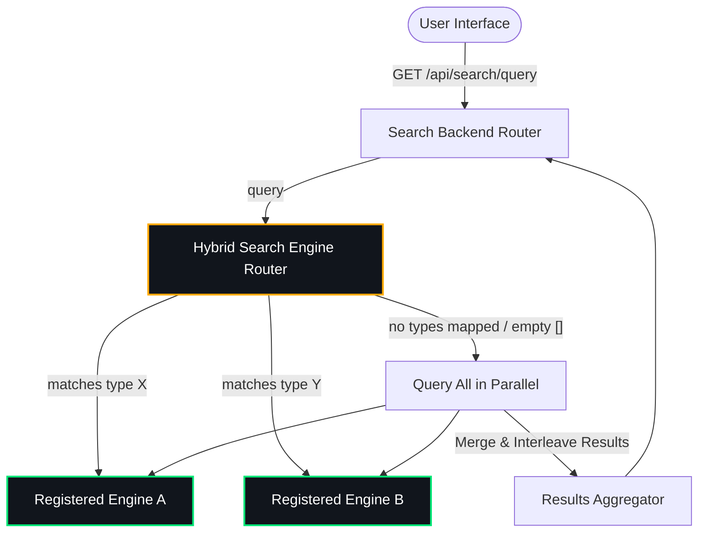

# Hybrid Search Backend Module for Backstage (`@backstage-community/plugin-search-backend-module-hybrid`)

This custom search engine module integrates with the Backstage search system, providing unified routing, parallel execution, and result interleaving across multiple indices and backends.

It acts as a **dynamic orchestrator** that delegates query routing and indexer streams to specialized sub-engines registered via its extension point.

---

## 🏛️ Architecture & Routing

The core engine operates a **Hybrid Search Router** that routes queries across registered sub-engines based on the document types (categories) requested, as defined in your configuration.



### Federated Query Routing & Interleaving

When no filter is selected (or multiple types mapping to different engines are requested), the hybrid engine queries the corresponding search engines in parallel. Results are dynamically interleaved to construct a single seamless result set.

---

## 🔌 Installation

First, install the package in your Backstage backend package:

```bash
yarn --cwd packages/backend add @backstage-community/plugin-search-backend-module-hybrid
```

Then, add it to your `packages/backend/src/index.ts` alongside any other plugins/modules:

```typescript
// packages/backend/src/index.ts
import { createBackend } from '@backstage/backend-defaults';

const backend = createBackend();

// ... other plugins ...

backend.add(import('@backstage-community/plugin-search-backend-module-hybrid'));

backend.start();
```

---

## ⚙️ Configuration

The full configuration is defined in your `app-config.yaml`. Under the `hybrid.routing` block, specify which engine name handles which document type, and configure the credentials and parameters for the sub-engines:

```yaml
search:
  engines:
    hybrid:
      routing:
        software-catalog: typesense
        techdocs: vertexai
        default: typesense # Fallback engine for types without explicit mapping
    typesense:
      apiKey: ${typesenseApiKey}
      nodes:
        - host: localhost
          port: 8108
          protocol: http
      # Additional raw options passed straight to the Typesense Client
      clientOptions:
        connectionTimeoutSeconds: 5
        numRetries: 3
        logLevel: info
      # Customizable schemas and query parameters per collection
      collections:
        software-catalog:
          fields:
            - name: '.*'
              type: 'auto'
            - name: 'embedding'
              type: 'float[]'
              num_dim: 384
              model_config:
                model_name: 'ts/all-MiniLM-L6-v2' # Optional vector search model config
          searchOptions:
            query_by: 'title,text,location,embedding'
    vertexai:
      projectId: ${projectId}
      location: ${location}
      dataStoreId: ${dataStoreId}
      # Optional: Search App Engine ID. If specified, queries will target the Engine serving config
      # rather than the standalone data store serving config, enabling advanced search features.
      engineId: ${engineId}
      # Configurable catalog cleanup task
      cleanup:
        enabled: true
        frequency: { hours: 2 }

techdocs:
  publisher:
    googleGcs:
      bucketName: my-techdocs-bucket
```

---

## 🔌 Extension Point: `hybridSearchEngineRegistryExtensionPoint`

Other backend modules can register their search engine implementations to the hybrid search router during their `init` phase.

> [!NOTE]
>
> - **If you are only using the pre-built sub-engines (Typesense / Vertex AI)**: You do not need to write this code. These modules are already fully implemented, and you only need to import them in your Backstage instance.
> - **If you want to integrate a different search engine (e.g., Elasticsearch, Pg, etc.)**: You will need to implement a custom backend module following these examples to register your engine instance with the `hybridSearchEngineRegistryExtensionPoint`.

### Concrete Examples

#### 1. Typesense Module Registration

```typescript
import { hybridSearchEngineRegistryExtensionPoint } from '@backstage-community/plugin-search-backend-module-hybrid';
import { TypesenseSearchEngine } from './TypesenseSearchEngine';

export const searchModuleTypesenseSearch = createBackendModule({
  pluginId: 'search',
  moduleId: 'typesense-search',
  register(env) {
    env.registerInit({
      deps: {
        hybridRegistry: hybridSearchEngineRegistryExtensionPoint,
        config: coreServices.rootConfig,
        logger: coreServices.logger,
      },
      async init({ hybridRegistry, config, logger }) {
        const typesenseSearchEngine = new TypesenseSearchEngine({ ... });

        hybridRegistry.registerEngine('typesense', typesenseSearchEngine, {
          supportsTypes: ['software-catalog'],
        });
      },
    });
  },
});
```

#### 2. Vertex AI Search Module Registration

```typescript
import { hybridSearchEngineRegistryExtensionPoint } from '@backstage-community/plugin-search-backend-module-hybrid';
import { VertexAISearchEngine } from './VertexAISearchEngine';

export const searchModuleVertexAISearch = createBackendModule({
  pluginId: 'search',
  moduleId: 'vertexai-search',
  register(env) {
    env.registerInit({
      deps: {
        hybridRegistry: hybridSearchEngineRegistryExtensionPoint,
        config: coreServices.rootConfig,
        logger: coreServices.logger,
      },
      async init({ hybridRegistry, config, logger }) {
        const vertexAiSearchEngine = new VertexAISearchEngine({ ... });

        hybridRegistry.registerEngine('vertexai', vertexAiSearchEngine, {
          supportsTypes: ['techdocs'],
        });
      },
    });
  },
});
```
