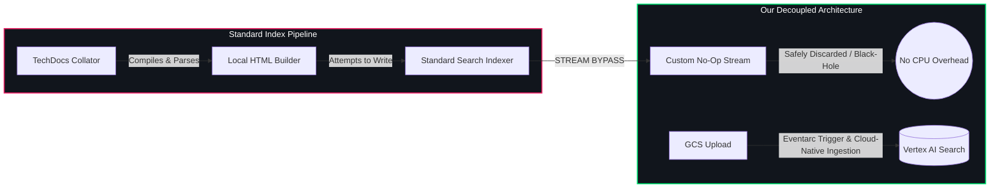

# Vertex AI Search Backend Module for Backstage (`@backstage-community/plugin-search-backend-module-vertexai`)

This backend module integrates Google Cloud Vertex AI Search capabilities into the Backstage Search system. It registers itself to the `@backstage-community/plugin-search-backend-module-hybrid` router to handle specific categories (like `techdocs` and others).

It also manages an automated background cleanup sweeper to prune orphaned documentation assets from Google Cloud Storage (GCS) and Vertex AI Search when catalog entities are deleted.

> [!WARNING] > **Important Ingestion Dependency**: Vertex AI Search is a query-only backend. It does not automatically parse TechDocs files. You **MUST** deploy and configure the companion ingestion module [`@backstage-community/plugin-events-backend-module-gcs-eventarc`](../events-backend-module-gcs-eventarc/README.md) (or set up GCS bucket notifications) to upload and index documents when they are published.

---

## 🏛️ Ingestion Bypass & Cloud-Native Indexing

In standard Backstage setups, TechDocs are parsed and indexed locally by the Node.js server. This creates massive memory and CPU overhead. Our architecture decouples query routing from ingestion:



1. **Bypass Stream**: The standard indexer returns a throwaway no-op stream, bypassing local document parsing and indexing.
2. **Decoupled Ingestion**: Documentation builds publish a unified `search_index.json` manifest to GCS. This upload triggers an Eventarc webhook that parses the manifest and imports/syncs pages to the Vertex AI Search data store (see the [gcs-eventarc plugin](../events-backend-module-gcs-eventarc/README.md)).
3. **Semantic Querying**: Queries route directly to the structured Vertex AI Search data store, returning relevant documents based on semantic query intent.

---

## 🧹 Scheduled Catalog Cleanup Sweeper

When components or templates are deleted from the Backstage catalog, their static files in GCS and document indexes in Vertex AI Search become orphaned.

This module registers a scheduled background sweeper task that:

1. Lists all active components in the Catalog using `CatalogService`.
2. Scans the TechDocs GCS bucket for orphaned folders.
3. Purges corresponding index documents from Vertex AI Search and wipes the files from GCS.

---

## 🔗 Required Integration Dependencies

To use this module successfully, your Backstage setup must configure two areas: **App Settings** and **Companion Plugins**.

### 1. ⚙️ Configuration Settings (`app-config.yaml`)

| Setting                                                           | Required Value           | Purpose                                                                                                                                              |
| :---------------------------------------------------------------- | :----------------------- | :--------------------------------------------------------------------------------------------------------------------------------------------------- |
| **Publisher Type** <br>`techdocs.publisher.type`                  | `googleGcs`              | Vertex AI Search reads your documentation index directly from **Google Cloud Storage (GCS)**. Local or other publisher settings will block indexing. |
| **GCS Bucket Name** <br>`techdocs.publisher.googleGcs.bucketName` | _(your-techdocs-bucket)_ | Used by the background sweeper to scan for and purge orphaned static HTML folders when catalog entities are deleted.                                 |

### 2. 📦 Code & Package Dependencies (`package.json`)

| Package / Module                                                     | Role              | Action / Impact                                                                                                                           |
| :------------------------------------------------------------------- | :---------------- | :---------------------------------------------------------------------------------------------------------------------------------------- |
| **`@backstage/plugin-search-backend-module-techdocs`**               | Standard Collator | **Intercepted**: We redirect its indexing stream to a **No-Op Bypass**, eliminating Node.js CPU/memory overhead from parsing static HTML. |
| **`@backstage-community/plugin-events-backend-module-gcs-eventarc`** | Ingestion Webhook | **Required**: Listens to Eventarc file upload triggers on GCS to sync updated pages directly to the Vertex AI Search data store.          |

---

## 🔌 Installation

First, install the package in your Backstage backend package:

```bash
yarn --cwd packages/backend add @backstage-community/plugin-search-backend-module-vertexai
```

Then, add it to your `packages/backend/src/index.ts` alongside any other plugins/modules:

```typescript
// packages/backend/src/index.ts
import { createBackend } from '@backstage/backend-defaults';

const backend = createBackend();

// ... other plugins ...

backend.add(
  import('@backstage-community/plugin-search-backend-module-vertexai'),
);

backend.start();
```

---

## ⚙️ Configuration

Configure the Google Cloud Vertex AI Search settings in your `app-config.yaml`:

```yaml
search:
  engines:
    vertexai:
      projectId: ${projectId}
      location: ${location}
      dataStoreId: ${dataStoreId}
      # Optional: Search App Engine ID. If specified, queries will target the Engine serving config
      # rather than the standalone data store serving config, enabling advanced search features.
      engineId: ${engineId}
      # Optional: Raw search client query options (e.g. summary answers / spell corrections)
      # passed directly to the Discovery Engine search API request
      searchOptions:
        summarySpec:
          summaryResultCount: 5
          includeCitations: true
        spellCorrectionSpec:
          mode: 'AUTO'
      # Configurable catalog cleanup task
      cleanup:
        enabled: true
        frequency: { hours: 2 }

techdocs:
  publisher:
    googleGcs:
      bucketName: my-techdocs-bucket
```

---

## 🛠️ Infrastructure Provisioning (Terraform)

### 🔑 Required Google Cloud APIs

Before provisioning, ensure the following service APIs are enabled on your GCP project:

- **`discoveryengine.googleapis.com`** (Vertex AI Agent Builder / Search API)
- **`cloudresourcemanager.googleapis.com`** (Cloud Resource Manager API, required for IAM policy configuration)

To provision the Vertex AI Search Data Store, App, and its custom schema in Google Cloud:

```hcl
# Create the unstructured/generic data store
resource "google_discovery_engine_data_store" "backstage_techdocs" {
  project           = var.project_id
  location          = var.region
  data_store_id     = "backstage-techdocs"
  display_name      = "Backstage TechDocs Store"
  industry_vertical = "GENERIC"
  content_config    = "NO_CONTENT" # We ingest jsonData directly, no raw documents
  solution_types    = ["SOLUTION_TYPE_SEARCH"]
}

# Create the Discovery Engine Search App (Engine) mapping to the data store
resource "google_discovery_engine_app" "backstage_search" {
  project           = var.project_id
  location          = google_discovery_engine_data_store.backstage_techdocs.location
  collection_id     = "default_collection"
  app_id            = "backstage-search"
  display_name      = "Backstage Search App"
  industry_vertical = "GENERIC"
  solution_type     = "SOLUTION_TYPE_SEARCH"
  data_store_ids    = [google_discovery_engine_data_store.backstage_techdocs.data_store_id]
}

# Define the custom schema for indexing TechDocs structure
resource "google_discovery_engine_schema" "backstage_techdocs_schema" {
  project       = var.project_id
  location      = google_discovery_engine_data_store.backstage_techdocs.location
  data_store_id = google_discovery_engine_data_store.backstage_techdocs.data_store_id
  schema_id     = "default_schema"

  json_schema = jsonencode({
    "$schema": "https://json-schema.org/draft/2020-12/schema",
    "type": "object",
    "dynamic": "false",
    "properties": {
      "title": { "type": "string", "keyPropertyMapping": "title", "retrievable": true },
      "name": { "type": "string", "searchable": true, "indexable": true, "retrievable": true },
      "namespace": { "type": "string", "searchable": true, "indexable": true, "retrievable": true },
      "kind": { "type": "string", "searchable": true, "indexable": true, "retrievable": true },
      "location": { "type": "string", "retrievable": true, "searchable": true },
      "text": { "type": "string", "keyPropertyMapping": "description", "retrievable": true }
    }
  })
}
```

> [!IMPORTANT] > **GCP Service Account IAM Requirements**:
> The Service Account used by your Backstage backend must have:
>
> 1. **`roles/discoveryengine.admin`** on the GCP project or Discovery Engine resource. _(Note: Admin permission is strictly required; lower-tier editor/viewer roles will fail to purge/delete indexed documents)._
> 2. **`roles/storage.objectAdmin`** on the TechDocs GCS bucket to scan for and delete orphaned static folders.
