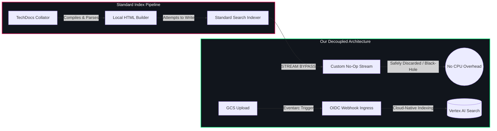

# Vertex AI Search Backend Module for Backstage (`@backstage-community/plugin-search-backend-module-vertexai`)

This backend module integrates Google Cloud Vertex AI Search (formerly Enterprise Search / Discovery Engine) capabilities into the Backstage Search system. It registers itself to the `@backstage-community/plugin-search-backend-module-hybrid` router to handle specific categories (like `techdocs` and others).

It also manages an automated background cleanup sweeper to prune orphaned documentation assets from Google Cloud Storage (GCS) and Vertex AI Search when catalog entities are deleted.

> [!WARNING]
> **Important Ingestion Dependency**: Vertex AI Search is a query-only backend. It does not automatically parse TechDocs files. You **MUST** deploy and configure the companion ingestion module [`@backstage-community/plugin-events-backend-module-gcs-eventarc`](../events-backend-module-gcs-eventarc/README.md) (or set up GCS bucket notifications) to upload and index documents when they are published.

---

## 🏛️ Ingestion Bypass & Cloud-Native Indexing

In standard Backstage setups, TechDocs are parsed and indexed locally by the Node.js server. This creates massive memory and CPU overhead. Our architecture decouples query routing from ingestion:



1. **Bypass Stream**: The standard indexer returns a throwaway no-op stream, bypassing local compilation.
2. **Decoupled Ingestion**: Documentation builds publish static HTML to GCS, triggering an Eventarc webhook that imports documents into the Vertex AI Search data store (see the [gcs-eventarc plugin](../events-backend-module-gcs-eventarc/README.md)).
3. **Semantic Querying**: Queries route directly to the unstructured Vertex AI Search data store, resolving passages matching conceptual intent.

---

## 🧹 Scheduled Catalog Cleanup Sweeper

When components or templates are deleted from the Backstage catalog, their static files in GCS and document indexes in Vertex AI Search become orphaned.

This module registers a scheduled background sweeper task that:
1. Lists all active components in the Catalog using `CatalogService`.
2. Scans the TechDocs GCS bucket for orphaned folders.
3. Purges corresponding index documents from Vertex AI Search and wipes the files from GCS.

---

## 🔗 TechDocs & GCS Dependency Matrix

To use this Vertex AI search module successfully, your Backstage instance must meet the following configuration dependencies:

| Component / Feature | Dependency | Purpose |
| :--- | :--- | :--- |
| **TechDocs Publisher** | `techdocs.publisher.type: googleGcs` | Vertex AI Search indexes documentation files directly from Google Cloud Storage. Using `local` or other publisher types will prevent indexing. |
| **Storage Bucket Access** | `techdocs.publisher.googleGcs.bucketName` | Used by the background sweeper to scan for and purge orphaned static HTML folders. |
| **Search Collator** | `@backstage/plugin-search-backend-module-techdocs` | This module intercepts the standard TechDocs indexing stream to redirect it to the **No-Op Bypass Stream**, eliminating GKE container CPU/memory overhead. |
| **Ingress Webhook** | `@backstage-community/plugin-events-backend-module-gcs-eventarc` | Listens to Eventarc file creation triggers to sync updated HTML pages from GCS to the Vertex AI Search data store. |

---

## ⚙️ Configuration

Configure the Google Cloud Vertex AI Search settings in your `app-config.yaml`:

```yaml
search:
  engines:
    vertexai:
      projectId: ${projectId}
      location: ${location}
      dataStoreId: ${dataStoreId}
      # Configurable catalog cleanup task
      cleanup:
        enabled: true
        frequency: { hours: 2 }

techdocs:
  publisher:
    googleGcs:
      bucketName: my-techdocs-bucket
```
