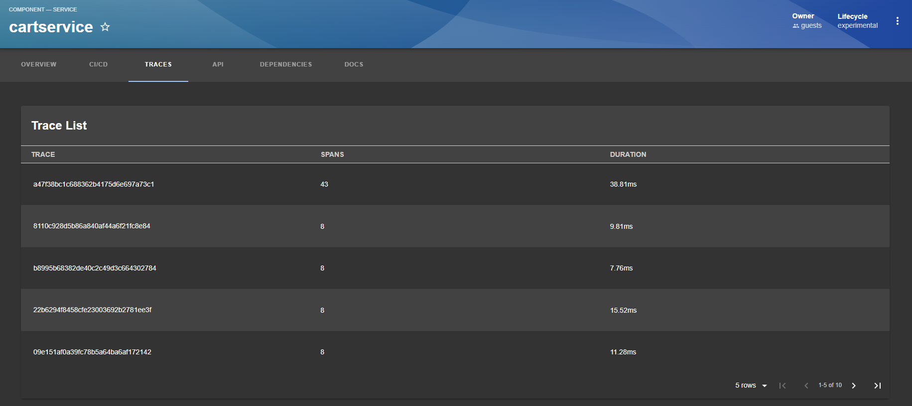
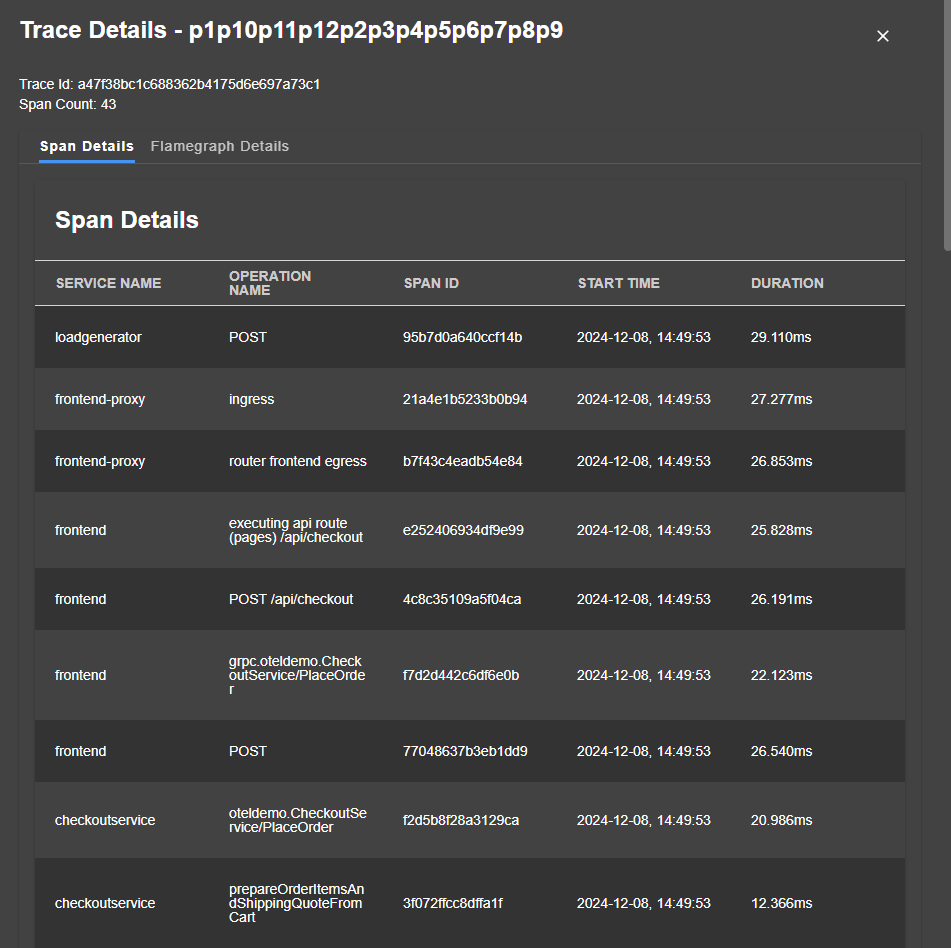

# Jaeger

Welcome to the Jaeger plugin!

## Getting started

### Overview

### Traces



### Spans Table View



## Installation

This plugin needs to be added to an existing backstage instance.

```bash
# From your Backstage root directory
yarn add --cwd packages/app @backstage-community/plugin-jaeger
```

Configure the plugin in `app-config.yaml`. The proxy endpoint for Jaeger API

```yaml
# app-config.yaml
proxy:
  endpoints:
    '/jaeger-api':
      target: ${JAEGAR_API_URL}
      pathRewrite:
        '^/api/proxy/jaeger-api': ''
```

### Jaeger Traces in to Service Entity

Add the following into `packages/app/src/components/catalog/EntityPage.tsx` and add the following.

```typescript
// ...
import { JaegerCard } from '@backstage-community/plugin-jaeger';
// ...
const serviceEntityPage = (
  <EntityLayout>
    <EntityLayout.Route path="/" title="Overview">
      {overviewContent}
    </EntityLayout.Route>
    <EntityLayout.Route path="/ci-cd" title="CI/CD">
      {cicdContent}
    </EntityLayout.Route>
    //...
    <EntityLayout.Route path="/jaeger" title="Traces">
      <JaegerCard />
    </EntityLayout.Route>
    // ...
  </EntityLayout>
);
```

`Note: If you dont want to display the Service page if no annotation specified in catalog.`

```typescript
//...
import {
  JaegerCard,
  isJaegerAvailable,
} from '@backstage-community/plugin-jaeger';
//...
<EntityLayout.Route if={isJaegerAvailable} path="/jaeger" title="Traces">
  <JaegerCard />
</EntityLayout.Route>;
// ...
```

### Example Entity Annotations

```yaml
apiVersion: backstage.io/v1alpha1
kind: Component
metadata:
  name: petstore
  annotations:
    jaegertracing.io/service: petstore # Mandatory
    jaegertracing.io/lookback: 30m # Optional (Default: 1h)
    jaegertracing.io/limit: 20 # Optional (Default: 30)
    jaegertracing.io/operation: / # Optional (Default: all)
spec:
  type: service
  lifecycle: experimental
  owner: guests
  providesApis:
    - petstore
```
