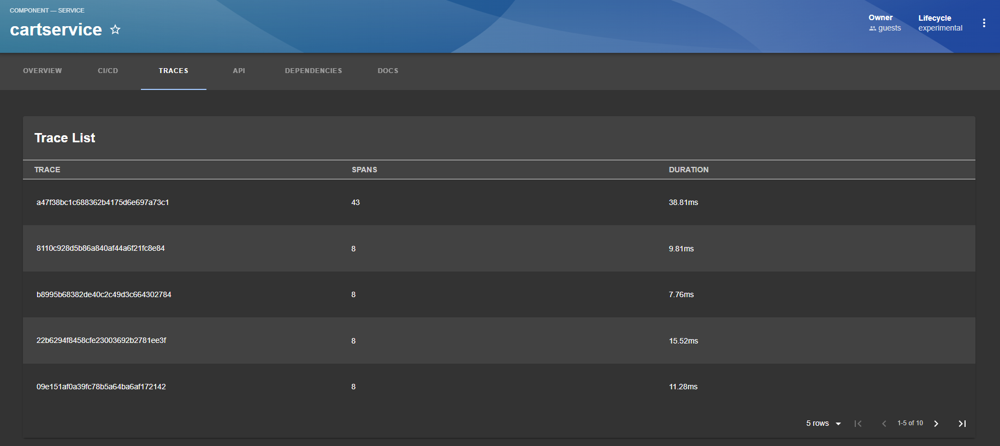
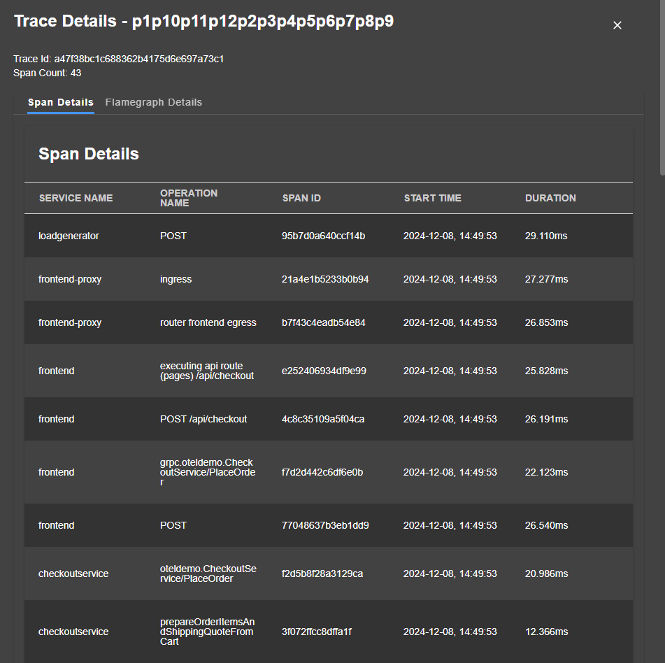

# Jaeger

Welcome to the Jaeger plugin!

## Getting started

### Overview

### Traces



### Spans Table View



## Installation

This plugin needs to be added to an existing backstage instance.

```bash
# From your Backstage root directory
yarn add --cwd packages/app @backstage-community/plugin-jaeger
```

Configure the plugin in `app-config.yaml`. The proxy endpoint for Jaeger API

```yaml
# app-config.yaml
proxy:
  endpoints:
    '/jaeger-api':
      target: ${JAEGAR_API_URL}
      pathRewrite:
        '^/api/proxy/jaeger-api': ''
```

### Jaeger Traces in to Service Entity

Add the following into `packages/app/src/components/catalog/EntityPage.tsx` and add the following.

```typescript
// ...
import { JaegerCard } from '@backstage-community/plugin-jaeger';
// ...
const serviceEntityPage = (
  <EntityLayout>
    <EntityLayout.Route path="/" title="Overview">
      {overviewContent}
    </EntityLayout.Route>
    <EntityLayout.Route path="/ci-cd" title="CI/CD">
      {cicdContent}
    </EntityLayout.Route>
    //...
    <EntityLayout.Route path="/jaeger" title="Traces">
      <JaegerCard />
    </EntityLayout.Route>
    // ...
  </EntityLayout>
);
```

`Note: If you dont want to display the Service page if no annotation specified in catalog.`

```typescript
//...
import {
  JaegerCard,
  isJaegerAvailable,
} from '@backstage-community/plugin-jaeger';
//...
<EntityLayout.Route if={isJaegerAvailable} path="/jaeger" title="Traces">
  <JaegerCard />
</EntityLayout.Route>;
// ...
```

### Example Entity Annotations

```yaml
apiVersion: backstage.io/v1alpha1
kind: Component
metadata:
  name: petstore
  annotations:
    jaegertracing.io/service: petstore # Mandatory
    jaegertracing.io/lookback: 30m # Optional (Default: 1h)
    jaegertracing.io/limit: 20 # Optional (Default: 30)
    jaegertracing.io/operation: / # Optional (Default: all)
spec:
  type: service
  lifecycle: experimental
  owner: guests
  providesApis:
    - petstore
```

## New Frontend System

Follow these steps to detect and configure the Jaeger plugin if you'd like to use it in an application that supports the new Backstage frontend system.

### Package detection

Once you install the `@backstage-community/plugin-jaeger` package using your preferred package manager, you have to choose how the package should be detected by the app. The package can be automatically discovered when the feature discovery config is set, or it can be manually enabled via code (for more granular package customization cases, such as extension overrides).

<table>
  <tr>
    <td>Via config</td>
    <td>Via code</td>
  </tr>
  <tr>
    <td>
      <pre lang="yaml">
        <code>
# app-config.yaml
  app:
    # Enable package discovery for all plugins
    packages: 'all'
  ---
  app:
    # Enable package discovery only for Jaeger
    packages:
      include:
        - '@backstage-community/plugin-jaeger'
        </code>
      </pre>
    </td>
    <td>
      <pre lang="javascript">
       <code>
// packages/app/src/App.tsx
import { createApp } from '@backstage/frontend-defaults';
import jaegerPlugin from '@backstage-community/plugin-jaeger/alpha';
//...
const app = createApp({
  // ...
  features: [
    //...
    jaegerPlugin,
  ],
});

//...
</code>

</pre>
</td>

  </tr>
</table>

## Extensions config

Currently, the plugin installs 2 extensions: 1 api (Jaeger) and 1 entity page content (also known as entity page tab), see below examples of how to configure the available extensions.

```yml
# app-config.yaml
app:
  extensions:
    # Example disabling the Jaeger entity content
    - 'entity-content:jaeger': false
    # Example customizing the Jaeger entity content
    - 'entity-content:jaeger':
        config:
          path: '/traces'
          title: 'Jaeger Traces'
```
