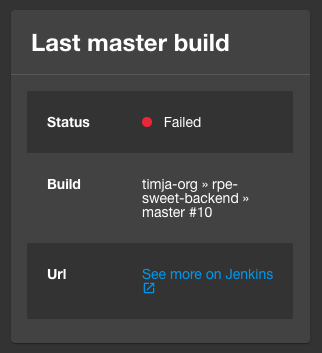
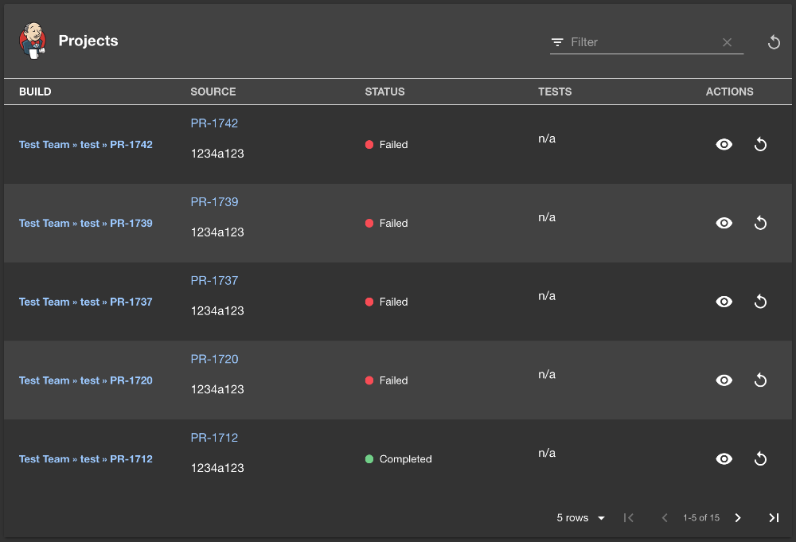
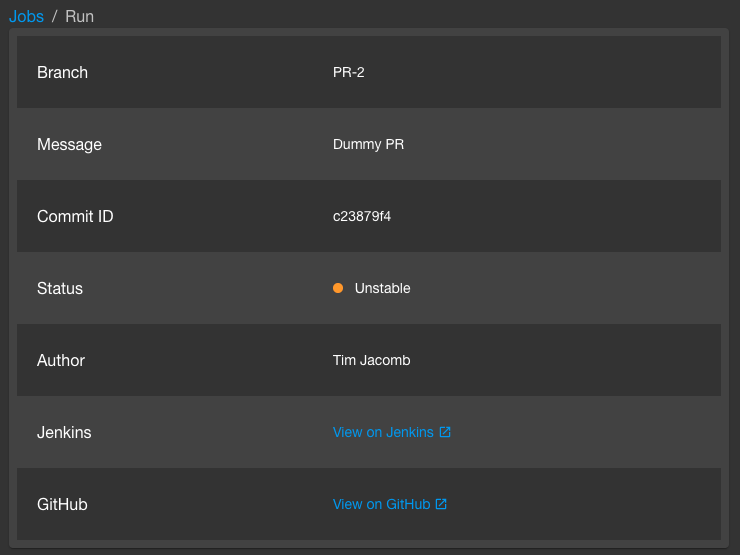
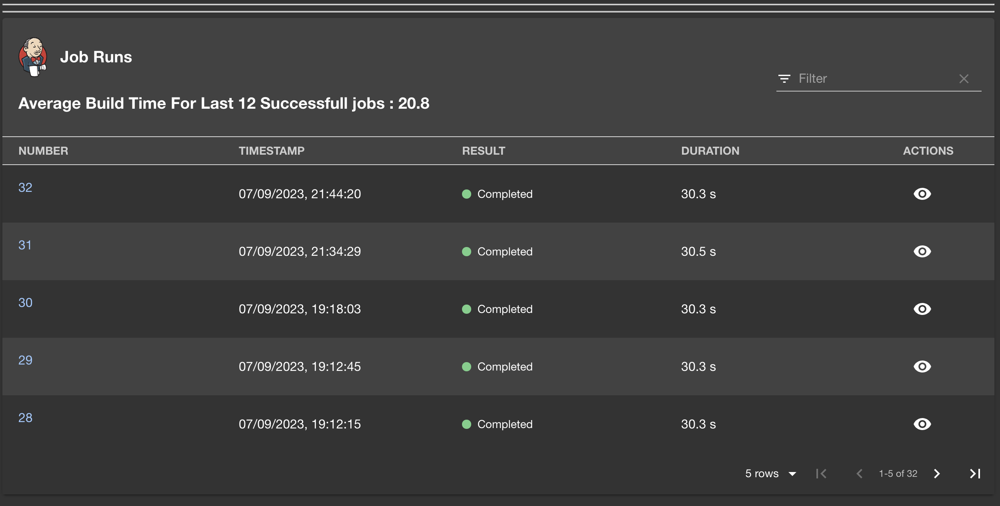
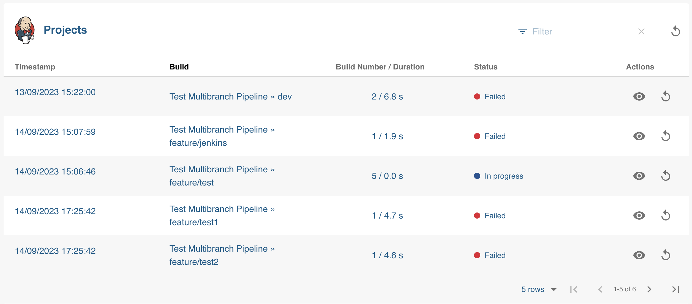

# Jenkins Plugin (Alpha)

Website: [https://jenkins.io/](https://jenkins.io/)







## Setup

1. If you have a standalone app (you didn't clone this repo), then do

```bash
# From your Backstage root directory
yarn --cwd packages/app add @backstage-community/plugin-jenkins
```

2. Add and configure the [jenkins-backend](../jenkins-backend) plugin according to it's instructions

3. Add the `EntityJenkinsContent` extension to the `CI/CD` page and `EntityLatestJenkinsRunCard` to the `overview` page in the app (or wherever you'd prefer):

Note that if you configured a custom JenkinsInfoProvider in step 2, you may need a custom isJenkinsAvailable. Also if you're transitioning to a new default branch name, you can pass multiple branch names as a comma-separated list and it will check for each branch name.

```tsx
// In packages/app/src/components/catalog/EntityPage.tsx
import {
  EntityJenkinsContent,
  EntityLatestJenkinsRunCard,
  isJenkinsAvailable,
} from '@backstage-community/plugin-jenkins';

// You can add the tab to any number of pages, the service page is shown as an
// example here
const serviceEntityPage = (
  <EntityLayout>
    <EntityLayout.Route path="/" title="Overview">
      {/* ... */}
      <EntitySwitch>
        <EntitySwitch.Case if={isJenkinsAvailable}>
          <Grid item sm={6}>
            <EntityLatestJenkinsRunCard
              branch="main,master"
              variant="gridItem"
            />
          </Grid>
        </EntitySwitch.Case>
        {/* ... */}
      </EntitySwitch>
    </EntityLayout.Route>
    {/* other tabs... */}
    <EntityLayout.Route path="/ci-cd" title="CI/CD">
      <EntitySwitch>
        <EntitySwitch.Case if={isJenkinsAvailable}>
          <EntityJenkinsContent />
        </EntitySwitch.Case>
        {/* ... */}
      </EntitySwitch>
    </EntityLayout.Route>
    {/* ... */}
  </EntityLayout>
);
```

If you are using Backstage's [new frontend system](https://backstage.io/docs/frontend-system/), simply import `sonarQubePlugin` in your `App.tsx` and add it to your app's `features` array:

```typescript
import jenkinsPlugin from '@backstage-community/plugin-jenkins/alpha';

// ...

export const app = createApp({
  features: [
    // ...
    jenkinsPlugin,
    // ...
  ],
});
```

4. Run app with `yarn start`
5. Add the Jenkins folder annotation to your `catalog-info.yaml`.

Currently, this plugin only supports folders and Git SCM.
Note that if you configured a custom JenkinsInfoProvider in step 2, you may need to use a different annotation scheme here

```yaml
apiVersion: backstage.io/v1alpha1
kind: Component
metadata:
  name: 'your-component'
  description: 'a description'
  annotations:
    jenkins.io/github-folder: 'folder-name/project-name' # deprecated
    jenkins.io/job-full-name: 'folder-name/project-name' # use this instead

spec:
  type: service
  lifecycle: experimental
  owner: your-name
```

7. Register your component

8. Click the component in the catalog. You should now see Jenkins builds, and a
   last build result for your master build.

## Features

- View all runs inside a folder
- Last build status for specified branch
- View summary of a build

## Limitations

- Only works with organization folder projects backed by GitHub
- No pagination support currently

## EntityJobRunsTable

- View all builds of a particular job
- shows average build time for successful builds

## Modify Columns of EntityJenkinsContent

- now you can pass down column props to show the columns/metadata as per your use case.

```tsx
export const generatedColumns: TableColumn[] = [
  {
    title: 'Timestamp',
    field: 'lastBuild.timestamp',
    render: (row: Partial<Project>) => (
      <>
        <Typography paragraph>
          {`
            ${new Date(row.lastBuild?.timestamp).toLocaleDateString()}
            ${new Date(row.lastBuild?.timestamp).toLocaleTimeString()}
            `}
        </Typography>
      </>
    ),
  },
]

// ...
<EntityJenkinsContent columns={generatedColumns}/>
// ...
```

## Modify the title

To change the default title text, simply use the `title` property:

```tsx
<EntityJenkinsContent title="Jenkins build history" />

<EntityLatestJenkinsRunCard
  branch="main"
  variant="gridItem"
  title="Latest production build"
/>

// Here it is possible to use a function to concatenate the branch name
<EntityLatestJenkinsRunCard
  branch="main"
  variant="gridItem"
  title={(branch: string) => `Latest ${branch} build`}
/>
```
