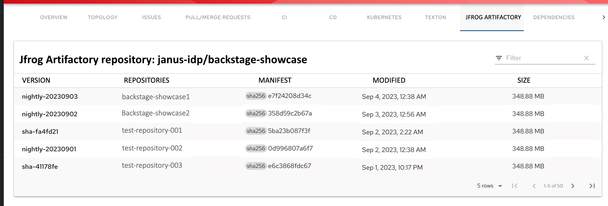

# Jfrog Artifactory plugin for Backstage

The Jfrog Artifactory plugin displays information about your container images within the Jfrog Artifactory registry.

## For administrators

### Installation and configuration

#### Procedure

1. Run the following command to install the Jfrog Artifactory plugin:

   ```console
   yarn workspace app add @backstage-community/plugin-jfrog-artifactory
   ```

1. Set the proxy to the desired Artifactory server in the `app-config.yaml` file as follows:

   ```yaml title="app-config.yaml"
   proxy:
     endpoints:
       '/jfrog-artifactory/api':
         target: 'http://<hostname>:8082' # or https://<customer>.jfrog.io
         headers:
           # Authorization: 'Bearer <YOUR TOKEN>'
         # Change to "false" in case of using self hosted artifactory instance with a self-signed certificate
         secure: true
   ```

If you have multiple instances of artifactory supported, you can set up multiple proxy target paths as follows:

```yaml title="app-config.yaml"
proxy:
  endpoints:
    '/jfrog-instance1': # This is a local alias for the proxy endpoint, not the actual Artifactory hostname
      target: 'https://<hostname1>'
      # Rest of the config for hostname1
    '/jfrog-instance2':
      target: 'https://<hostname2>'
```

1. Enable the **JFROG ARTIFACTORY** tab on the entity view page in `packages/app/src/components/catalog/EntityPage.tsx`:

   ```ts title="packages/app/src/components/catalog/EntityPage.tsx"
   /* highlight-add-start */
   import {
     isJfrogArtifactoryAvailable,
     JfrogArtifactoryPage,
   } from '@backstage-community/plugin-jfrog-artifactory';

   /* highlight-add-end */

   const serviceEntityPage = (
     <EntityLayout>
       // ...
       {/* highlight-add-start */}
       <EntityLayout.Route
         if={isJfrogArtifactoryAvailable}
         path="/jfrog-artifactory"
         title="Jfrog Artifactory"
       >
         <JfrogArtifactoryPage />
       </EntityLayout.Route>
       {/* highlight-add-end */}
     </EntityLayout>
   );
   ```

1. Annotate your entity with the following annotations:

   ```yaml title="catalog-info.yaml"
   metadata:
     annotations:
       'jfrog-artifactory/image-name': '<IMAGE-NAME>'
       # if your app supports multiple artifactory instances,
       # you'll need to specify the instance proxy target path your image belongs to
       'jfrog-artifactory/target-proxy': '/<PROXY-TARGET>' # e.g. `/jfrog-instance1` from the example above
   ```

## For users

### Using the Jfrog Artifactory plugin in Backstage

Jfrog Artifactory is a front-end plugin that enables you to view the information about the container images that are available in your Jfrog Artifactory registry.

#### Prerequisites

- Your Backstage application is installed and running.
- You have installed the Jfrog Artifactory plugin. For installation and configuration steps, see [Installation and configuration](#installation-and-configuration).

#### Procedure

1. Open your Backstage application and select a component from the **Catalog** page.

1. Go to the **JFROG ARTIFACTORY** tab.

   

   The **JFROG ARTIFACTORY** tab contains a list of container images and related information, such as **VERSION**, **REPOSITORIES**, **MANIFEST**, **MODIFIED**, and **SIZE**.
