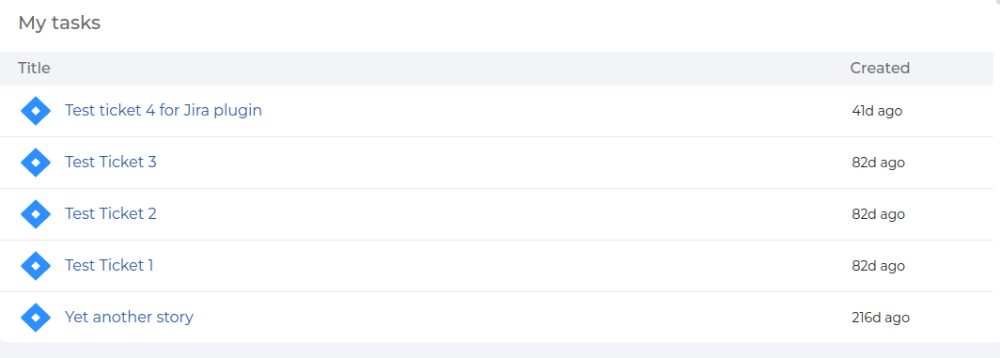

# Jira Plugin

The Jira Plugin provides a page that integrates with Jira to display relevant project and issue information for the user.

  

### Features

- Displays Jira project and issue data.
- Integrates with Jira APIs to fetch and show information relevant to the current user or project.

## Getting Started

1. Install the Jira Plugin:

    ```bash
    # From your Backstage root directory
    yarn --cwd packages/app add @nineleaps/plugin-jira
    ```

2. Add the `JiraPage` extension to your app:
   
   ```tsx
   // packages/app/src/App.tsx

    import { Route } from 'react-router';
    import { JiraPage } from '@nineleaps/plugin-jira';

    <Route path="/jira" element={<JiraPage />} />;
    ```

## Customization

You can customize the appearance or behavior of the Jira page by modifying the components or by passing custom props if needed.


## Development

To run a development version of the plugin with mocked data, use:

```bash
    yarn start
```

## API
This plugin provides a custom `JiraApiClient` for interacting with Jira APIs, defined in jiraApiRef.

```typescript
   export const jiraPlugin = createPlugin({
    id: 'jira',
    apis: [
        createApiFactory({
        api: jiraApiRef,
        deps: {
            discoveryApi: discoveryApiRef,
            configApi: configApiRef,
        },
        factory: ({ discoveryApi, configApi }) =>
            new JiraApiClient({ discoveryApi, configApi }),
        }),
    ],
    });
  ```
  
## License

```text
* Copyright 2024 The Backstage Authors
*
* Licensed under the Apache License, Version 2.0 (the "License");
* you may not use this file except in compliance with the License.
* You may obtain a copy of the License at
*
*     http://www.apache.org/licenses/LICENSE-2.0
*
* Unless required by applicable law or agreed to in writing, software
* distributed under the License is distributed on an "AS IS" BASIS,
* WITHOUT WARRANTIES OR CONDITIONS OF ANY KIND, either express or implied.
* See the License for the specific language governing permissions and
* limitations under the License.
