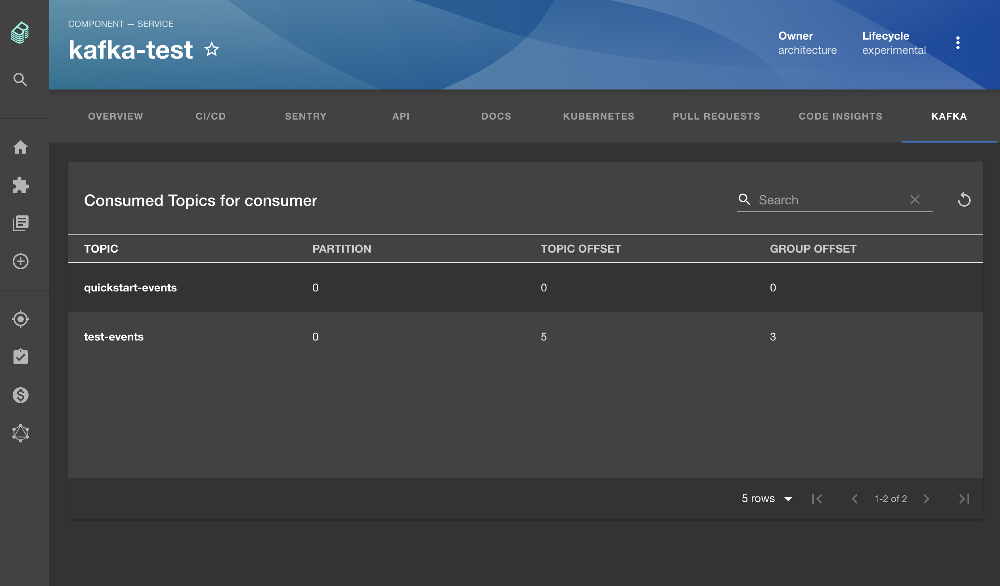

# Kafka Plugin



## Setup

1. Run:

```bash
# From your Backstage root directory
yarn --cwd packages/app add @backstage-community/plugin-kafka
yarn --cwd packages/backend add @backstage-community/plugin-kafka-backend
```

2. Add the plugin backend:

In a new file named `kafka.ts` under `backend/src/plugins`:

```js
import { createRouter } from '@backstage-community/plugin-kafka-backend';
import { Router } from 'express';
import { PluginEnvironment } from '../types';

export default async function createPlugin(
  env: PluginEnvironment,
): Promise<Router> {
  return await createRouter({
    logger: env.logger,
    config: env.config,
  });
}
```

And then add to `packages/backend/src/index.ts`:

```js
// In packages/backend/src/index.ts
import kafka from './plugins/kafka';
// ...
async function main() {
  // ...
  const kafkaEnv = useHotMemoize(module, () => createEnv('kafka'));
  // ...
  apiRouter.use('/kafka', await kafka(kafkaEnv));
```

3. Add the plugin as a tab to your service entities:

```jsx
// In packages/app/src/components/catalog/EntityPage.tsx
import { EntityKafkaContent } from '@backstage-community/plugin-kafka';

const serviceEntityPage = (
  <EntityLayout>
    {/* other tabs... */}
    <EntityLayout.Route path="/kafka" title="Kafka">
      <EntityKafkaContent />
    </EntityLayout.Route>
```

4. Add broker configs for the backend in your `app-config.yaml` (see
   [kafka-backend](https://github.com/backstage/community-plugins/tree/main/workspaces/kafka/plugins/kafka-backend/README.md)
   for more options):

```yaml
kafka:
  clientId: backstage
  clusters:
    - name: cluster-name
      brokers:
        - localhost:9092
```

5. Add the `kafka.apache.org/consumer-groups` annotation to your services:

Can be a comma separated list.

```yaml
apiVersion: backstage.io/v1alpha1
kind: Component
metadata:
  # ...
  annotations:
    kafka.apache.org/consumer-groups: cluster-name/consumer-group-name
spec:
  type: service
```

6. Configure dashboard urls:

You have two options.\
Either configure it with an annotation called `kafka.apache.org/dashboard-urls`

```yaml
apiVersion: backstage.io/v1alpha1
kind: Component
metadata:
  # ...
  annotations:
    kafka.apache.org/dashboard-urls: cluster-name/consumer-group-name/dashboard-url
spec:
  type: service
```

> The consumer-group-name is optional.

or with configs in `app-config.yaml`

```yaml
kafka:
  # ...
  clusters:
    - name: cluster-name
      dashboardUrl: https://dashboard.com
```

## New Frontend System

Follow these steps to detect and configure the Kafka plugin if you'd like to use it in an application that supports the new Backstage frontend system.

### Package detection

Once you install the `@backstage-community/plugin-kafka` package using your preferred package manager, you have to choose how the package should be detected by the app. The package can be automatically discovered when the feature discovery config is set, or it can be manually enabled via code (for more granular package customization cases, such as extension overrides).

<table>
  <tr>
    <td>Via config</td>
    <td>Via code</td>
  </tr>
  <tr>
    <td>
      <pre lang="yaml">
        <code>
# app-config.yaml
  app:
    # Enable package discovery for all plugins
    packages: 'all'
  ---
  app:
    # Enable package discovery only for Kafka
    packages:
      include:
        - '@backstage-community/plugin-kafka'
        </code>
      </pre>
    </td>
    <td>
      <pre lang="javascript">
       <code>
// packages/app/src/App.tsx
import { createApp } from '@backstage/frontend-defaults';
import kafkaPlugin from '@backstage-community/plugin-kafka/alpha';
//...
const app = createApp({
  // ...
  features: [
    //...
    kafkaPlugin,
  ],
});

//...
</code>

</pre>
</td>

  </tr>
</table>

## Extensions config

Currently, the plugin installs 3 extensions: 2 apis (Kafka and Kafka dashboard) and 1 entity page content (also known as entity page tab), see below examples of how to configure the available extensions.

```yml
# app-config.yaml
app:
  extensions:
    # Example disabling the Kafka entity content
    - 'entity-content:kafka': false
    # Example customizing the Kafka entity content
    - 'entity-content:kafka':
        config:
          path: '/events'
          title: 'Events'
```

## Features

- List topics offsets and consumer group offsets for configured services.
