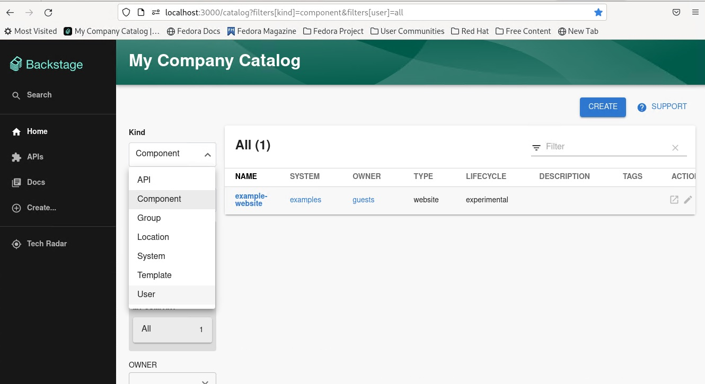
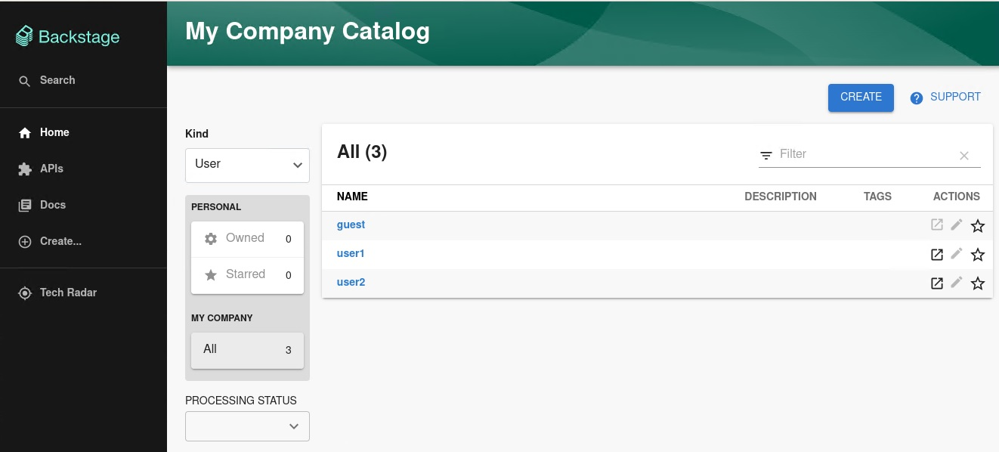
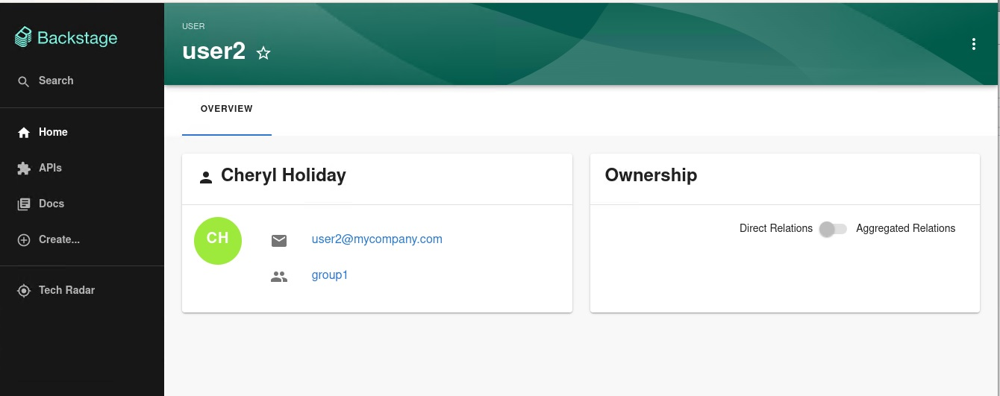
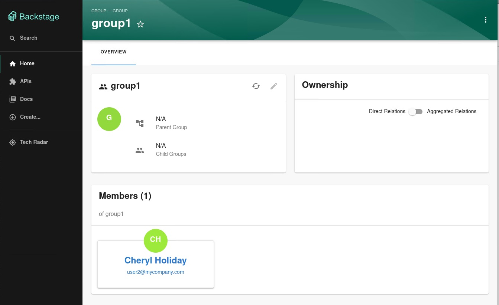

# Keycloak backend plugin for Backstage

The Keycloak backend plugin integrates Keycloak into Backstage.

## Capabilities

The Keycloak backend plugin has the following capabilities:

- Synchronization of Keycloak users in a realm
- Synchronization of Keycloak groups and their users in a realm

## For administrators

### Installation

Install the Backstage package into the backend. When not integrating with a published package, clone the repository locally and add the Backstage as follows:

```console
yarn workspace backend add @backstage-community/plugin-catalog-backend-module-keycloak
```

### Configuration

#### New Backend Configuration

1. Add the following configuration to the `app-config.yaml` file. The default schedule is a frequency of 30 minutes and a timeout of 3 minutes, please configure the schedule in the `app-config.yaml` as per your requirement.

   ```yaml title="app-config.yaml"
   catalog:
     providers:
       keycloakOrg:
         default:
           baseUrl: https://<keycloak_host>
           loginRealm: ${KEYCLOAK_REALM}
           realm: ${KEYCLOAK_REALM}
           clientId: ${KEYCLOAK_CLIENTID}
           clientSecret: ${KEYCLOAK_CLIENTSECRET}
           schedule: # Optional (defaults to the configurations below if not provided); same options as in TaskScheduleDefinition
             # supports cron, ISO duration, "human duration" as used in code
             frequency: { minutes: 30 } # Customize this to fit your needs
             # supports ISO duration, "human duration" as used in code
             timeout: { minutes: 3 } # Customize this to fit your needs
   ```

1. Register the plugin in the `packages/backend/src/index.ts` file:

   ```ts title="packages/backend/src/index.ts"
   const backend = createBackend();

   /* highlight-add-next-line */
   backend.add(
     import('@backstage-community/plugin-catalog-backend-module-keycloak'),
   );

   backend.start();
   ```

1. Optional: By default, the user and group transformers will sanitize special characters in the user/group name to be Backstage compliant. To override the default behavior, configure custom transformer function for user/group to mutate the entity generated by the catalog-backend-module-keycloak. Create a new backend module with the `yarn new` command and add your custom user and group transformers to the `keycloakTransformerExtensionPoint`. Then install this new backend module into your backstage backend. Below is an example of how the backend module can be defined:

   ```ts title="plugins/<module-name>/src/module.ts"
   /* highlight-add-start */
   import {
     GroupTransformer,
     keycloakTransformerExtensionPoint,
     UserTransformer,
   } from '@backstage-community/plugin-catalog-backend-module-keycloak';

   const customGroupTransformer: GroupTransformer = async (
     entity,
     realm,
     groups,
   ) => {
     /* apply transformations */
     return entity;
   };
   const customUserTransformer: UserTransformer = async (
     entity,
     user,
     realm,
     groups,
   ) => {
     /* apply transformations */
     return entity;
   };
   /* highlight-add-end */

   export const keycloakBackendModuleTransformer = createBackendModule({
     pluginId: 'catalog',
     moduleId: 'keycloak-transformer',
     register(reg) {
       reg.registerInit({
         deps: {
           /* highlight-add-start */
           keycloak: keycloakTransformerExtensionPoint,
           /* highlight-add-end */
         },
         /* highlight-add-start */
         async init({ keycloak }) {
           keycloak.setUserTransformer(customUserTransformer);
           keycloak.setGroupTransformer(customGroupTransformer);
           /* highlight-add-end */
         },
       });
     },
   });
   ```

   ***

   **IMPORTANT**

   The `pluginId` for the module **MUST** be set to `catalog` to match the `pluginId` of the `catalog-backend-module-keycloak` or else the module will fail to initialize.

   ***

Communication between Backstage and Keycloak is enabled by using the Keycloak API. Username/password or client credentials are supported authentication methods.

The following table describes the parameters that you can configure to enable the plugin under `catalog.providers.keycloakOrg.<ENVIRONMENT_NAME>` object in the `app-config.yaml` file:

| Name             | Description                                                               | Default Value | Required                                             |
| ---------------- | ------------------------------------------------------------------------- | ------------- | ---------------------------------------------------- |
| `baseUrl`        | Location of the Keycloak server, such as `https://localhost:8443`.        | ""            | Yes                                                  |
| `realm`          | Realm to synchronize                                                      | `master`      | No                                                   |
| `loginRealm`     | Realm used to authenticate                                                | `master`      | No                                                   |
| `username`       | Username to authenticate                                                  | ""            | Yes if using password based authentication           |
| `password`       | Password to authenticate                                                  | ""            | Yes if using password based authentication           |
| `clientId`       | Client ID to authenticate                                                 | ""            | Yes if using client credentials based authentication |
| `clientSecret`   | Client Secret to authenticate                                             | ""            | Yes if using client credentials based authentication |
| `userQuerySize`  | Number of users to query at a time                                        | `100`         | No                                                   |
| `groupQuerySize` | Number of groups to query at a time                                       | `100`         | No                                                   |
| `maxConcurrency` | Maximum request concurrency to prevent DoS attacks on the Keycloak server | `20`          | No                                                   |

When using client credentials, the access type must be set to `confidential` and service accounts must be enabled. You must also add the following roles from the `realm-management` client role:

- `query-groups`
- `query-users`
- `view-users`

### 📊 Metrics

The Keycloak backend plugin supports [OpenTelemetry](https://opentelemetry.io/) metrics to monitor fetch operations and diagnose potential issues.

#### Available Counters

| Metric Name                                             | Description                                                                                          |
| ------------------------------------------------------- | ---------------------------------------------------------------------------------------------------- |
| `backend_keycloak_fetch_task_failure_count_total`       | Counts fetch task failures where no data was returned due to an error.                               |
| `backend_keycloak_fetch_data_batch_failure_count_total` | Counts partial data batch failures. Even if some batches fail, the plugin continues fetching others. |

The plugin is designed to tolerate partial failures and proceed with the data that can be successfully retrieved. Failed batches may be fetched in the next scheduled task.

#### 🏷 Labels

All counters include the `taskInstanceId` label, which uniquely identifies each scheduled fetch task.  
This allows you to trace failures back to individual task executions.

Example:

```text
backend_keycloak_fetch_data_batch_failure_count_total{taskInstanceId="df040f82-2e80-44bd-83b0-06a984ca05ba"} 1
```

#### ⚠️ Use Case Example

Imagine your Keycloak instance is under-provisioned (e.g., low CPU/RAM limits), and the plugin is configured to send many parallel API requests.  
This could cause request timeouts or throttling. The metrics described above can help detect such behavior early, allowing administrators to:

- Tune the plugin configuration (e.g., reduce parallelism)
- Increase resources on the Keycloak server
- Investigate network or permission issues

#### 📥 Exporting Metrics

You can export metrics using any OpenTelemetry-compatible backend, such as **Prometheus**.

➡️ See the [Backstage OpenTelemetry setup guide](https://backstage.io/docs/tutorials/setup-opentelemetry) for integration instructions.

### Limitations

If you have self-signed or corporate certificate issues, you can set the following environment variable before starting Backstage:

`NODE_TLS_REJECT_UNAUTHORIZED=0`

---

**NOTE**
The solution of setting the `NODE_TLS_REJECT_UNAUTHORIZED` environment variable is not recommended.

---

## For users

### Imported users and groups in Backstage using Keycloak plugin

After configuring the plugin successfully, the plugin imports the users and groups each time when started.

After the first import is complete, you can select **User** to list the users from the catalog page:



You can see the list of users on the page:



When you select a user, you can see the information imported from Keycloak:



You can also select a group, view the list, and select or view the information imported from Keycloak for a group:


