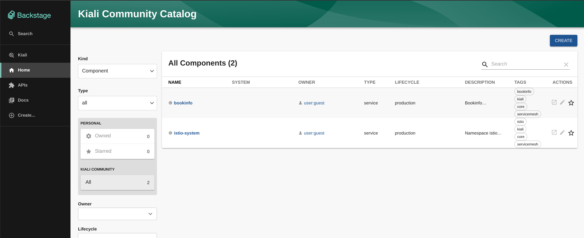
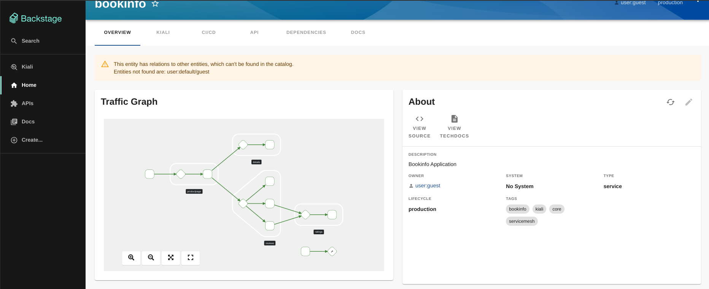
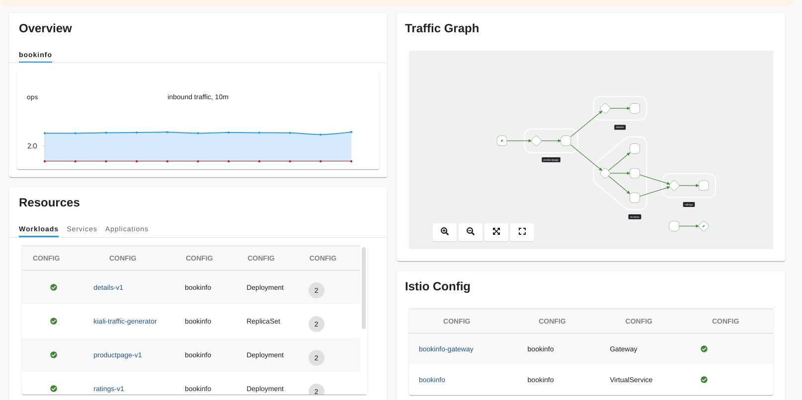

# Kiali plugin for Backstage

The Kiali Plugin
This plugin exposes information about your entity-specific ServiceMesh objects.

## Capabilities

The Kiali plugin has the following capabilities:

- Overview
  - Metrics by namespace
  - Health by namespace
  - Canary info
  - Istio Config warnings
- Worklist

## For administrators

### Setting up the Kiali plugin

#### Prerequisites

- The following annotation is added to the entity's `catalog-info.yaml` file to identify whether an entity contains the Kubernetes resources:

  ```yaml
  annotations:
    ...
    kiali.io/provider: default
    kiali.io/namespace: <RESOURCE_NS>
  ```

**kiali.io/provider** This value must match with the **name** provider in `app-config.yaml`

#### Setting up the Kiali frontend package

1. Install the Kiali plugin using the following commands:

   ```console
   yarn workspace app add @backstage-community/plugin-kiali
   ```

2. Select the components that you want to use, such as:

   - `KialiPage`: This is a standalone page or dashboard displaying all namespaces in the mesh. You can add `KialiPage` to `packages/app/src/App.tsx` file as follows:

     ```tsx title="packages/app/src/App.tsx"
     /* highlight-add-next-line */
     import { KialiPage } from '@backstage-community/plugin-kiali';

     const routes = (
       <FlatRoutes>
         {/* ... */}
         {/* highlight-add-next-line */}
         <Route path="/kiali" element={<KialiPage />} />
       </FlatRoutes>
     );
     ```

     You can also update navigation in `packages/app/src/components/Root/Root.tsx` as follows:

     ```tsx title="packages/app/src/components/Root/Root.tsx"
     /* highlight-add-next-line */
     import { KialiIcon } from '@backstage-community/plugin-kiali';

     export const Root = ({ children }: PropsWithChildren<{}>) => (
       <SidebarPage>
         <Sidebar>
           <SidebarGroup label="Menu" icon={<MenuIcon />}>
             {/* ... */}
             {/* highlight-add-next-line */}
             <SidebarItem icon={KialiIcon} to="kiali" text="Kiali" />
           </SidebarGroup>
           {/* ... */}
         </Sidebar>
         {children}
       </SidebarPage>
     );
     ```

   - `EntityKialiContent`: This component is a React context provided for Kiali data, which is related to the current entity. The `EntityKialiContent` component is used to display any data on the React components mentioned in `packages/app/src/components/catalog/EntityPage.tsx`:

   ```tsx title="packages/app/src/components/catalog/EntityPage.tsx"
   /* highlight-add-next-line */
   import { EntityKialiContent } from '@backstage-community/plugin-kiali';

   const serviceEntityPage = (
     <EntityLayout>
       {/* ... */}
       {/* highlight-add-start */}
       <EntityLayout.Route path="/kiali" title="kiali">
         <EntityKialiContent />
       </EntityLayout.Route>
       {/* highlight-add-end */}
     </EntityLayout>
   );
   ```

3. Configure you `app-config.yaml` with kiali configuration

```yaml
kiali:
  providers:
    # highlight-add-start
    # Required. Name of provider taht match the entity annotation
    - name: 'default'
      # Required. Kiali endpoint
      url: ${KIALI_ENDPOINT}
      # Optional. Required by token authentication
      serviceAccountToken: ${KIALI_SERVICE_ACCOUNT_TOKEN}
      # Optional. defaults false
      skipTLSVerify: true
      # Optional
      caData: ${KIALI_CONFIG_CA_DATA}
      # Optional. Local path to CA file
      caFile: ''
      # Optional. Time in seconds that session is enabled, defaults to 1 minute.
      sessionTime: 60
      # highlight-add-end
```

Authentication methods:

- anonymous [Read docs about this authentication in kiali.io](https://kiali.io/docs/configuration/authentication/anonymous/)
- token [Read docs about this authentication in kiali.io](https://kiali.io/docs/configuration/authentication/token/)

The following table describes the parameters that you can configure to enable the plugin under `catalog.providers.keycloakOrg.<ENVIRONMENT_NAME>` object in the `app-config.yaml` file:

| Name                  | Description                                                                                                          | Default Value | Required                                |
| --------------------- | -------------------------------------------------------------------------------------------------------------------- | ------------- | --------------------------------------- |
| `name`                | Name of the kiali provider, such as `default`                                                                        | "default"     | Yes and unique                          |
| `url`                 | Location of the Kiali server, such as `https://localhost:4000`                                                       | ""            | Yes                                     |
| `serviceAccountToken` | Service Account Token which is used for querying data from Kiali                                                     | ""            | Yes if using token based authentication |
| `skipTLSVerify`       | Skip TLS certificate verification presented by the API server                                                        | false         | No                                      |
| `caData`              | Base64-encoded certificate authority bundle in PEM format                                                            | ""            | No                                      |
| `caFile`              | Filesystem path (on the host where the Backstage process is running) to a certificate authority bundle in PEM format | ""            | No                                      |
| `sessionTime`         | Time in seconds that session is enabled                                                                              | 60            | No                                      |

## For users

We have 2 ways to consume the Kiali plugin, entity view or full view.

1. Open your Backstage application and select a component from the **Catalog** page.



2. We can see the GraphCard in the overview section



3. Go to the **Kiali** tab.

   The **Kiali** tab displays the Overview view associated to a Servicemesh.

   

   An If we scroll down we can see the full picture

   

To see the full view we can select the kiali option sidebar.


## Development

To develop/contribute in kiali plugin follow [these instructions](./DEVELOPMENT.md)
