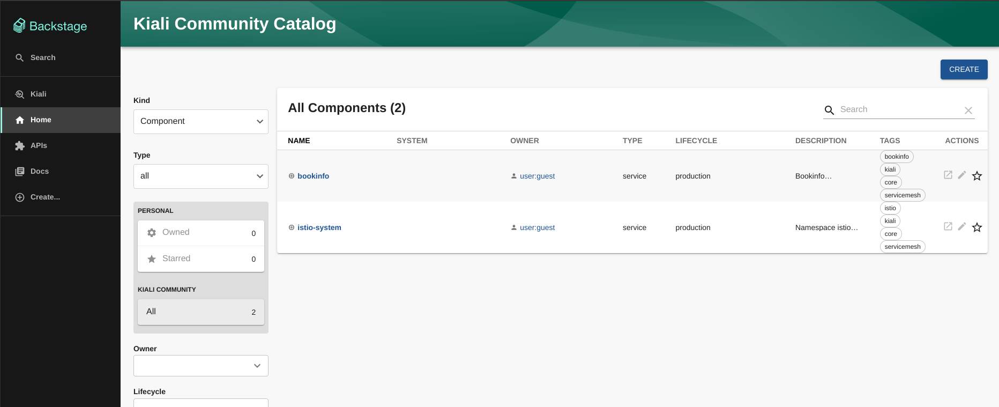
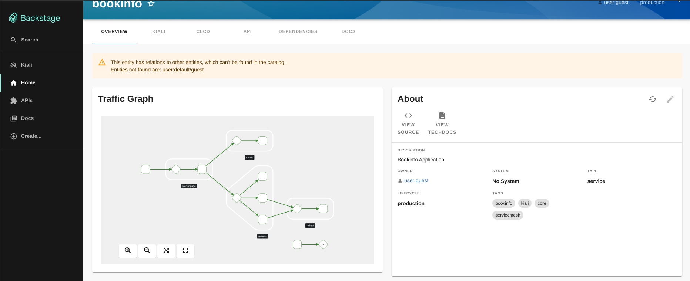
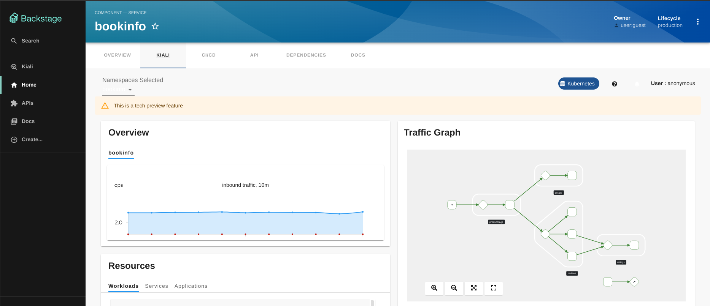
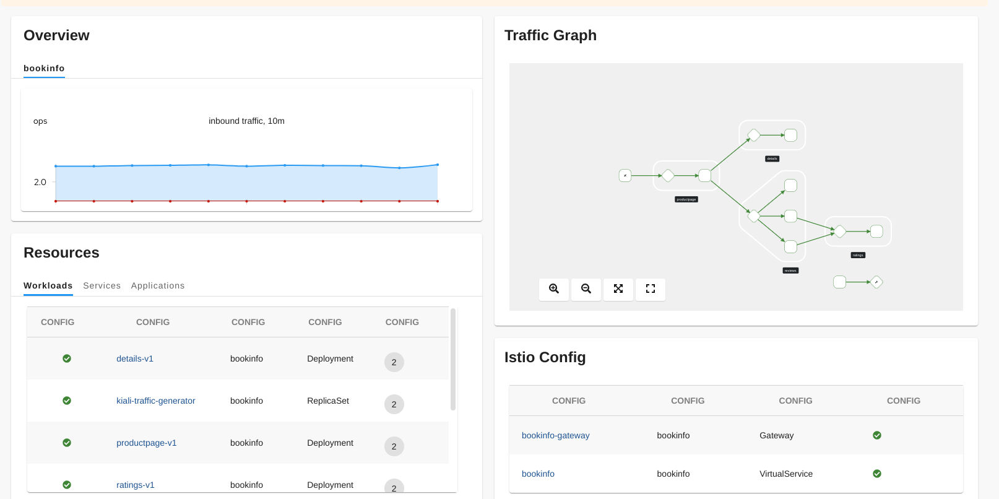
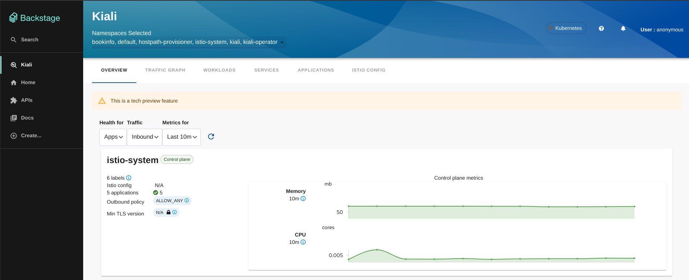

# Kiali plugin for Backstage

The Kiali plugin surfaces Kiali service mesh data in Backstage, both at the catalog entity level and as a standalone page.

For backend setup and API proxying, see the [`@backstage-community/plugin-kiali-backend`](https://github.com/backstage/community-plugins/tree/main/workspaces/kiali/plugins/kiali-backend) plugin.

## Capabilities

The Kiali plugin has the following capabilities:

- Overview
  - Metrics by namespace
  - Health by namespace
  - Canary info
  - Istio Config warnings
- Worklist

## For administrators

### Setting up the Kiali plugin

#### Prerequisites

- The following annotation is added to the entity's `catalog-info.yaml` file to identify whether an entity contains the Kubernetes resources:

  ```yaml
  annotations:
    ...
    kiali.io/provider: default
    kiali.io/namespace: <RESOURCE_NS>
  ```

**kiali.io/provider**: This value must match the provider `name` in `app-config.yaml`.

#### Setting up the Kiali frontend package

1. Install the Kiali plugin using the following commands:

   ```console
   yarn workspace app add @backstage-community/plugin-kiali
   ```

2. Select the components that you want to use, such as:

   - `KialiPage`: This is a standalone page or dashboard displaying all namespaces in the mesh. You can add `KialiPage` to `packages/app/src/App.tsx` file as follows:

     ```tsx title="packages/app/src/App.tsx"
     /* highlight-add-next-line */
     import { KialiPage } from '@backstage-community/plugin-kiali';

     const routes = (
       <FlatRoutes>
         {/* ... */}
         {/* highlight-add-next-line */}
         <Route path="/kiali" element={<KialiPage />} />
       </FlatRoutes>
     );
     ```

     You can also update navigation in `packages/app/src/components/Root/Root.tsx` as follows:

     ```tsx title="packages/app/src/components/Root/Root.tsx"
     /* highlight-add-next-line */
     import { KialiIcon } from '@backstage-community/plugin-kiali';

     export const Root = ({ children }: PropsWithChildren<{}>) => (
       <SidebarPage>
         <Sidebar>
           <SidebarGroup label="Menu" icon={<MenuIcon />}>
             {/* ... */}
             {/* highlight-add-next-line */}
             <SidebarItem icon={KialiIcon} to="kiali" text="Kiali" />
           </SidebarGroup>
           {/* ... */}
         </Sidebar>
         {children}
       </SidebarPage>
     );
     ```

   - `EntityKialiContent`: This component is a React context provided for Kiali data, which is related to the current entity. The `EntityKialiContent` component is used to display any data on the React components mentioned in `packages/app/src/components/catalog/EntityPage.tsx`:

   ```tsx title="packages/app/src/components/catalog/EntityPage.tsx"
   /* highlight-add-next-line */
   import { EntityKialiContent } from '@backstage-community/plugin-kiali';

   const serviceEntityPage = (
     <EntityLayout>
       {/* ... */}
       {/* highlight-add-start */}
       <EntityLayout.Route path="/kiali" title="kiali">
         <EntityKialiContent />
       </EntityLayout.Route>
       {/* highlight-add-end */}
     </EntityLayout>
   );
   ```

3. Configure your `app-config.yaml` with Kiali configuration

```yaml
kiali:
  providers:
    # highlight-add-start
    # Required. Name of provider that matches the entity annotation
    - name: 'default'
      # Required. Kiali endpoint
      url: ${KIALI_ENDPOINT}
      # Optional. Required by token authentication
      serviceAccountToken: ${KIALI_SERVICE_ACCOUNT_TOKEN}
      # Optional. defaults to false
      skipTLSVerify: true
      # Optional. defaults to kiali-token-Kubernetes
      tokenName: string
      # Optional
      caData: ${KIALI_CONFIG_CA_DATA}
      # Optional. Local path to CA file
      caFile: ''
      # Optional. Time in seconds that session is enabled, defaults to 1 minute.
      sessionTime: 60
      # highlight-add-end
```

Authentication methods:

- anonymous [Read docs about this authentication in kiali.io](https://kiali.io/docs/configuration/authentication/anonymous/)
- token [Read docs about this authentication in kiali.io](https://kiali.io/docs/configuration/authentication/token/)

The following table describes the parameters under `kiali.providers` in your `app-config.yaml`:

| Name                  | Description                                             | Default                | Required                       |
| --------------------- | ------------------------------------------------------- | ---------------------- | ------------------------------ |
| `name`                | Provider name, e.g. `default`                           | "default"              | Yes, unique                    |
| `url`                 | Kiali server URL, e.g. `https://localhost:4000`         | ""                     | Yes                            |
| `serviceAccountToken` | Service account token used to query Kiali               | ""                     | Yes, if using token-based auth |
| `skipTLSVerify`       | Skip TLS certificate verification                       | false                  | No                             |
| `tokenName`           | Cookie name used by Kiali for the auth token            | kiali-token-Kubernetes | No                             |
| `caData`              | Base64-encoded certificate authority bundle (PEM)       | ""                     | No                             |
| `caFile`              | Filesystem path to a certificate authority bundle (PEM) | ""                     | No                             |
| `sessionTime`         | Session duration in seconds                             | 60                     | No                             |

## For users

There are two ways to use the Kiali plugin: within an entity view or as a full-page view.

1. Open your Backstage application and select a component from the **Catalog** page.

   

2. In the entity overview, the Graph card shows service mesh health and traffic.

   

3. Open the **Kiali** tab to see the Kiali overview associated with the selected entity.

   

   Scroll to view more details.

   

4. To browse all namespaces across the mesh, open the standalone Kiali page from the sidebar.

   

## Development

To develop or contribute to the Kiali plugin, follow [these instructions](https://github.com/backstage/community-plugins/blob/main/workspaces/kiali/DEVELOPMENT.md).
